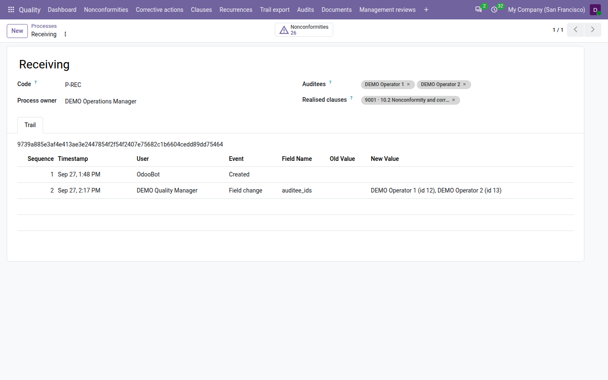
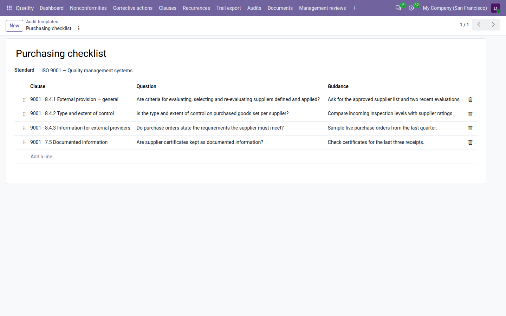
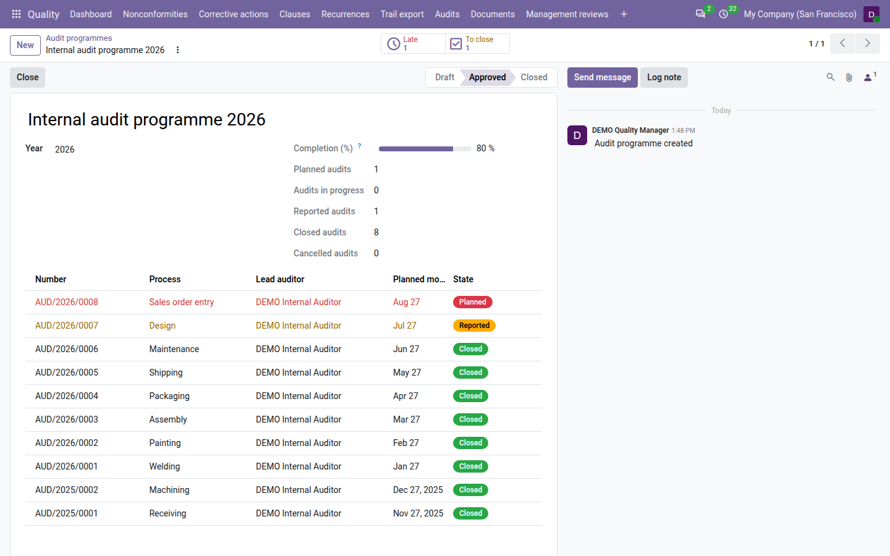
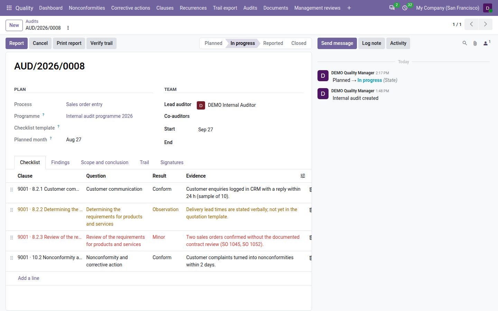
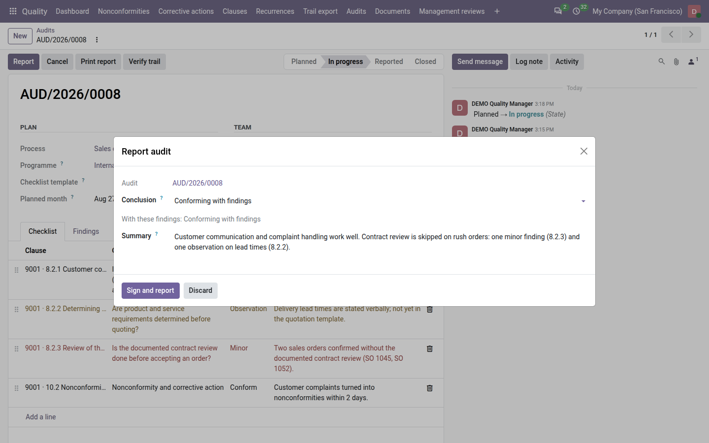
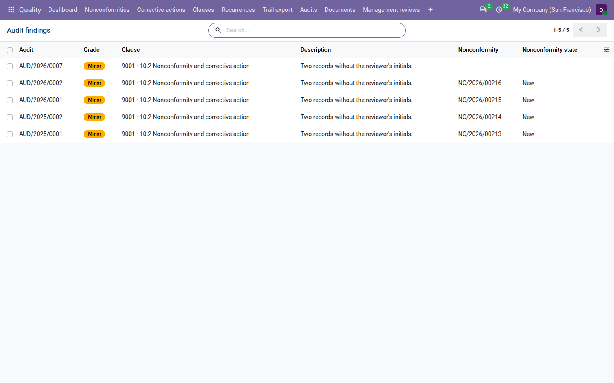
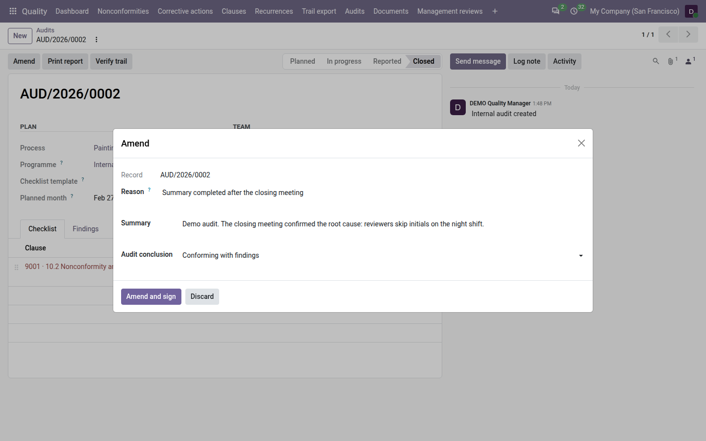
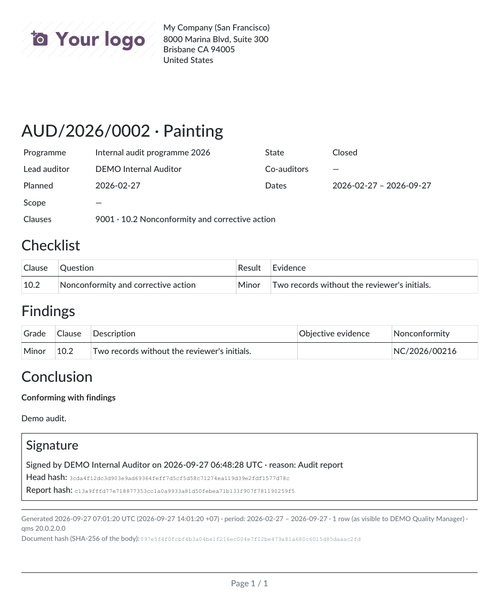

===============
Internal audits
===============

ISO 9001 clause 9.2 asks for internal audits run to a *programme*, by auditors who are independent of what they
audit, with every finding followed up. With **Core QMS** installed, the **Quality** app plans the year's audits,
builds each audit's checklist from the clauses in scope, keeps the auditor away from their own process, has the
auditor sign the report, and turns every minor and major finding into a nonconformity when the audit is closed.

The pieces fit together like this:

- **Processes** — the register of the processes of your management system, each with its owner and its auditees.
- **Audit templates** — reusable checklists: questions per clause.
- **Programmes** — one plan per year, approved by a quality manager, with its completion.
- **Audits** — one audit of one process, planned for a month, run by a lead auditor.
- **Findings** — what the audit found; minor and major ones become nonconformities.

Every audit moves through these states:

.. list-table::
   :header-rows: 1
   :widths: 15 85

   * - State
     - Meaning
   * - **Planned**
     - In the plan, with its process, lead auditor and planned month. Not started yet.
   * - **In progress**
     - Started: the checklist exists and the auditors are recording results.
   * - **Reported**
     - The lead auditor signed the report. The checklist, findings and conclusion are locked.
   * - **Closed**
     - A quality manager closed the audit, and its minor and major findings became nonconformities.
   * - **Cancelled**
     - Abandoned by a quality manager, with a reason. The number is kept.

Register your processes
=======================

The process register lists the processes of your management system, such as *Purchasing*, *Production* or *Sales*.
Each audit audits one process, and the register says who may not audit it.

#. Go to :menuselection:`Quality --> Configuration --> Processes` and click :guilabel:`New`.
#. Enter the process name, for example *Purchasing*, and, if you use one, a short :guilabel:`Code` for reports.
#. Choose the :guilabel:`Process owner`.
#. Add the :guilabel:`Auditees`: the users who work in the process.
#. Tag the :guilabel:`Realised clauses`: the clauses of the standard this process carries out. They become the
   default scope of the audits of this process.
#. Save.

Process names are unique within a company, whatever the upper and lower case. The list shows how many
nonconformities and audits each process has; the :guilabel:`Nonconformities` smart button on the process opens its
nonconformities. The :guilabel:`Trail` tab keeps every change of owner, auditees and clauses, so that you can show who
belonged to a process when it was audited.

         smart button.

.. note::
   With Core QMS installed, the :guilabel:`Process` of a nonconformity is chosen from this register. When the
   process is not in the register, type it in :guilabel:`Process not in the register` instead. Typed text that
   exactly matches the name of one registered process (whatever the case) is linked to that process when the
   nonconformity is saved.

Prepare checklist templates
===========================

A template is a reusable list of audit questions, each tied to a clause.

#. Go to :menuselection:`Quality --> Configuration --> Audit templates` and click :guilabel:`New`.
#. Name the template, for example *Purchasing checklist*, and choose the :guilabel:`Standard`.
#. Add one line per question: the :guilabel:`Clause`, the :guilabel:`Question` — what the auditor asks or checks —
   and, if useful, :guilabel:`Guidance`: what good looks like.
#. Save.

When an audit that uses a template starts, it takes the template's questions whose clause is in the audit's scope.
A question on a sub-clause counts as in scope: a question on *8.4.1* is used by an audit whose scope contains *8.4*.

Plan the year: programmes
=========================

A programme is the plan of the year's internal audits. There is one programme per year and company.

#. Go to :menuselection:`Quality --> Audits --> Programmes` and click :guilabel:`New`.
#. Enter a name, for example *Internal audit programme 2026*, and check the :guilabel:`Year`.
#. Save. The programme starts in the **Draft** state.
#. Plan the audits of the year (see `Plan an audit`_) and choose this programme in each audit's
   :guilabel:`Programme` field. They appear in the programme's list of audits.
#. When the plan is agreed, a quality manager clicks :guilabel:`Approve`. The programme moves to **Approved**.

A programme is approved as a plan, so Odoo checks it first: it refuses to approve a programme with no audit (*Plan at
least one audit before approving the programme*), or with an audit planned in a month outside the programme's year,
which it names. Cancelled audits are not checked. Every audit already has its process and lead auditor, since both are
required.

The programme shows how many of its audits are planned, in progress, reported, closed and cancelled, and its
:guilabel:`Completion (%)`: the closed audits divided by all its audits that are not cancelled. For example, 8 closed
audits out of 10 give 80 %. Cancelled audits do not count, and neither do audits that belong to no programme.

Two smart buttons show what needs doing:

- :guilabel:`Late` counts the audits that are *late*: still **Planned** after their planned month has ended. An
  audit planned for March is late from 1 April if it has not been started.
- :guilabel:`To close` counts the audits that are **Reported** and wait for a quality manager to close them — which is
  what turns their findings into nonconformities.

Each button appears only when its count is not zero, and opens exactly those audits. In the programme's list of
audits, late audits are red and audits to close are amber.

         buttons, and its audits colour-coded by state.

At the end of the year, a quality manager clicks :guilabel:`Close` on the approved programme. Every audit of the
programme must be closed or cancelled first; if not, Odoo lists the ones still open. A closed programme is locked.

Plan an audit
=============

#. Go to :menuselection:`Quality --> Audits --> Audits` and click :guilabel:`New`.
#. Choose the :guilabel:`Process` to audit and the :guilabel:`Programme` it belongs to. Leave the programme empty for
   an ad hoc audit, for example after a customer complaint.
#. Choose the :guilabel:`Checklist template`, if any, and the :guilabel:`Planned month` — any day of the month will do.
#. Choose the :guilabel:`Lead auditor` and, if needed, the :guilabel:`Co-auditors`. Only users with the
   **Internal auditor** role are offered — quality managers have it too — and Odoo refuses anyone else, who could
   neither read the audit nor record its results.
#. On the :guilabel:`Scope and conclusion` tab, check the :guilabel:`Clauses` in scope. When you leave them empty,
   the process's realised clauses are used. Describe in :guilabel:`Scope` what else the audit covers: sites, shifts,
   products.
#. Save. The audit gets its number, such as ``AUD/2026/0003``, numbered in the year of its planned month, and starts
   in the **Planned** state.

The process, programme, template, planned month and clauses can be changed only while the audit is planned. The
team can be changed until the audit is reported.

Auditor independence
--------------------

An auditor must not audit their own work. Odoo refuses to save an audit when the lead auditor or any co-auditor is
the owner of the audited process or one of its auditees. The rule applies to quality managers too. A process with no
owner and no auditees can be audited by anyone.

The rule is checked again when the audit starts, because people move between processes. When the process's owner or
auditees changed in the 90 days before the start, Odoo also posts a note in the audit's chatter asking you to check
the auditor's independence.

Run the audit
=============

Start it
--------

The lead auditor, or a quality manager, opens the audit and clicks :guilabel:`Start`; the button is shown to them
only, not to co-auditors. The audit moves to
**In progress**, its :guilabel:`Start` date is set to today unless one was entered, and Odoo builds the checklist:

- **with a template**: one line per template question whose clause is in scope, with its question;
- **without a template**: one line per clause in scope, the question being the clause's title.

Odoo refuses to start when there would be no line at all: *Add clauses to the scope* without a template, or *The
template covers none of the scope clauses* with one.

Record the results
------------------

On the :guilabel:`Checklist` tab, give each line a :guilabel:`Result` and write the :guilabel:`Evidence`: what was
seen, heard or read.

.. list-table::
   :header-rows: 1
   :widths: 20 80

   * - Result
     - Meaning
   * - :guilabel:`Not checked`
     - Not answered yet. Every line starts here.
   * - :guilabel:`Conform`
     - The requirement is met.
   * - :guilabel:`Observation`
     - Not a nonconformity, but worth noting: a weakness or an improvement opportunity.
   * - :guilabel:`Minor`
     - A minor nonconformity.
   * - :guilabel:`Major`
     - A major nonconformity.

Evidence is required for :guilabel:`Observation`, :guilabel:`Minor` and :guilabel:`Major`, and is limited to 2,000
characters. Each of these results creates a *finding* on the :guilabel:`Findings` tab, graded like the result and
described by the evidence. Change the result back to :guilabel:`Conform` or :guilabel:`Not checked` and the finding
disappears.

You can also add or remove checklist lines, and add findings by hand on the :guilabel:`Findings` tab: choose the
:guilabel:`Grade`, the :guilabel:`Clause`, the :guilabel:`Description` and the :guilabel:`Objective evidence` —
records, samples or observations that support it. A finding added by hand is never removed automatically.

The lead auditor and the co-auditors can fill in the checklist and the findings while the audit is in progress.

         minor and major lines in red, observations in amber.

Report it with a signature
==========================

The report is the auditor's signed statement. Signing it freezes the checklist, the findings and the conclusion.

#. Check that no line is still :guilabel:`Not checked`; Odoo refuses to report and names the clauses still open.
#. Click :guilabel:`Report`.
#. Check the :guilabel:`Conclusion`: Odoo proposes the one the findings allow and lists the allowed conclusions
   under the field. Write the :guilabel:`Summary`: what the audit concluded, in words.
#. Click :guilabel:`Sign and report`. When Odoo asks for your password, enter your own.

The conclusion must agree with the findings:

.. list-table::
   :header-rows: 1
   :widths: 40 60

   * - Findings
     - Allowed conclusion
   * - None, or only observations
     - :guilabel:`Conforming` or :guilabel:`Conforming with findings`
   * - At least one minor, no major
     - :guilabel:`Conforming with findings`
   * - At least one major
     - :guilabel:`Not conforming`

The audit moves to **Reported**. Its :guilabel:`End` date is set to today unless one was entered, the signature is on
the :guilabel:`Signatures` tab with the reason *Audit report*, and the :guilabel:`Report hash` on the
:guilabel:`Scope and conclusion` tab fingerprints the audit's trail at the moment of signing.

Only the lead auditor reports the audit. A quality manager can report it on the lead auditor's behalf; the trail then
says so. Co-auditors cannot report: the :guilabel:`Report` button is shown to the lead auditor and to quality managers
only.

.. note::
   Whether Odoo asks for the password is a setting: :guilabel:`Ask the password before signing` in the
   :guilabel:`Integrity` block of the Quality settings. It is on by default. See :doc:`configuration`.

Close it: findings become nonconformities
=========================================

A finding that stays in a report is a finding nobody owns. Closing the audit hands each one to the nonconformity
register.

A quality manager opens the reported audit and clicks :guilabel:`Close`. For every **minor** and **major** finding,
Odoo creates a nonconformity in the **New** state:

- its title is the audit number, the clause number and the grade, for example *AUD/2026/0003 · 8.4.1 · Minor*;
- its :guilabel:`Source Type` is :guilabel:`Audit` and its source is the finding;
- its :guilabel:`Severity` is the grade: :guilabel:`Minor` or :guilabel:`Major`;
- it carries the finding's clause, the audited process and the finding's description;
- its owner is the owner of the process. If that user is archived, the fallback owner set in the Quality settings
  receives it, or else the first quality manager;
- it is detected on the audit's end date, by the lead auditor.

Observations create no nonconformity; they stay in the report. The audit moves to **Closed**. From then on, each
finding shows its nonconformity, and each of those nonconformities has an :guilabel:`Audit` smart button that opens
the audit. The nonconformities are then accepted, treated and closed like any other — see :doc:`nonconformities` and
:doc:`corrective_actions`.

         became and that nonconformity's state.

Cancel an audit
===============

A quality manager can cancel an audit that is **Planned** or **In progress**:

#. Open the audit and click :guilabel:`Cancel`.
#. Give a :guilabel:`Reason` of at least ten characters.
#. Click :guilabel:`Cancel audit`.

The audit shows a red *Cancelled* ribbon, and the reason is shown on the :guilabel:`Scope and conclusion` tab. A
cancelled audit no longer counts in its programme's completion.

Amend a reported or closed audit
================================

Once reported, the audit is locked. When its summary or conclusion must be corrected, a quality manager amends it:

#. Open the reported or closed audit and click :guilabel:`Amend`.
#. Correct the :guilabel:`Summary` or the :guilabel:`Audit conclusion`.
#. Give the :guilabel:`Reason` for the change, at least ten characters.
#. Click :guilabel:`Amend and sign`. If Odoo asks for your password, enter your own: the amendment is applied once it
   is confirmed.

The amended conclusion must still agree with the findings, as in the table of `Report it with a signature`_: an audit
with a minor finding cannot be amended to :guilabel:`Conforming`, for example; Odoo says which conclusions the
findings allow. The amendment is signed (reason *Amendment*), and the trail keeps the original value next to the new
one, with your reason. A cancelled audit cannot be amended.

The checklist and the findings are not amended: they stay as the auditor signed them. A problem noticed after the
audit was closed is raised as a new nonconformity of source :guilabel:`Audit` (see :doc:`nonconformities`).

         conclusion, with the Amend and sign button.

Findings
========

:menuselection:`Quality --> Audits --> Findings` lists every audit finding with its audit, :guilabel:`Grade`,
:guilabel:`Clause`, description, the :guilabel:`Nonconformity` it became and that :guilabel:`Nonconformity state`.
Findings are created from an audit, never from this list.

Print the report
================

Click :guilabel:`Print report` on an audit that is in progress, reported or closed. The PDF shows the audit header
(programme, state, auditors, dates, scope and clauses), the checklist with results and evidence, the findings with
the numbers of the nonconformities they became, the conclusion and summary, and, once reported, the signature block
with the signer, the time in UTC and the report hash. Its footer carries the generation date and a fingerprint of
the document, like every Quality report.

- While the audit is **In progress**, the PDF carries a large *DRAFT — not reported* watermark and no signature.
- Once the audit is **Closed**, the first print is stored on the audit, and later prints return that same stored
  file, so the report the process owner received is the report the certification auditor reads. After an amendment,
  the next print shows the amended audit and is stored in its turn.

         conclusion and signature block.

Check the trail
===============

Every audit keeps a :guilabel:`Trail` tab with each change of state, team, process, planned month and conclusion.
The :guilabel:`Verify trail` button checks that nothing was changed outside the application. See :doc:`trail`.

Find and follow audits
======================

:menuselection:`Quality --> Audits --> Audits` offers a list, a kanban board by state and a calendar by planned month.
In the list, late audits are red, reported audits are amber, closed ones are green and cancelled ones are grey.
Useful filters:

- :guilabel:`My audits`: audits you lead or co-audit;
- :guilabel:`Open`: planned or in progress;
- :guilabel:`Late`, :guilabel:`To close`, :guilabel:`Closed`, :guilabel:`Planned this year`.

You can group by :guilabel:`Programme`, :guilabel:`Process` or :guilabel:`State`.

Dashboard and statistics
========================

Core QMS adds two tiles to the :doc:`dashboard`:

.. list-table::
   :header-rows: 1
   :widths: 30 70

   * - Tile
     - What it shows
   * - :guilabel:`Audit programme completion (%)`
     - The completion of the programme of each year in the dashboard's period. It is green from 80 %, amber below
       50 %. It opens the programmes.
   * - :guilabel:`Open audit findings`
     - Minor and major findings whose nonconformity is not created yet or not yet closed. A red badge counts the
       major ones. It opens the findings.

With :guilabel:`My records` switched on, :guilabel:`Open audit findings` counts only the findings of audits you
lead. The completion is the same for everyone; the open findings count only the findings you are allowed to see.

For a period, the :doc:`management review <management_reviews>` prints the audit figures: :guilabel:`Audits` started
(or, if not started, planned) in the period, :guilabel:`Audits by state`, :guilabel:`Findings by grade`, the
:guilabel:`Nonconformities raised from findings` of those audits (created when each audit was closed) and the
:guilabel:`Programme completion` of the year the period ends in.

Settings
========

Audits have no settings of their own. Two Quality settings apply to them (see :doc:`configuration`):

- :guilabel:`Ask the password before signing` (on by default): the password is asked when the auditor signs the
  report.
- :guilabel:`Fallback owner`: receives the nonconformities of a closed audit when the process owner's user is
  archived.

Who can do what
===============

.. list-table::
   :header-rows: 1
   :widths: 25 75

   * - Role
     - Internal audits
   * - **User**
     - Reads the audits, checklists and findings of the processes they own or work in, the programmes and the
       templates. Cannot be chosen as an auditor.
   * - **Internal auditor**
     - Reads every audit. Plans audits they lead or co-audit, starts the audits they lead, records results and
       findings on the audits they are assigned to, and signs the report of the audits they lead.
   * - **Manager**
     - Everything: manages processes and templates (:menuselection:`Quality --> Configuration`), approves and closes
       programmes, starts or reports any audit, closes audits, cancels them and amends reported or closed audits. A
       manager remains bound by the independence rule.

See :doc:`roles` for the full picture.

.. seealso::
   - :doc:`nonconformities`
   - :doc:`corrective_actions`
   - :doc:`audit_pack`
   - :doc:`trail`
   - :doc:`dashboard`
