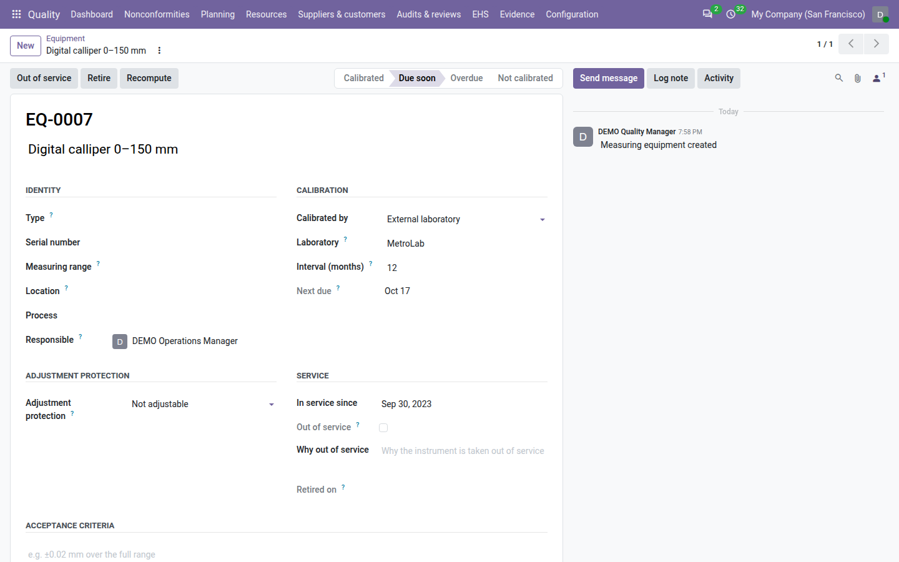
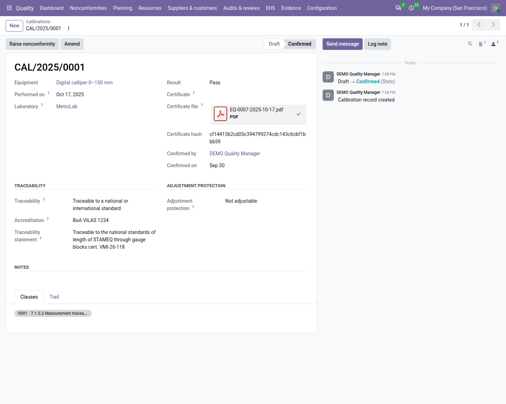

===========
Calibration
===========

ISO 9001 clause 7.1.5 asks that the instruments used to check your products are calibrated at specified intervals
against traceable standards, identified so their status can be seen, protected from adjustments that would invalidate
the calibration, and that you assess what was measured with an instrument found out of tolerance. With **QMS Advanced**
installed, the **Quality** app keeps the register of your measuring equipment, records each calibration with its
certificate, computes each instrument's status every day, and raises a nonconformity when a calibration finds a
problem.

Everything is under :menuselection:`Quality --> Resources --> Equipment`.

Register an instrument
======================

#. Go to :menuselection:`Quality --> Resources --> Equipment --> Equipment` and click :guilabel:`New`.
#. Leave the code empty to have one proposed on save, for example ``EQ-0007``, or type the code already engraved on
   the instrument. The code is unique in the company and never changes afterwards.
#. Enter the description, for example *Digital calliper 0–150 mm*, and, in :guilabel:`Identity`, its
   :guilabel:`Type`, :guilabel:`Serial number`, :guilabel:`Measuring range`, :guilabel:`Location`,
   :guilabel:`Process` and :guilabel:`Responsible` — the internal user who books the calibrations and is reminded.
#. In :guilabel:`Calibration`, choose :guilabel:`Calibrated by`: :guilabel:`External laboratory` (then choose the
   :guilabel:`Laboratory`) or :guilabel:`Internal method` (then choose the controlled document describing the method
   in :guilabel:`Internal method`). Set the :guilabel:`Interval (months)`: 12 by default, at least 1.
#. In :guilabel:`Adjustment protection`, choose how the instrument is protected from adjustments: :guilabel:`None`,
   :guilabel:`Seal`, :guilabel:`Locked setting`, :guilabel:`Password` or :guilabel:`Not adjustable`. For a seal, a
   locked setting or a password, say what protects it and where in :guilabel:`Protection details`, for example *lead
   seal on the adjustment screw*.
#. Check :guilabel:`In service since` and write the :guilabel:`Acceptance criteria`: the tolerance the instrument is
   checked against, for example *±0.02 mm over the full range*.
#. Save.

Clause 7.1.5 of ISO 9001 is proposed on the :guilabel:`Clauses` tab. When the internal method document has no version
in force, the form warns *The method document <code> has no version in force.*

         next due in October, not adjustable, and the status bar on Due soon.

On the laboratory's contact, the :guilabel:`Calibration laboratory` tab records its :guilabel:`Accreditation number`,
:guilabel:`Accreditation body` and :guilabel:`Accreditation valid until`.

Status: may it be used today?
=============================

Odoo computes the :guilabel:`Status` of each instrument from its calibrations and the dates, and refreshes it every
day. The first row that applies wins:

.. list-table::
   :header-rows: 1
   :widths: 20 55 25

   * - Status
     - When
     - May it be used?
   * - **Retired**
     - Its :guilabel:`Retired on` date has come.
     - No
   * - **Out of service**
     - It was put out of service (quarantined).
     - No
   * - **Not calibrated**
     - No calibration is confirmed yet.
     - No
   * - **Out of tolerance**
     - Its last confirmed calibration found it out of tolerance and it was not brought back within tolerance.
     - No
   * - **Overdue**
     - Its next due date has passed.
     - No
   * - **Due soon**
     - Its next due date falls within the :ref:`Due soon window <config-calibration>` (30 days by default).
     - Yes
   * - **Calibrated**
     - Otherwise.
     - Yes

:guilabel:`Next due` is the date of the last calibration that left the instrument fit for use plus the interval. When
the instrument may not be used, its form shows a red **DO NOT USE** banner and the list's :guilabel:`Do not use`
column is on.

For example, *EQ-0007*, calibrated every 12 months, passed its calibration on 2025-10-15: it is due on 2026-10-15. With
the default 30-day window it reads **Calibrated** on 2026-09-10, **Due soon** from 2026-09-15, and **Overdue** from
2026-10-16 if no new calibration was confirmed.

From the day an instrument is due soon or overdue, its responsible gets a *Book the calibration of <code>* to-do. It is
marked done when the next calibration is confirmed. A retired instrument is never reminded.

Out of service and retired
--------------------------

- To quarantine an instrument, write why in :guilabel:`Why out of service` and click :guilabel:`Out of service`. Click
  :guilabel:`Back in service` to use it again: its status is read again from its calibrations and dates.
- A quality manager retires an instrument with :guilabel:`Retire` (*Retire this instrument from today?*). An instrument with calibration records is never
  deleted: retire it.
- :guilabel:`Recompute` (quality managers) reads the status again at once.

Use the :guilabel:`In use` (the default), :guilabel:`Do not use`, :guilabel:`Due soon or overdue` and :guilabel:`My
instruments` filters, or group by :guilabel:`Status` or :guilabel:`Responsible`.

Record a calibration
====================

#. Go to :menuselection:`Quality --> Resources --> Equipment --> Calibrations` and click :guilabel:`New`, or open the instrument's
   :guilabel:`Calibrations` tab.
#. Choose the :guilabel:`Equipment` and enter :guilabel:`Performed on`: the day the calibration was performed, not the
   day the certificate arrived. The due date counts from it.
#. For an external calibration, check the :guilabel:`Laboratory`; for an in-house one, choose who :guilabel:`Performed
   by`.
#. Choose the :guilabel:`Result`: :guilabel:`Pass`, :guilabel:`Adjusted` or :guilabel:`Out of tolerance`. For an
   instrument found out of tolerance and then adjusted or repaired so that it meets the criteria again, tick
   :guilabel:`Within tolerance as left`.
#. Enter the :guilabel:`Certificate` number, for example ``ML-26-4471``, and attach the :guilabel:`Certificate file`.
   An external calibration needs the file.
#. Fill in :guilabel:`Traceability` (see below) and, for a protected instrument, :guilabel:`Adjustment protection`:
   whether the protection was :guilabel:`Found intact`, :guilabel:`Found broken` or :guilabel:`Not applicable`, and
   whether it was restored.
#. For an in-house calibration, describe in :guilabel:`Notes` what was checked, and how.
#. Save. The calibration gets its number, for example ``CAL/2026/0012``, and stays a **Draft**.

Traceability
------------

Every calibration says how it is traceable to measurement standards. Choose the :guilabel:`Traceability`:

- :guilabel:`Traceable to a national or international standard`. For an external calibration, record the laboratory's
  :guilabel:`Accreditation` (proposed from the laboratory) and copy the certificate's :guilabel:`Traceability
  statement`, for example *Traceable to the national standards of length of STAMEQ*. For an in-house calibration,
  choose the :guilabel:`Reference equipment` it was made against, for example a gauge block set: the reference must be
  usable on the day, and its last good calibration is recorded as :guilabel:`Reference calibration` at confirmation.
- :guilabel:`No such standard exists`: write the :guilabel:`Basis used`, in at least 20 characters, for example *the
  customer's master part*.

When the laboratory's accreditation expired before the calibration date, the form warns *<laboratory>'s accreditation
expired on <date>.*; the calibration is not refused. When the same certificate file was already used for another
calibration, the form warns too.

Confirm it
----------

The instrument's responsible or a quality manager clicks :guilabel:`Confirm`. Odoo checks the result, the certificate
file of an external calibration, the notes of an in-house one, the traceability fields and, for a protected
instrument, that the protection was checked. A protection found broken must be restored before confirming, or the
instrument put out of service.

On confirmation, the calibration is locked and its certificate fingerprint (:guilabel:`Certificate hash`) is kept; the
instrument's due date and status move at once. Later corrections of the notes or of the impact assessment go through
:guilabel:`Amend`, with a reason.

         a national standard with the accreditation and the statement, confirmed by and on.

Out of tolerance: the impact assessment
=======================================

When a confirmed calibration finds the instrument out of tolerance, or its adjustment protection broken, Odoo raises one
nonconformity, for example *EQ-0007 out of tolerance on 2026-09-20*, linked both ways: the calibration's
:guilabel:`Nonconformity` smart button opens it, and the nonconformity's :guilabel:`Calibration` smart button opens the
calibration. You can also raise one yourself with :guilabel:`Raise nonconformity`.

Everything measured with the instrument since its last good calibration may be affected. The calibration's
:guilabel:`Impact assessment` section shows the window: :guilabel:`Measurements from` (the last good calibration
before this one, or the day the instrument entered service) :guilabel:`Up to` the calibration date. To record the
assessment:

#. Click :guilabel:`Record impact assessment`.
#. Describe the :guilabel:`Measurements concerned` in at least 20 characters: products, lots, orders, for example
   *Lots L-2201…L-2290 of part 44-17 accepted with EQ-0007*.
#. Choose the :guilabel:`Conclusion`: :guilabel:`No impact`, :guilabel:`Re-inspected, conforming`, :guilabel:`Product
   affected` or :guilabel:`Customer notified`.
#. Click :guilabel:`Record`.

The nonconformity cannot be closed until the assessment is recorded: its closure list says *Record the impact
assessment of <calibration> (measurements from <date> to <date>).* The assessment is recorded once; to change it, use
:guilabel:`Amend`.

Label and register
==================

- **Label.** From an instrument, choose :menuselection:`Print --> Equipment label`: a label with the code, the status,
  the next due date and the adjustment protection, and **DO NOT USE** when the instrument may not be used, to stick on
  the instrument.
- **Register.** Go to :menuselection:`Quality --> Resources --> Equipment --> Calibration register`, choose :guilabel:`From` and
  :guilabel:`To` (the last 12 months by default) and click :guilabel:`Print`. The *Calibration register* PDF lists
  every instrument with its status at the end of the period and the calibrations of the period. The :doc:`audit pack
  <audit_pack>` includes it as ``14_calibration_register.pdf``.

Evidence, review and dashboard
==============================

- **Evidence.** In the :doc:`clause view <clauses>`, an instrument counts for 7.1.5 from its entry into service until it
  is retired, and a calibration in the period it was performed.
- **Retention.** A confirmed calibration record is kept for the retention period of *Calibration records*; the
  :guilabel:`Past retention` filter lists those whose period has ended (see :ref:`documents-retention`).
- **Management review.** Input *9.3.2 c5 — Monitoring and measurement results* shows the equipment in service, its
  status at the end of the period, the calibrations of the period and their results, the instruments overdue at the
  end of the period, and the out-of-tolerance events without impact assessment. With nothing in the period it reads
  *No calibration recorded for the period*. See :doc:`management_reviews`.
- **Dashboard.** The :guilabel:`Calibration due` tile counts the instruments due soon or overdue; its badge says how
  many are overdue (red) and how many are not usable (never calibrated or out of tolerance). A quality user who is not
  an internal auditor, or anyone with :guilabel:`My records`, counts only the instruments they are responsible for.

Who can do what
===============

.. list-table::
   :header-rows: 1
   :widths: 25 75

   * - Role
     - Calibration
   * - **User**
     - Reads the register; as the responsible of an instrument, puts it out of service or back and changes its location.
       Records calibrations, confirms those of the instruments they are responsible for, records impact assessments.
   * - **Internal auditor**
     - Reads the register and the calibration records; does not change them.
   * - **Manager**
     - Everything: registers instruments and changes their calibration settings, confirms any calibration, retires
       instruments, recomputes the status, amends confirmed calibrations.

See :doc:`roles` for the full picture.

.. seealso::
   - :doc:`nonconformities`
   - :doc:`documents`
   - :doc:`management_reviews`
   - :doc:`audit_pack`
