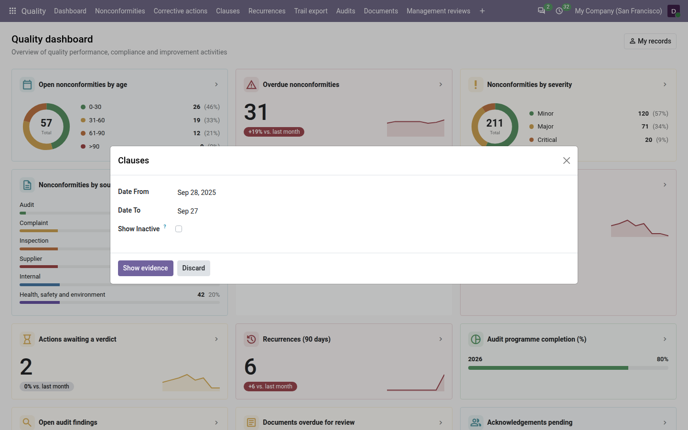
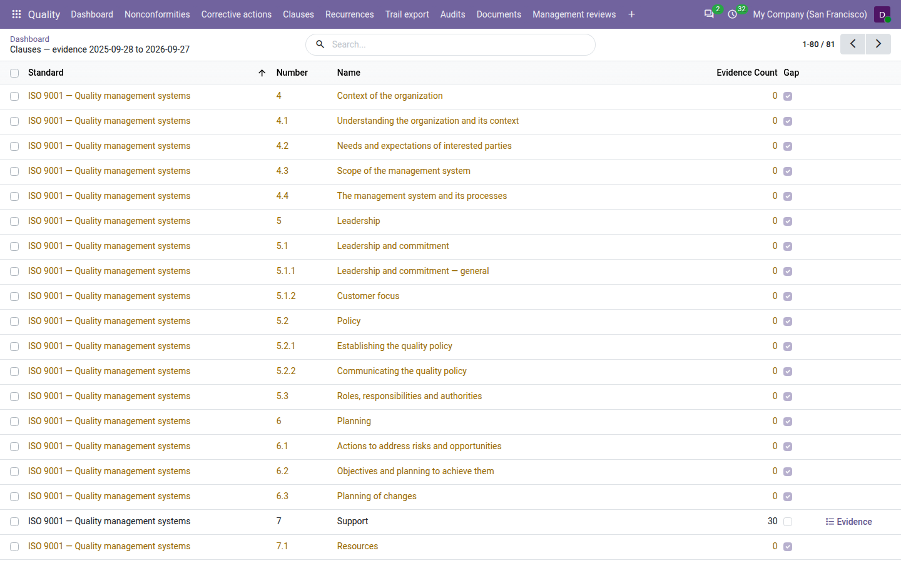
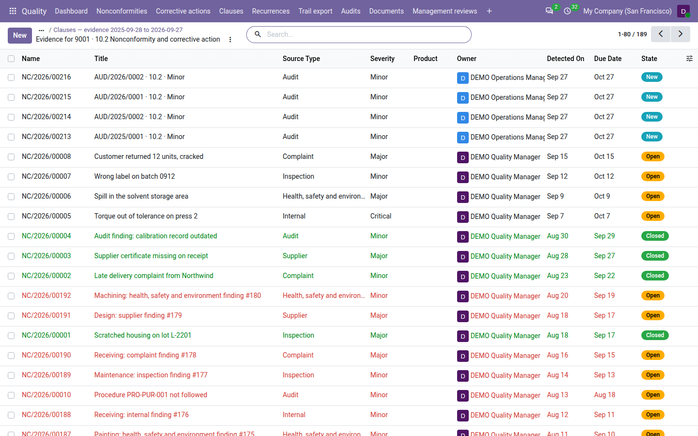
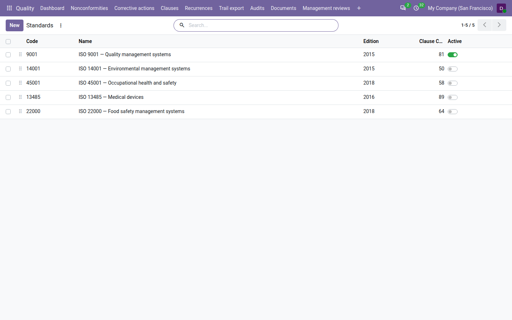

=====================
Clauses and standards
=====================

Auditors read your quality system clause by clause: *show me your evidence for 10.2*. The **Quality** app ships the
clause lists of five ISO management-system standards. You tag each nonconformity with the clauses it is evidence
for, and the clause view shows, for any period, how much evidence each clause has — and which clauses have none.

The standards
=============

.. list-table::
   :header-rows: 1
   :widths: 45 15 15 25

   * - Standard
     - Edition
     - Clauses
     - At installation
   * - ISO 9001 — Quality management systems
     - 2015
     - 81
     - Enabled
   * - ISO 14001 — Environmental management systems
     - 2015
     - 50
     - Disabled
   * - ISO 45001 — Occupational health and safety
     - 2018
     - 58
     - Disabled
   * - ISO 13485 — Medical devices
     - 2016
     - 89
     - Disabled
   * - ISO 22000 — Food safety management systems
     - 2018
     - 64
     - Disabled

Each clause has its number as printed in the standard (for example ``10.2``), a short title, and one sentence saying
what the clause asks for. The titles are paraphrased: the official text of the standards is copyrighted and is not
included. Clauses are organised as a tree: ``10.2`` sits under ``10``.

In pickers and lists, a clause reads as the standard's code, its number and its title, for example
*9001 · 10.2 Nonconformity and corrective action*.

Enable a standard
=================

Only clauses of *enabled* standards can be tagged. To certify against ISO 14001 as well as ISO 9001, for example:

#. Go to :menuselection:`Settings --> Quality`.
#. In :guilabel:`Enabled standards`, add *ISO 14001 — Environmental management systems*.
#. Click :guilabel:`Save`.

Its clauses are now offered wherever clauses are tagged.

To disable a standard, remove it from :guilabel:`Enabled standards` and save. Its clauses are no longer offered, but
records already tagged with them keep their tags. At least one standard must stay enabled.

.. important::
   Enable and disable standards in the settings. A standard switched on only from
   :menuselection:`Quality --> Configuration --> Standards` is switched off again the next time the settings are
   saved.

Tag records with clauses
========================

A nonconformity is tagged in its :guilabel:`Clauses` tab, or in the :guilabel:`Accept` dialog. At least one clause
is required before a nonconformity can be accepted, and it must still be there to close it. See
:doc:`nonconformities`.

- Tag the most precise clause that applies. A record tagged with ``10.2`` also counts as evidence for ``10``.
- Tag several clauses when one problem breaks several requirements, including clauses of different enabled
  standards: a chemical spill might be tagged with both an ISO 14001 and an ISO 45001 clause.
- The :guilabel:`Standards` field under the clauses fills itself with the standards of the tagged clauses.

With **Core QMS** installed, corrective actions, audits, audit findings, audit programmes, processes, documents and
management reviews are tagged the same way, and count as evidence too.

The clause view
===============

#. Go to :menuselection:`Quality --> Clauses`.
#. In the dialog, choose the period with :guilabel:`Date From` and :guilabel:`Date To`. By default it covers the last
   twelve months, ending today.
#. Tick :guilabel:`Show Inactive` to also list the clauses of standards that are not enabled.
#. Click :guilabel:`Show evidence`.

The list, titled *Clauses — evidence* with the period, shows one row per clause:

- :guilabel:`Standard`, :guilabel:`Number` and :guilabel:`Name` of the clause;
- :guilabel:`Evidence Count`: how many records are tagged with this clause or one of its sub-clauses in the period;
- :guilabel:`Gap`: ticked when the clause has no evidence in the period;
- an evidence button, shown when there is at least one record: click it to list them.

How the evidence is counted
---------------------------

- A nonconformity counts in the period when its :guilabel:`Detected On` date falls in it.
- Cancelled nonconformities never count.
- A record tagged with both a clause and one of its sub-clauses counts once for the parent clause.
- Only the records you are allowed to see are counted. A quality user may see lower counts than a quality manager.

Find the gaps
-------------

A *gap* is a clause of an enabled standard with no evidence in the period. Gaps are shown in amber. To list only
them, choose the :guilabel:`Gaps` filter. Clauses of disabled standards, shown with :guilabel:`Show Inactive`, are
never marked as gaps.

.. tip::
   Before a certification audit, open the clause view on the audit period and filter on :guilabel:`Gaps`. Each gap is a
   question the auditor may ask: either find the evidence and tag it, or plan an activity that produces it.

When clauses of more than one standard are listed, the list is grouped by :guilabel:`Standard`. With a single
standard, the clauses show directly. You can also group by :guilabel:`Standard` yourself, or search by
:guilabel:`Number` or :guilabel:`Name`.

Open the evidence of a clause
-----------------------------

Click the evidence button on a clause row. The nonconformities tagged with that clause or its sub-clauses and detected
in the period open in a list; from there, open any of them.

Manage standards and clauses
============================

Quality managers can review the libraries in :menuselection:`Quality --> Configuration --> Standards`. The list shows
every standard, enabled or not, with its :guilabel:`Code`, :guilabel:`Name`, :guilabel:`Edition`, number of clauses
and an :guilabel:`Active` switch. Drag the handle to change the order in which standards are listed.

Open a standard to see its clauses in the :guilabel:`Clauses` tab. You can:

- add a clause with its :guilabel:`Number`, :guilabel:`Name`, :guilabel:`Intent` (one sentence) and
  :guilabel:`Parent` clause;
- create a new standard, for example an internal or customer-specific requirement set, with a :guilabel:`Name` and a
  unique :guilabel:`Code`. Then enable it in the settings.

A clause number must be unique within its standard. A clause that is already tagged on a record cannot be deleted:
disable its standard instead.

.. note::
   The clause titles and intents of the shipped standards are translated with the app (French, German, Spanish and
   Vietnamese). When the app is updated, the shipped titles and intents may be restored: to use your own wording,
   prefer adding your own clauses or your own standard.

.. seealso::
   - :doc:`nonconformities`
   - :doc:`configuration`
   - :doc:`audit_pack`
