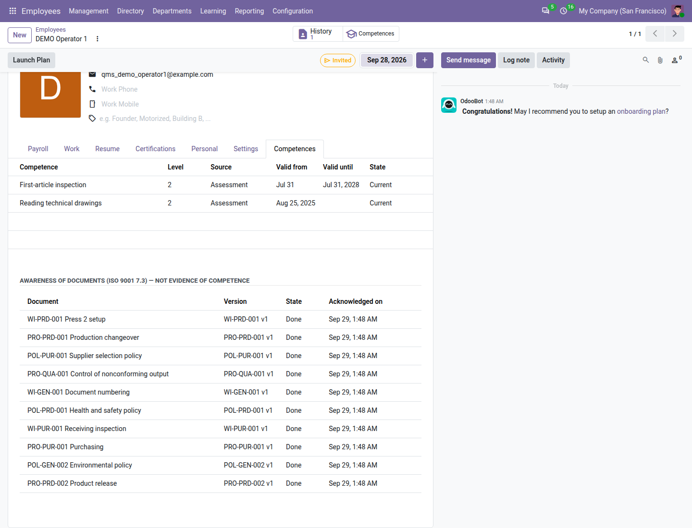
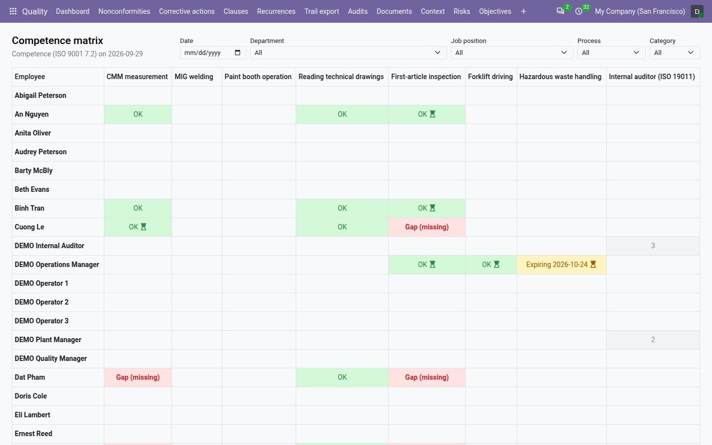

=====================
Training & Competence
=====================

ISO 9001 clause 7.2 asks you to determine the competence each job needs, to make sure people are competent on the
basis of education, training or experience, to act when they are not and check that the action worked, and to keep
evidence of it. The **Training & Competence** add-on does this in the **Quality** app: a catalogue of competences, the
level each job and each process requires, each person's competence records with their evidence and validity,
trainings with each attendee's result and a later check that the training worked, the competence matrix, and the
internal auditor qualification that the audits read.

The add-on is free with **QMS Advanced**. It needs the **Employees** app, and it is installed separately, on purpose:
search for *QMS — Training & Competence* in **Apps**. It is never installed automatically, because it changes one rule
of the audits the day it arrives (see `What changes for audits`_). People are employees, so staff who never log in to
Odoo are covered too.

.. important::
   **Awareness of documents (ISO 9001 7.3) — not evidence of competence.** A *read and understood* acknowledgement of a
   controlled document shows that a person was made aware of it. It never creates, extends or counts as a competence
   record: the matrix never shows acknowledgements, and the employee's form lists them apart under that heading.

Everything is under :menuselection:`Quality --> Competence`; the catalogue and the requirements are under
:menuselection:`Quality --> Configuration`.

The competence catalogue
========================

#. Go to :menuselection:`Quality --> Configuration --> Competences` and click :guilabel:`New`.
#. Name the competence, for example *CMM measurement*, and give it a :guilabel:`Code` if you like, for example ``CMM``
   (unique in the company).
#. Choose the :guilabel:`Category`: :guilabel:`Technical`, :guilabel:`Quality`, :guilabel:`Safety`,
   :guilabel:`Regulatory`, :guilabel:`Auditor` or :guilabel:`Other`. The matrix groups competences by category.
#. Set the :guilabel:`Validity (months)`: how long a record of this competence stays valid, for example 24. 0 means
   records never expire. A change applies to new records only.
#. Check the words of the three :guilabel:`Levels`: 1 *Learning (supervised)*, 2 *Competent*, 3 *Expert (can train or
   lead)* by default.
#. Describe what *competent* means and how it is assessed.
#. Save. Clause 7.2 is proposed.

The add-on ships one competence, *Internal auditor (ISO 19011)*, of category :guilabel:`Auditor`, valid 36 months, with
:guilabel:`Internal auditor qualification` ticked: it is the competence the audits read. Each company has at most one
such competence.

Requirements: who needs what
============================

#. Go to :menuselection:`Quality --> Configuration --> Requirements` and click :guilabel:`New`, or open a competence and
   its :guilabel:`Required by` tab.
#. Choose the :guilabel:`Competence` and either a :guilabel:`Job` (every employee in that job) or a :guilabel:`Process`
   (everyone working in it: its owner and its auditees) — one or the other, not both.
#. Choose the :guilabel:`Required level`, for example 2, and say why in :guilabel:`Note`.

For example, the job *Quality inspector* requires *CMM measurement* at level 2, and so does the process *Final
inspection*. When several requirements apply to a person, the highest level counts. Archiving a requirement is noted on
the competence.

Competence records
==================

A competence record is the evidence that an employee holds a competence at a level from a date until an expiry.

.. list-table::
   :header-rows: 1
   :widths: 25 45 30

   * - Source
     - What it rests on
     - Who records it
   * - :guilabel:`Training`
     - The passed attendance of a training marked done.
     - Created by :guilabel:`Mark done` only.
   * - :guilabel:`Assessment`
     - What was observed on the job, and where.
     - A quality manager or the employee's manager.
   * - :guilabel:`Prior education or experience`
     - The diploma, the previous employer, the courses.
     - A quality manager.
   * - :guilabel:`Signed qualification`
     - The internal auditor qualification, granted with a signature.
     - A quality manager (see `Auditor qualification`_).

To record an assessment or prior experience:

#. Go to :menuselection:`Quality --> Competence --> Competence records` and click :guilabel:`New`, or use the
   :guilabel:`Competences` smart button of the employee.
#. Choose the :guilabel:`Employee`, the :guilabel:`Competence`, the :guilabel:`Level` and the :guilabel:`Source`.
#. Write the :guilabel:`Evidence` and attach the :guilabel:`Certificates`; name who :guilabel:`Assessed by` — nobody
   assesses their own competence.
#. Check :guilabel:`Valid from` and :guilabel:`Valid until`, proposed from the competence's validity.
#. Save. The record gets its number, for example ``CR/2026/0015``, and is **Current**.

A record is evidence: it never changes in substance and is never deleted.

- A new record of the same employee and competence **supersedes** the current one, even at a lower level; the old one
  shows :guilabel:`Superseded on`.
- A quality manager or the employee's manager **revokes** a record that no longer holds with :guilabel:`Revoke` and a
  reason of at least ten characters. It cannot be undone: grant a new record instead.
- The evidence and certificates are corrected with :guilabel:`Amend`, with a reason.

:menuselection:`Quality --> Competence --> My competences` lists your own current records, read-only. The filters
:guilabel:`Current`, :guilabel:`Expired`, :guilabel:`Superseded`, :guilabel:`Revoked` and :guilabel:`Past retention`
help in the full list.

On the employee's form, the :guilabel:`Competences` tab lists the person's records and, under the heading *Awareness of
documents (ISO 9001 7.3) — not evidence of competence*, the documents they acknowledged.

         awareness heading, the documents the employee acknowledged.

Trainings
=========

.. list-table::
   :header-rows: 1
   :widths: 15 85

   * - State
     - Meaning
   * - **Planned**
     - Recorded, with its attendees. It can still change.
   * - **Done**
     - Marked done by a quality manager: the records of the attendees who passed are created. It is locked.
   * - **Cancelled**
     - Cancelled with a reason; it did not take place.

#. Go to :menuselection:`Quality --> Competence --> Trainings` and click :guilabel:`New` (quality managers).
#. Enter the :guilabel:`Course`, for example *CMM level 2 course*, the :guilabel:`Date` (and :guilabel:`End date` for a
   training over several days), the :guilabel:`Duration (hours)` and the :guilabel:`Method`: :guilabel:`Classroom`,
   :guilabel:`On the job`, :guilabel:`E-learning`, :guilabel:`External course` or :guilabel:`Document briefing`.
#. Choose the :guilabel:`Trainer` (an employee's work contact or an external trainer) and, if any, the
   :guilabel:`Training provider`.
#. Choose the :guilabel:`Competences taught` and the :guilabel:`Level granted`, and, if useful, the :guilabel:`Documents
   taught`.
#. On the :guilabel:`Attendees` tab, add the employees. The trainer cannot attend their own training.
#. After the training, give each attendee a :guilabel:`Result`: :guilabel:`Passed`, :guilabel:`Failed`,
   :guilabel:`Attended` or :guilabel:`Absent`, and, if any, the score, the certificate and its file, and a
   :guilabel:`Valid until` that overrides the competence's validity.
#. Click :guilabel:`Mark done` and confirm *Grant the competences to every attendee who passed?*

Odoo checks that every attendee has a result; an external course needs a certificate for every attendee who passed.
Then only the attendees who **passed** get a competence record of each competence taught, at the level granted, source
*Training*. Attending is not competence: *Attended* grants nothing. A done training is never cancelled or deleted; to
undo its effect for one person, revoke their record.

For example, the *CMM level 2 course* on 2026-09-10 has three attendees: the two who passed get a *CMM measurement*
record at level 2 valid until 2028-09-10, with their certificate; the one who failed gets none.

Check that the training worked
------------------------------

ISO 9001 asks you to evaluate the effectiveness of the actions taken. Each attendee who passed has an effectiveness
evaluation **Pending** until the :guilabel:`Evaluation due` date — 90 days after the training by default (the
:ref:`Training effectiveness <config-training>` setting). On that date, the employee's manager (or, without one, the
quality managers) gets an *Evaluate the training of <employee>* to-do.

#. Click :guilabel:`Evaluate` on the attendee's line, or open the to-do.
#. Choose the verdict, :guilabel:`Effective` or :guilabel:`Not effective`, and write what was observed on the job, at
   least ten characters.
#. Click :guilabel:`Record verdict`.

The verdict is final. A **not effective** verdict revokes the competence records the training granted, and the gap
reappears in the matrix. Nobody evaluates their own training, and the trainer does not evaluate it either. The
:guilabel:`Evaluation pending` filter of the attendances lists what is still to evaluate.

The competence matrix
=====================

Go to :menuselection:`Quality --> Competence --> Matrix`. The matrix shows, headed *Competence (ISO 9001 7.2) on
<date>*, one row per employee you may see and one column per competence that is required or held. An employee with
nothing required and nothing held has an empty row (the printed matrix leaves such employees out). Each cell reads:

.. list-table::
   :header-rows: 1
   :widths: 30 70

   * - Cell
     - Meaning
   * - *OK*
     - The competence is required and a valid record meets the required level.
   * - *Expiring <date>*
     - Met, but the record expires within the :ref:`Expiry warning <config-training>` (60 days by default).
   * - *Gap (level 2 of 3)*
     - A valid record exists, at a lower level than required.
   * - *Gap (expired <date>)*
     - The last record ended on that date and nothing replaced it.
   * - *Gap (missing)*
     - Required, never recorded.
   * - A level, in grey
     - Held but not required.

An hourglass on a cell means the effectiveness of the training behind it is still to be evaluated; hover a cell to see
its source and assessor, click it to open the record. Choose another :guilabel:`Date` to see the matrix on that day.
Quality managers and internal auditors see every employee of their companies; another user sees the employees they
manage. The filters above the matrix narrow those rows and combine with each other:

- :guilabel:`Department` keeps the employees of that department and of the departments under it.
- :guilabel:`Job position` keeps the employees holding that job position.
- :guilabel:`Process` keeps the employees whose user owns the process or is one of its auditees (employees without a
  user never belong to a process).
- :guilabel:`Category` keeps the competence columns of that category.

Each list offers only the departments, job positions and processes of the employees you may see; :guilabel:`All`
lifts the filter.

         (missing) in their colours, an hourglass where a training's evaluation is pending, and in grey a level held but
         not required.

Reminders
---------

Before a record of a required competence expires — 60 days before by default — the employee's manager, or without one
the quality managers, gets a *Renew <competence> of <employee>* to-do, due on the expiry date. It is marked done when a
new record renews it.

Auditor qualification
=====================

The internal auditor qualification is recorded as a signed competence record:

#. Go to :menuselection:`Quality --> Competence --> Grant auditor qualification` (quality managers).
#. Choose the :guilabel:`Employee` and the :guilabel:`Level`: 2 audits as a co-auditor, 3 leads an audit.
#. Write the :guilabel:`Evidence`: courses followed, audits observed or led, the ISO 19011 criteria met, and attach the
   certificates.
#. Check :guilabel:`Valid from` and :guilabel:`Valid until` (empty: 36 months as shipped).
#. Click :guilabel:`Sign and grant` and, when Odoo asks for it, enter your password.

The record's signature reads *Auditor qualification*. An employee without a user is warned: *No user: this person
cannot be selected as an auditor.* A training that teaches the auditor competence, marked done, grants signed
qualifications too. On an auditor's record, the :guilabel:`Audits performed` tab lists the audits they led or co-audited,
as supporting evidence.

What changes for audits
-----------------------

Once the add-on is installed, an audit whose lead auditor is not qualified cannot start:

- a planned audit warns about every auditor not qualified for its planned month;
- :guilabel:`Start` is refused when the lead auditor has no current qualification of the level to lead (3 by default)
  on the start date: *<user> cannot lead this audit: <reason> Record the qualification or change the lead auditor.* The
  reason reads, for example, *No current auditor qualification on 2026-10-01.*, *Auditor qualification level 2;
  leading needs 3.* or *No employee record for <user> in <company>.*;
- a co-auditor below the level to audit (2 by default) is noted as an auditor in training, without stopping the audit;
- the audit report prints each auditor's qualification line, and an audit programme lists a lead auditor not qualified
  as a deviation.

**First step after installing:** record the qualifications of your internal auditors before the next audit starts.
The levels are set in :ref:`Internal auditor levels <config-training>`. See :ref:`audits-qualification`.

Print and audit pack
====================

:menuselection:`Quality --> Competence --> Print competence and training` prints, for the dates you choose, the matrix at
the end of the period (only the employees with at least one requirement) and the trainings of the period with each attendee's result and effectiveness verdict, headed
*Competence (ISO 9001 7.2)*. The :doc:`audit pack <audit_pack>` includes it as ``13_competence_and_training.pdf``, apart
from the acknowledgement matrix (file 05), which is evidence of awareness only.

Evidence, retention and dashboard
=================================

- **Evidence.** A competence record counts for clause 7.2 in the :doc:`clause view <clauses>` from its first valid day
  to its last; a training in the period of its date.
- **Retention.** *Competence records* are kept from the day they were superseded or revoked; *Training attendances*
  from the employee's departure. See :ref:`documents-retention`.
- **Dashboard.** :guilabel:`Competence gaps` counts the gap cells of the matrix (red when there are some),
  :guilabel:`Qualifications expiring` the expiring cells, and :guilabel:`Training evaluations due` the evaluations
  whose date has come.

Who can do what
===============

.. list-table::
   :header-rows: 1
   :widths: 25 75

   * - Role
     - Training & Competence
   * - **User**
     - Reads the catalogue, the requirements, the records and the trainings; sees their own competences. As an
       employee's manager: records assessments, revokes records and evaluates trainings of the people they manage, and
       sees them in the matrix.
   * - **Internal auditor**
     - Reads everything, including the whole matrix.
   * - **Manager**
     - Everything: manages the catalogue and the requirements, records prior experience, plans, marks done and cancels
       trainings, grants auditor qualifications (signed), revokes and amends records.

See :doc:`roles` for the full picture.

.. seealso::
   - :doc:`audits`
   - :doc:`documents`
   - :doc:`audit_pack`
   - :doc:`configuration`
