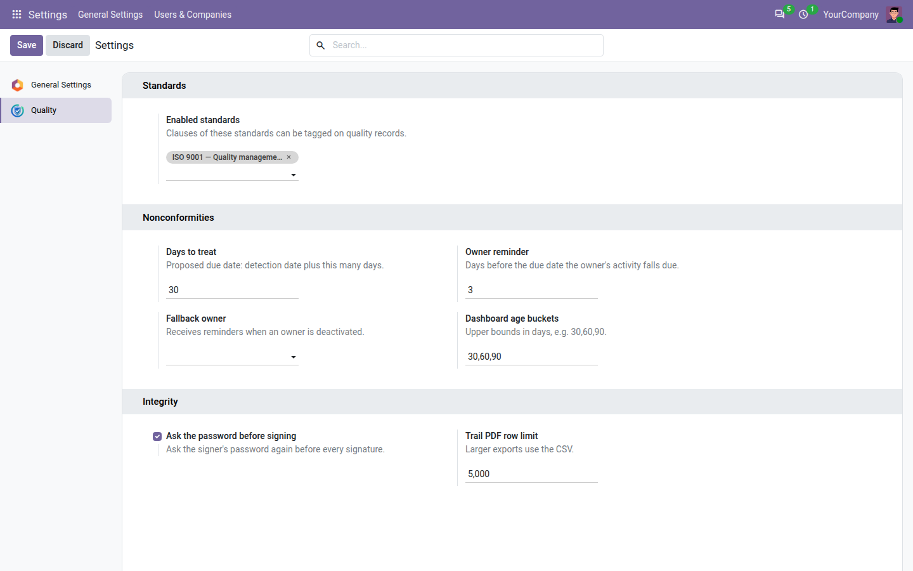

=============
Configuration
=============

This page explains how to install the **Quality** app, the order in which to set it up, and every setting of the
free core.

Install the app
===============

#. Go to the **Apps** app.
#. Search for *Quality Management System* and click :guilabel:`Activate` on *Quality Management System — Core*.

The **Quality** menu appears in the main menu. The app needs nothing but a standard Odoo Community database: no
Enterprise module and no connection to any outside service.

At installation:

- the administrator becomes a quality manager;
- ISO 9001 is enabled, and the four other standards are installed but disabled (see :doc:`clauses`);
- the settings take the default values listed below;
- the free source modules install themselves for the apps already present (Inventory, Manufacturing, Purchase,
  Repairs), and later for any of these apps you install afterwards. See :doc:`sources`.

.. note::
   The app is available in English, French, German, Spanish and Vietnamese. Add the language in the Settings app
   and choose it in the user's preferences.

First-time setup
================

Follow this order the first time:

#. **Give people their roles.** Go to :menuselection:`Settings --> Users & Companies --> Users`, open each user and
   set their **Quality** role: :guilabel:`User` for people who raise and treat nonconformities,
   :guilabel:`Internal auditor` for people who must read every nonconformity, :guilabel:`Manager` for people who
   close, cancel, amend and configure. See :doc:`roles`.
#. **Enable your standards** in :menuselection:`Settings --> Quality`: add ISO 14001, 45001, 13485 or 22000 if you
   certify against them. See :doc:`clauses`.
#. **Check the nonconformity settings**: days to treat, owner reminder, fallback owner and dashboard age buckets (see
   below).
#. **Decide on the password check** for signatures. Leave it on unless your users sign in through single sign-on.
#. **Record or raise your first nonconformity.** See :doc:`nonconformities`.

Settings
========

Go to :menuselection:`Settings --> Quality`. The section is visible to quality managers only.

.. important::
   Odoo opens the Settings app only to users with the *Administration: Settings* right. A quality manager without
   that right cannot change these settings: ask your administrator.

Every value is checked when you click :guilabel:`Save`; a wrong value is refused with a message, and nothing is
saved.

Standards
---------

.. _config-standards:

:guilabel:`Enabled standards`
   The standards whose clauses can be tagged on quality records.

   - Default: ISO 9001.
   - Allowed: any of the installed standards; at least one must stay enabled. Saving with none is refused with
     *At least one standard must be enabled.*
   - Disabling a standard hides its clauses from the pickers; records already tagged keep their tags.
   - Example: add *ISO 45001 — Occupational health and safety* to tag health and safety events with ISO 45001
     clauses.

Nonconformities
---------------

.. _config-days-to-treat:

:guilabel:`Days to treat`
   The due date proposed for a new nonconformity: its detection date plus this many days. It is used only when the
   due date is left empty; you can always change the due date on the record or in the :guilabel:`Accept` dialog.

   - Default: 30.
   - Allowed: 0 or more. 0 means the same day as detection.
   - Example: with 14, a nonconformity detected on 3 March is due on 17 March.

.. _config-owner-reminder:

:guilabel:`Owner reminder`
   When a nonconformity is accepted, its owner receives a *Nonconformity to treat* activity. This setting is how many
   days before the nonconformity's due date that activity falls due.

   - Default: 3.
   - Allowed: 0 or more. 0 makes the activity due on the due date itself.
   - Example: with 5, a nonconformity due on 20 March gives the owner an activity due on 15 March.

.. _config-fallback-owner:

:guilabel:`Fallback owner`
   The user who receives the overdue reminder of a nonconformity whose owner has been deactivated, for example
   someone who left the company.

   - Default: empty. The reminder then goes to the first active quality manager of the nonconformity's company.
   - Allowed: any internal user.
   - Example: set it to your quality coordinator so that orphaned nonconformities land on one desk.

.. _config-age-buckets:

:guilabel:`Dashboard age buckets`
   How the :guilabel:`Open nonconformities by age` tile of the :doc:`dashboard` splits open nonconformities by the
   number of days since detection. Enter the upper limit of each bucket, in days, separated by commas; a last bucket
   collects everything older.

   - Default: ``30,60,90``, which gives 0-30, 31-60, 61-90 and over 90 days.
   - Allowed: whole numbers above zero, each larger than the one before. ``30,30,90`` or ``90,60`` are refused with
     *Age buckets must be a strictly increasing list of positive day counts, e.g. 30,60,90.*
   - Example: ``7,14,30`` gives 0-7, 8-14, 15-30 and over 30 days.

Integrity
---------

.. _config-password:

:guilabel:`Ask the password before signing`
   When ticked, every signature — closing a nonconformity, amending a closed record and, with **Core QMS**, the other
   signed decisions — asks the signer for their own password first. See :doc:`trail`.

   - Default: ticked.
   - Untick it only on installations where users sign in through single sign-on and have no Odoo password.
   - Every change of this setting is recorded in the trail, with who changed it and when, and appears in the
     :menuselection:`Quality --> Trail export` of that period.

.. _config-trail-pdf-limit:

:guilabel:`Trail PDF row limit`
   The largest number of rows a trail PDF may contain. A larger export is refused as a PDF; use the CSV export,
   which has no limit, or a shorter period.

   - Default: 5000.
   - Allowed: 100 or more.
   - Example: raise it to 20000 if your auditor wants a whole year of trail on paper and your server copes with it.

Settings of Core QMS
--------------------

With **Core QMS** installed, the same page shows more blocks. They are explained with their features:

- :guilabel:`Corrective actions` (effectiveness gap, reminder interval, recurrence window, severities needing a
  corrective action) — see :doc:`corrective_actions`.
- :guilabel:`Documents` (review period, acknowledgement grace, controlled-copy stamp) — see :doc:`documents`.
- :guilabel:`Management review` (review interval, review reminder) — see :doc:`management_reviews`.
- :guilabel:`Audit pack` (longest period, time cap, NC log rows per file) — see :doc:`audit_pack`.

Internal audits have no settings of their own; their configuration menus are described in :doc:`audits`.

Other configuration menus
=========================

:menuselection:`Quality --> Configuration --> Standards`
   The standards and their clause libraries. Visible to quality managers only. See :doc:`clauses`.

Scheduled action
   Odoo runs *QMS: overdue nonconformities* once a day. It marks nonconformities that became overdue and sends their
   owners a reminder. See :doc:`nonconformities`. It is active from installation; there is nothing to set up.

Demo data
=========

When the app is installed on a database created with demo data, it adds a demonstration register:

- a quality manager called *DEMO Quality Manager* (login ``qms_demo_manager``), who owns every demo nonconformity;
- twelve nonconformities covering all six source types and the three severities; every accepted one is tagged with
  ISO 9001 clause 10.2:

  - four **closed** and signed, with a complete treatment;
  - six **open**, two of them **overdue**;
  - two **new**, waiting to be accepted.

One open nonconformity, *Wrong label on batch 0912*, has its treatment complete and its activity done: a manager can
close it straight away to see the signature at work.

The demo nonconformities fill the :doc:`dashboard` and the :doc:`clause view <clauses>` from the first minute. The
demo closures were signed without a password, since nobody could type one while the data was loaded.

.. seealso::
   - :doc:`roles`
   - :doc:`clauses`
   - :doc:`trail`
   - :doc:`dashboard`
