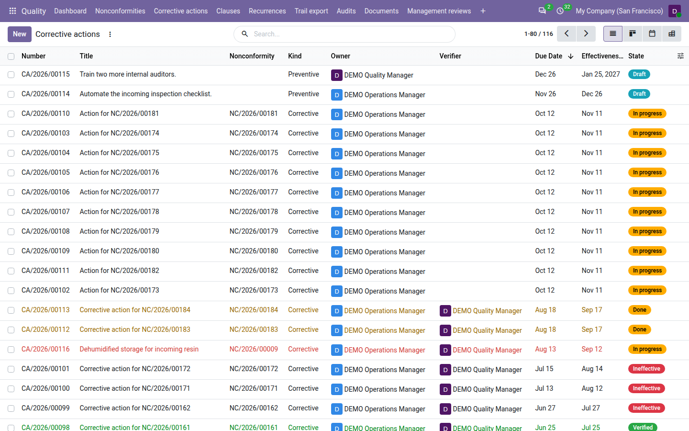
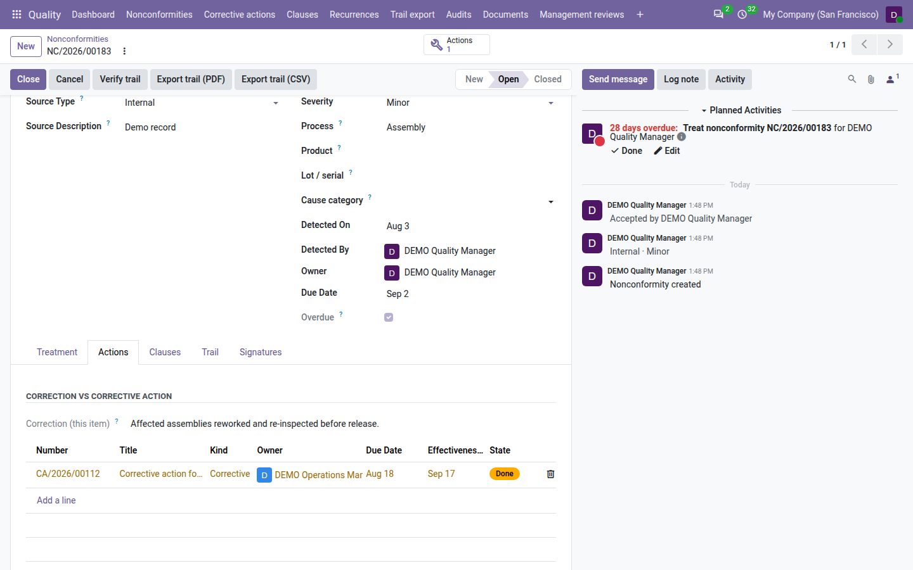
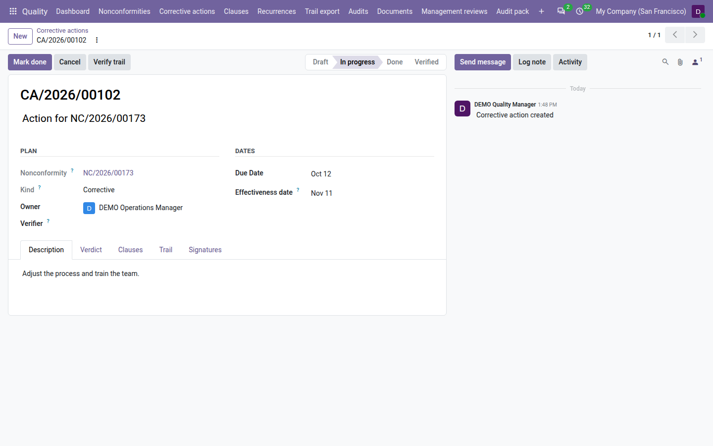
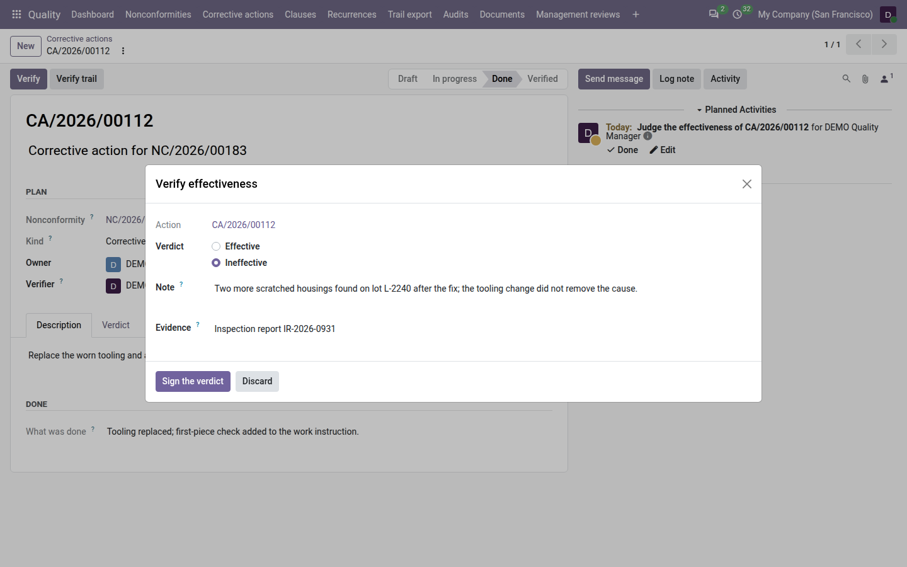
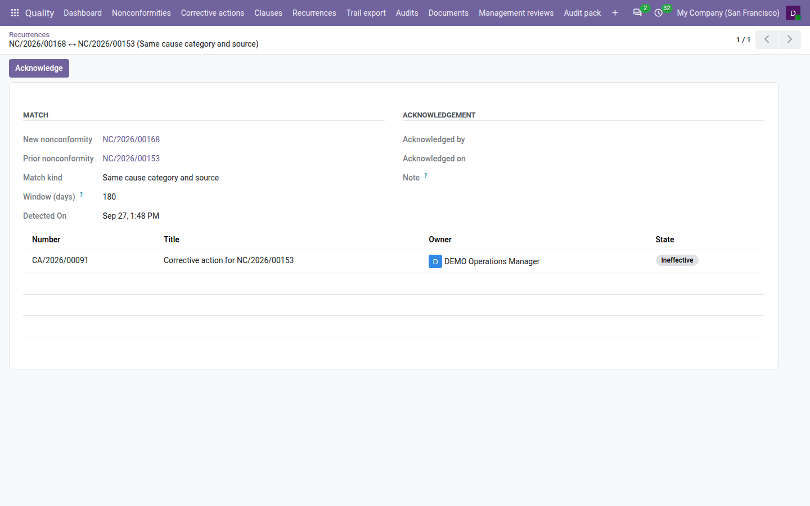
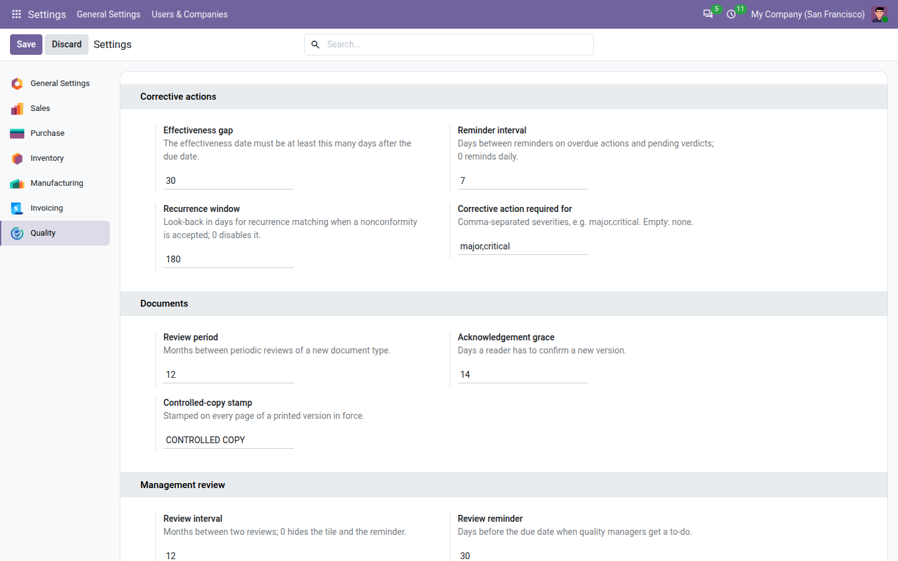

==================
Corrective actions
==================

A *correction* fixes the nonconforming item: the wrong label is replaced. A *corrective action* removes the cause,
so that the problem does not come back: the labelling step gets a second check. ISO 9001 clause 10.2 asks for both,
and asks you to check afterwards that the corrective action actually worked.

With **Core QMS** installed, each nonconformity can carry corrective actions. Every action has an owner who carries
it out, a due date, an *effectiveness date* on which its effect can be judged, and a *verifier* — someone other than
the owner — who signs the verdict. The nonconformity cannot be closed while one of its corrective actions is still
waiting for that verdict.

Every action moves through these states:

.. list-table::
   :header-rows: 1
   :widths: 15 85

   * - State
     - Meaning
   * - **Draft**
     - Planned, not started yet.
   * - **In progress**
     - The owner is carrying it out.
   * - **Done**
     - The owner has finished and said what was done. The action now waits for its effectiveness verdict.
   * - **Verified**
     - The verifier signed it *effective*. The record is locked.
   * - **Ineffective**
     - The verifier signed it *ineffective*, or the same problem came back (see `Recurrences`_). The record is
       locked.
   * - **Cancelled**
     - Abandoned by a quality manager, with a reason. The number is kept.

Actions are numbered per company and year, for example ``CA/2026/00012``.

         effectiveness date and state; overdue rows in red, rows awaiting a verdict in amber.

Corrective or preventive
========================

The :guilabel:`Kind` of an action is either :guilabel:`Corrective` or :guilabel:`Preventive`:

- A **corrective** action removes the cause of this nonconformity. Only corrective actions count when the
  nonconformity is closed.
- A **preventive** action acts on a *potential* cause, for example a similar machine that has not failed yet. It is
  tracked, reminded and verified like any other action, but it never blocks or allows the closure of the
  nonconformity.

The kind is fixed once the action has started.

.. tip::
   Preventive actions can also come from a management review, without any nonconformity. See
   :doc:`management_reviews`.

Add an action to a nonconformity
================================

Actions are added to a nonconformity that has been accepted, that is, one in the **Open** state. A new nonconformity
must be accepted first, and a closed one takes no new action: raise a new nonconformity instead. Only the owner of
the nonconformity or a quality manager can add an action to it.

#. Open the nonconformity and go to the :guilabel:`Actions` tab. The tab also shows the :guilabel:`Correction (this
   item)` already recorded in the treatment, so that the correction and the corrective action are not confused.
#. Click :guilabel:`Add a line`. Odoo fills in what it can from the nonconformity:

   - the :guilabel:`Clauses` of the nonconformity;
   - the :guilabel:`Owner`: the owner of the nonconformity;
   - the :guilabel:`Due Date`: the due date of the nonconformity;
   - the :guilabel:`Effectiveness date`: the due date plus the *effectiveness gap* (30 days by default, see
     `Settings`_).

#. Enter a :guilabel:`Title`, one line saying what will be done, and a :guilabel:`Description`: what will be changed
   so that the cause disappears.
#. Check the :guilabel:`Kind`, the :guilabel:`Owner` and the dates, and choose the :guilabel:`Verifier`: the person who
   will judge whether the action worked. The verifier cannot be the owner.
#. Save. The action gets its number and starts in the **Draft** state.

The :guilabel:`Actions` smart button at the top of the nonconformity counts its actions (cancelled ones excluded) and
opens them.

         actions with their owner, due date, effectiveness date and state.

.. note::
   The :guilabel:`Effectiveness date` must be at least the effectiveness gap after the :guilabel:`Due Date`. With the
   default gap of 30 days, an action due on 1 March can be judged on 31 March at the earliest. If you move the due
   date, move the effectiveness date too, or Odoo refuses to save.

.. tip::
   You can also create an action from :menuselection:`Quality --> Corrective actions` by clicking :guilabel:`New` and
   choosing the :guilabel:`Nonconformity`. Creating it from the nonconformity's :guilabel:`Actions` tab is quicker:
   the owner, dates and clauses are proposed for you.

Carry it out
============

#. Open the action and click :guilabel:`Start`. The action moves to **In progress**. At least one clause must be
   tagged on the :guilabel:`Clauses` tab.
#. Do the work.
#. Click :guilabel:`Mark done`. In the dialog, describe :guilabel:`What was done` — what was actually changed, which
   may differ from the plan — and click :guilabel:`Mark done`. The action moves to **Done** and records when it was
   done.

Only the owner of the action, or a quality manager, can start it and mark it done: the :guilabel:`Start` and
:guilabel:`Mark done` buttons are shown to them only. :guilabel:`What was done` is required.

.. note::
   An action that is still **In progress** after its due date is *overdue*. It shows in red in the register and counts
   in the :guilabel:`Overdue corrective actions` tile of the :doc:`dashboard`. An action in **Draft** does not count as
   overdue, and neither does an action already marked done.

         Description, Verdict, Clauses, Trail and Signatures tabs.

Verify its effectiveness
========================

Marking an action done is a promise, not a proof. The *verdict* says whether the cause is really gone, and it is
signed.

An action can be verified when all of the following are true:

- it is **Done**;
- today is on or after its :guilabel:`Effectiveness date`. Before that, Odoo says from which date effectiveness can
  be judged;
- you are **not** the owner of the action. The :guilabel:`Verify` button is hidden from the owner. This holds even
  for a quality manager who owns the action;
- you are the :guilabel:`Verifier` of the action, or a quality manager. The :guilabel:`Verify` button is shown to
  them only.

To record the verdict:

#. Open the action and click :guilabel:`Verify`.
#. Choose the verdict: :guilabel:`Effective` or :guilabel:`Ineffective`.
#. Write a :guilabel:`Note` saying what you observed. The note is required when the verdict is ineffective.
#. In :guilabel:`Evidence`, say where the evidence lives: a record, a document, a measurement, for example
   *SPC chart line 2, weeks 12–16*.
#. Click :guilabel:`Sign the verdict`. When Odoo asks for your password, enter your own.

         and the Sign the verdict button.

The action moves to **Verified** or **Ineffective** and is locked. The :guilabel:`Verdict` tab shows the verdict, who
gave it and when, the note and the evidence, and the :guilabel:`Signatures` tab shows the signature, with the reason
*Effectiveness verdict*.

.. note::
   A **Done** action without a verdict whose effectiveness date has arrived is *awaiting verdict*. It shows in amber
   in the register and counts in the :guilabel:`Actions awaiting a verdict` tile of the :doc:`dashboard`. The
   :guilabel:`To verify (me)` filter lists the ones waiting for you.

.. note::
   Whether Odoo asks for the password is a setting: :guilabel:`Ask the password before signing` in the
   :guilabel:`Integrity` block of the Quality settings. It is on by default. See :doc:`configuration`.

When an action is ineffective
=============================

If the fix did not work, the cause was wrong or incomplete. When an action is judged ineffective, Odoo reopens the
root-cause analysis of its nonconformity:

- a red :guilabel:`Root cause to revisit` ribbon appears on the nonconformity, and the :guilabel:`Root cause to
  revisit` box is ticked;
- a note quoting the verdict is posted in the nonconformity's chatter;
- the owner of the nonconformity receives a *Revisit the root cause* activity.

While the ribbon is shown, the nonconformity cannot be closed: :guilabel:`Close` lists *Revisit the root cause*. The
flag clears by itself when both of these are done:

#. The :guilabel:`Root Cause` on the :guilabel:`Treatment` tab has been changed since the action was judged
   ineffective.
#. A new **corrective** action on the nonconformity has been started (:guilabel:`Start`).

Starting a new action without changing the root cause leaves the flag on: the same analysis would lead to the same
fix.

The ineffective action itself stays on the nonconformity, locked, as the record of what was tried. To close the
nonconformity, the new corrective action — the one you added after the ineffective one — must be verified
**Effective**: until then :guilabel:`Close` lists *Add a new corrective action and verify that it works*. So the
full path after an ineffective verdict is:

#. Revise the :guilabel:`Root Cause`.
#. Add a new corrective action and :guilabel:`Start` it (the ribbon clears).
#. Carry it out, :guilabel:`Mark done`, and have it verified **Effective**.
#. Close the nonconformity.

.. tip::
   The :guilabel:`Root cause to revisit` filter in :menuselection:`Quality --> Nonconformities` lists every
   nonconformity whose analysis has been reopened.

Closing the nonconformity
=========================

With **Core QMS** installed, :guilabel:`Close` on a nonconformity checks its corrective actions as well as its
treatment. Odoo refuses to close and lists what is missing when:

- a corrective action is still waiting for its verdict (**Draft**, **In progress** or **Done**) — *Verify
  effectiveness of every corrective action*;
- a corrective action was judged **Ineffective** and no corrective action added after it has been verified
  **Effective** — *Add a new corrective action and verify that it works*. An action verified before the ineffective
  one does not count: it is not the replacement;
- the nonconformity's severity requires a corrective action and none is **Verified** yet — *Add and verify a
  corrective action*. By default this applies to **Major** and **Critical** nonconformities; see the
  :guilabel:`Corrective action required for` setting;
- its root cause has been reopened — *Revisit the root cause*.

.. list-table:: Examples with the default setting
   :header-rows: 1
   :widths: 20 45 35

   * - Severity
     - Corrective actions
     - Can it close?
   * - Minor
     - None
     - Yes: the correction may be enough.
   * - Minor
     - One **Done**, verdict not given yet
     - No: verify it first.
   * - Major
     - None
     - No: add and verify a corrective action.
   * - Major
     - One **Verified**, one **Cancelled**
     - Yes.
   * - Critical
     - Only one, **Ineffective**
     - No: revisit the root cause, then add a new corrective action and verify it.
   * - Minor
     - One **Ineffective**, then a newer one **Verified** (root cause revised)
     - Yes.

Preventive actions are ignored by these checks.

.. note::
   Cancelling a pending action to get round the check does not help on a major or critical nonconformity: it still
   needs a verified corrective action.

Cancel an action
================

A quality manager can cancel an action that is in **Draft** or **In progress**:

#. Open the action and click :guilabel:`Cancel`.
#. Give a :guilabel:`Reason` of at least ten characters.
#. Click :guilabel:`Cancel action`.

The action moves to **Cancelled** and is locked. The reason is shown on the :guilabel:`Description` tab and kept in
the trail. An action that is done can no longer be cancelled: it waits for its verdict.

Amend a verified or ineffective action
======================================

Once the verdict is signed the action is locked. When its wording must be corrected, a quality manager amends it:

#. Open the action and click :guilabel:`Amend`.
#. Correct what needs correcting. Only these fields can be amended: :guilabel:`Title`, :guilabel:`Description`,
   :guilabel:`Evidence` and :guilabel:`Clauses`.
#. Give the :guilabel:`Reason` for the change, at least ten characters.
#. Click :guilabel:`Amend and sign`. If Odoo asks for your password, enter your own: the amendment is applied once it
   is confirmed.

The amendment is signed (reason *Amendment*), and the trail keeps each original value next to the new one, with your
reason. The verdict, owner, verifier and dates cannot be amended. A cancelled action cannot be amended.

Reminders
=========

Once a day, Odoo reminds people of actions that are waiting for them, through activities in Odoo (no e-mail
configuration is needed):

- the **owner** of an overdue action receives *Action CA/… is overdue*;
- the **verifier** of an action awaiting its verdict receives *Judge the effectiveness of CA/…*. If the action has
  no verifier, or the verifier's user is archived, the reminder goes to the owner of the nonconformity — unless that
  person is also the owner of the action, in which case it goes to the quality managers of the company.

The same action is reminded at most once per *reminder interval* (7 days by default), even when the previous
reminder was already marked done. When the action is verified, judged ineffective or cancelled, its open reminders
are closed.

Recurrences
===========

A repeat of the same problem is the objective proof that an earlier corrective action did not work. Odoo checks for
this each time a nonconformity is **accepted**. It compares it with the other nonconformities of the same company,
not cancelled, detected in the *recurrence window* (180 days by default) before its own detection date. A match is
recorded as a *recurrence* when:

.. list-table::
   :header-rows: 1
   :widths: 30 70

   * - Match kind
     - Rule
   * - :guilabel:`Same product`
     - Both nonconformities are on the same product. This needs the free *QMS — Product link* module.
   * - :guilabel:`Same process`
     - Both name the same process. Upper and lower case and extra spaces are ignored: *Final assembly* matches
       *final  ASSEMBLY*.
   * - :guilabel:`Same cause category and source`
     - Both have the same :guilabel:`Cause category` (Man, Machine, Method, Material, Measurement, Environment) **and**
       the same :guilabel:`Source Type`.

Two nonconformities can match on several kinds at once; each kind is one recurrence.

What happens next depends on the kind:

- A **same product** or **same cause** match proves the earlier fix failed. Every **Verified** corrective action of
  the earlier nonconformity becomes **Ineffective**, with the note *Recurrence: NC/…* naming the new nonconformity,
  and the root cause is reopened as described in `When an action is ineffective`_. If the earlier nonconformity is
  already closed, it stays untouched and the *new* nonconformity carries the :guilabel:`Root cause to revisit` flag
  instead, so that its analysis starts knowing the earlier fix failed.
- A **same process** match alone is recorded and reported, but does not touch the earlier actions: a busy process
  sees many unrelated problems.

In every case, each quality manager of the company receives a *Recurrence detected* activity on the new
nonconformity.

.. tip::
   Set the :guilabel:`Cause category` of a nonconformity (next to its process) **before** you accept it: detection
   runs once, at acceptance.

Review and acknowledge recurrences
----------------------------------

#. Go to :menuselection:`Quality --> Recurrences`. Each row shows when the recurrence was detected, the
   :guilabel:`New nonconformity`, the :guilabel:`Prior nonconformity`, the :guilabel:`Match kind` and the
   :guilabel:`Window (days)` in force at the time.
#. Open a recurrence to see the :guilabel:`Flagged actions`: the earlier corrective actions it made ineffective.
#. A quality manager clicks :guilabel:`Acknowledge` to record that the recurrence has been seen. Odoo records who
   acknowledged it and when, and the row turns grey.

The :guilabel:`To acknowledge` filter lists the recurrences nobody has acknowledged yet. On the nonconformity, the
:guilabel:`Actions` tab lists the earlier nonconformities it repeats and the later ones that repeat it.

         flagged actions.

.. note::
   Recurrences are recorded by Odoo only. Nobody can create, edit or delete one; only the acknowledgement can be
   added.

Find and follow actions
=======================

:menuselection:`Quality --> Corrective actions` opens the register, filtered on open actions (Draft, In progress and
Done). It offers a list, a kanban board by state, a calendar by due date and a pivot table (states by kind).

In the list, overdue actions are red, actions awaiting a verdict are amber, verified actions are green and cancelled
ones are grey. Useful filters:

- :guilabel:`My actions`: actions you own;
- :guilabel:`To verify (me)`: actions awaiting your verdict;
- :guilabel:`Overdue`, :guilabel:`Awaiting verdict`, :guilabel:`Ineffective`, :guilabel:`Open`.

You can group by :guilabel:`Nonconformity`, :guilabel:`Owner`, :guilabel:`Kind` or :guilabel:`State`.

Each action keeps a :guilabel:`Trail` tab listing every change, and a :guilabel:`Verify trail` button that checks
nothing was changed outside the application. See :doc:`trail`.

Dashboard and statistics
========================

Core QMS adds three tiles to the :doc:`dashboard`. Each opens the matching list:

.. list-table::
   :header-rows: 1
   :widths: 30 70

   * - Tile
     - What it counts
   * - :guilabel:`Overdue corrective actions`
     - Actions in progress past their due date. The graph shows, per month, the corrective actions that fell due and
       were not done by then.
   * - :guilabel:`Actions awaiting a verdict`
     - Done actions whose effectiveness date has arrived, with no verdict yet. The graph shows the verdicts falling due
       each month.
   * - :guilabel:`Recurrences (90 days)`
     - Recurrences detected in the last 90 days.

With :guilabel:`My records` switched on, the first two tiles count only actions you own or verify, and the third
only recurrences on nonconformities you own. Every tile counts only the records you are allowed to see.

For a period, the :doc:`management review <management_reviews>` and the :doc:`audit pack <audit_pack>` print the
same set of figures:

- :guilabel:`Nonconformities closed` in the period;
- :guilabel:`Closed with an effectiveness verdict`: those among them with at least one verified corrective action;
- the :guilabel:`Effectiveness ratio`: the second figure divided by the first;
- actions due in the period, :guilabel:`By state` and :guilabel:`By kind`;
- actions :guilabel:`Overdue at period end`: still in progress with a due date on or before the end of the period;
- :guilabel:`Recurrences` detected in the period.

Settings
========

Go to the :menuselection:`Settings` app and open the :guilabel:`Quality` section. Only quality managers see it. The
:guilabel:`Corrective actions` block holds four settings:

.. list-table::
   :header-rows: 1
   :widths: 25 12 63

   * - Setting
     - Default
     - What it does
   * - :guilabel:`Effectiveness gap`
     - 30
     - The minimum number of days between an action's due date and its effectiveness date. It is also the gap used to
       propose the effectiveness date of a new action. Example: set 90 to judge every action on a full quarter of
       data.
   * - :guilabel:`Reminder interval`
     - 7
     - Days between two reminders on the same overdue action or pending verdict. ``0`` reminds every day.
   * - :guilabel:`Recurrence window`
     - 180
     - How many days back Odoo looks for an earlier nonconformity when one is accepted. ``0`` switches recurrence
       detection off. Example: with 180, a scratch on the same product 170 days after the first one is a recurrence;
       after 190 days it is not.
   * - :guilabel:`Corrective action required for`
     - ``major,critical``
     - The severities whose nonconformities cannot close without a verified corrective action, separated by commas,
       written ``minor``, ``major`` and ``critical``. Leave it empty to require it for none. Example: ``critical``
       alone lets a major nonconformity close on its correction.

Negative numbers and unknown severities are refused.

         and the severities that require a corrective action.

Who can do what
===============

.. list-table::
   :header-rows: 1
   :widths: 25 75

   * - Role
     - Corrective actions
   * - **User**
     - Sees the actions they own, the actions they verify, and the actions of nonconformities they own. Adds actions
       to nonconformities they own. Starts and marks done their own actions. Signs the verdict of actions they verify.
       Reads recurrences.
   * - **Internal auditor**
     - Everything a user can do, and reads every action of their companies.
   * - **Manager**
     - Everything: adds actions to any nonconformity, starts and completes any action, verifies any action they do
       not own, cancels actions, amends verified or ineffective actions, acknowledges recurrences and changes the
       settings.

See :doc:`roles` for the full picture.

.. seealso::
   - :doc:`nonconformities`
   - :doc:`audits`
   - :doc:`dashboard`
   - :doc:`trail`
   - :doc:`management_reviews`
