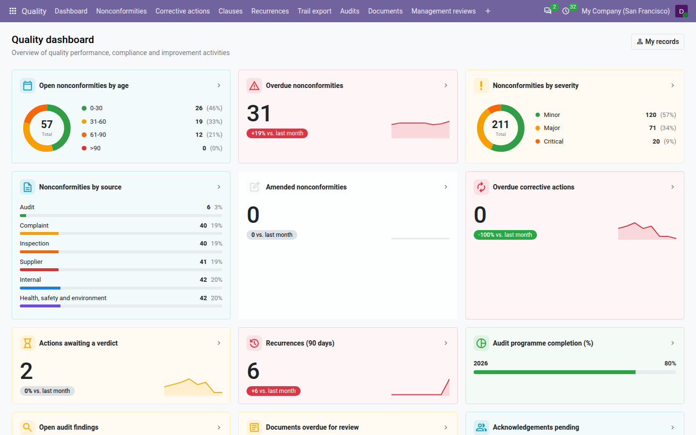

=========
Dashboard
=========

The Quality dashboard is the quality manager's morning screen: how many nonconformities are open and how old they
are, what is overdue, and how they split by severity and by source. Every tile opens the records it counts.

Go to :menuselection:`Quality --> Dashboard`.

Every figure is counted with your own access rights: a quality user who only sees the nonconformities they own,
detected or follow gets figures for those records only. A quality manager or internal auditor sees the whole
company. See :doc:`roles`.

The tiles
=========

The free core shows five tiles, in this order:

.. list-table::
   :header-rows: 1
   :widths: 25 45 30

   * - Tile
     - Counts
     - Shown as
   * - :guilabel:`Open nonconformities by age`
     - New and open nonconformities, split by the number of days since their detection date. With the default age
       buckets: *0-30*, *31-60*, *61-90* and *>90* days.
     - A ring with the total in the middle and, next to it, each bucket with its count and share.
   * - :guilabel:`Overdue nonconformities`
     - New and open nonconformities whose due date has passed.
     - A number, a history line of the last eight months and the change since last month.
   * - :guilabel:`Nonconformities by severity`
     - New, open and closed nonconformities, split into :guilabel:`Minor`, :guilabel:`Major` and
       :guilabel:`Critical`.
     - A ring with the total and each severity with its count and share.
   * - :guilabel:`Nonconformities by source`
     - New, open and closed nonconformities, split by source type (:guilabel:`Audit`, :guilabel:`Complaint`,
       :guilabel:`Inspection`, :guilabel:`Supplier`, :guilabel:`Internal`, :guilabel:`Health, safety and
       environment`).
     - One bar per source type, with its count and share.
   * - :guilabel:`Amended nonconformities`
     - Nonconformities that were amended at least once after closing, whatever their state.
     - A number, a history line of the last eight months and the change since last month.

Cancelled nonconformities are never counted. A source type or severity with no nonconformity does not appear on its
tile.

.. note::
   Age is counted from the :guilabel:`Detected On` date, not from the date the record was entered.

Colours
-------

Each tile has its own tint so that the eye finds it quickly: red for :guilabel:`Overdue nonconformities`, amber for
:guilabel:`Nonconformities by severity`, grey for :guilabel:`Amended nonconformities`, and blue for the age and source tiles.

In the rings and bars, each part has its own colour. The age buckets go from green (the youngest) through amber and
orange to red (the oldest), so a ring that turns red means old open nonconformities.

History and trend
-----------------

The :guilabel:`Overdue nonconformities` and :guilabel:`Amended nonconformities` tiles show a small line of the last eight
months, the current month last:

- on :guilabel:`Overdue nonconformities`, each month counts the nonconformities that fell due in that month and were
  not closed by their due date;
- on :guilabel:`Amended nonconformities`, each month counts the amended values recorded in that month (an amendment that
  changes two fields counts twice).

Under the number, a badge compares this month with last month, for example *+50% vs. last month*. When last month was
zero, the badge shows the difference instead, for example *+2 vs. last month*. On a quality dashboard, more is bad
news: an increase shows in **red**, a decrease in **green**, and no change in grey.

Open the records behind a tile
==============================

Click anywhere on a tile. The nonconformity register opens, titled with the name of the tile, on exactly the records
the tile counts. The register's usual :guilabel:`Open` filter is not applied, so nothing is hidden or added.

For a tile split into parts, the click opens all the records of the tile, not only one part. To go further, group the
list, for example by :guilabel:`Severity` or :guilabel:`Source`.

.. tip::
   :guilabel:`Overdue nonconformities` opens the late ones directly: a good list to review in the weekly quality
   meeting.

My records
==========

Click :guilabel:`My records` at the top right to see only the nonconformities you own. The button turns solid while it
is on, and every tile, including the history lines, is recounted. Click it again to see everything you are allowed to
see.

.. note::
   :guilabel:`My records` counts the nonconformities you **own**. The :guilabel:`My NCs` filter of the register is
   wider: it also includes those you detected.

Change the age buckets
======================

The age buckets are set in :menuselection:`Settings --> Quality`, under :guilabel:`Dashboard age buckets`: a list of
day counts separated by commas, each the upper limit of one bucket. The default ``30,60,90`` gives *0-30*, *31-60*,
*61-90* and *>90* days. A food plant might prefer ``7,14,30``; an engineering company ``30,90,180``. See
:ref:`config-age-buckets`.

Tiles added by Core QMS
=======================

With **Core QMS** installed, the dashboard shows more tiles after the five above:

- :guilabel:`Overdue corrective actions`, :guilabel:`Actions awaiting a verdict` and :guilabel:`Recurrences (90 days)`
  — see :doc:`corrective_actions`;
- :guilabel:`Audit programme completion (%)` and :guilabel:`Open audit findings` — see :doc:`audits`;
- :guilabel:`Documents overdue for review` and :guilabel:`Acknowledgements pending` — see :doc:`documents`;
- :guilabel:`Next management review` — see :doc:`management_reviews`.

.. seealso::
   - :doc:`nonconformities`
   - :doc:`configuration`
