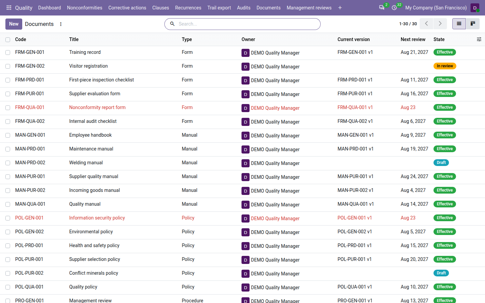
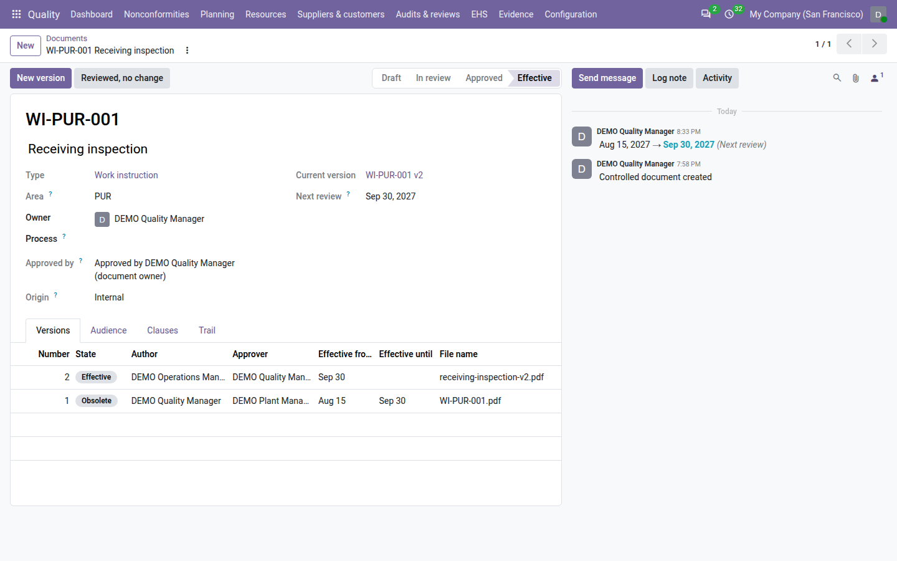
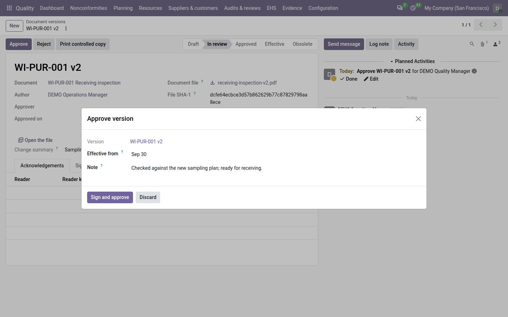
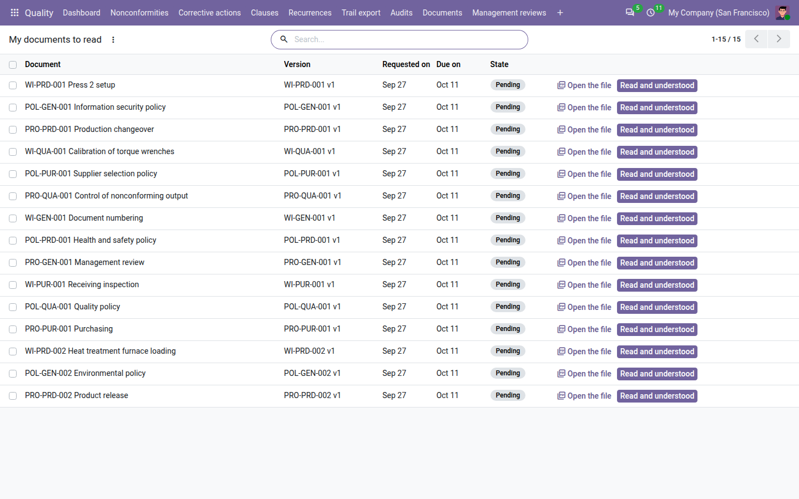
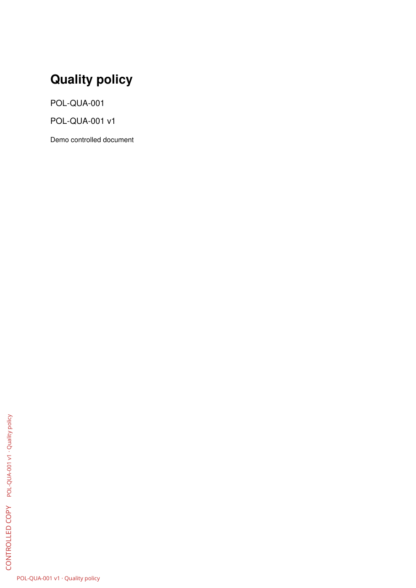
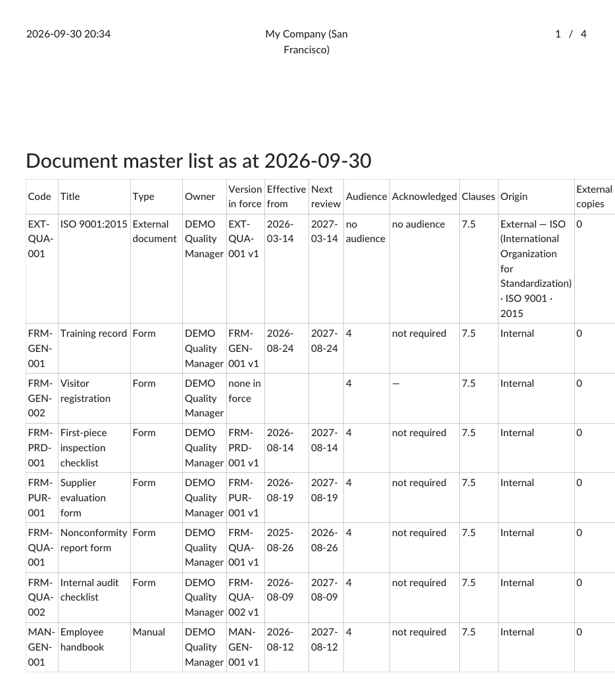
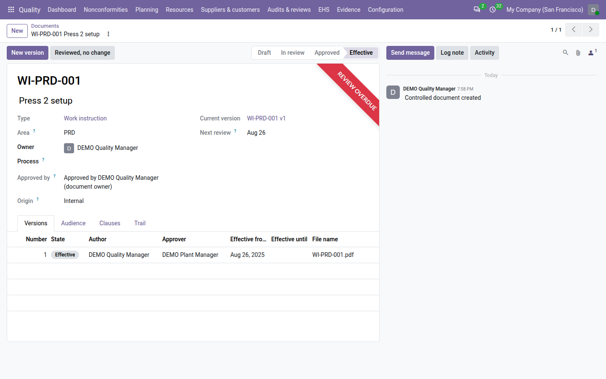
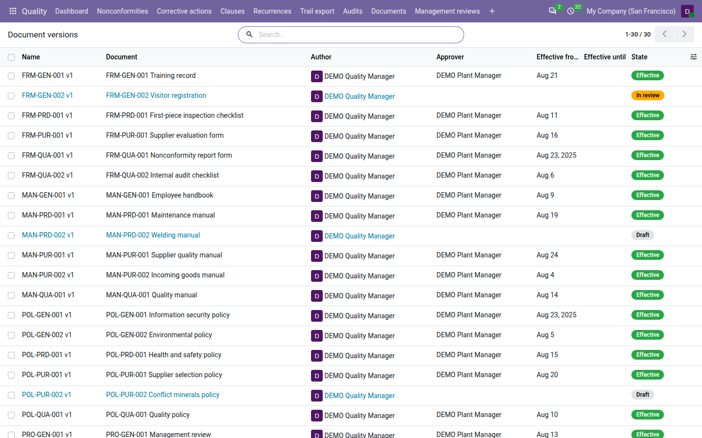

================
Document control
================

ISO 9001 clause 7.5 asks you to control your documented information: every procedure, work instruction, form or
policy is approved before use, the right version is available where it is used, obsolete versions cannot be mistaken
for the current one, and changes are reviewed. With **QMS Advanced** installed, the **Quality** app keeps each controlled
document with a code that never changes, numbers its versions, has each version approved by someone other than its
author with an electronic signature, brings it into force on a date, asks the people concerned to confirm they read
it, stamps every printed copy, and reminds the owner when the document is due for review.

The pieces fit together like this:

- **Document types** — the kinds of documents you control, such as *Procedure* or *Form*, each with a code prefix,
  a review period and whether readers must acknowledge it.
- **Documents** — one controlled document: its code, title, owner, audience and clauses. The document stays the same
  across all its versions.
- **Versions** — one numbered revision of a document, with its file and its own lifecycle.
- **Acknowledgements** — who must confirm they read and understood a version in force, and who did.

Every version moves through these states:

.. list-table::
   :header-rows: 1
   :widths: 15 85

   * - State
     - Meaning
   * - **Draft**
     - Being written by its author. The file and the change summary can still change.
   * - **In review**
     - Submitted by the author, waiting for a quality manager to approve or reject it. The file is frozen.
   * - **Rejected**
     - Sent back by a quality manager with a reason. The author corrects it and submits it again.
   * - **Approved**
     - Approved and signed by a quality manager. Not yet in force: it waits for its effective date.
   * - **Effective**
     - In force. It is locked, and the readers of its document are asked to acknowledge it.
   * - **Obsolete**
     - No longer in force: replaced by a newer version, or withdrawn. It is kept, locked, as evidence.

         with an overdue review shown in red.

Set up document types
=====================

A document type says what kind of document it is and how it is controlled. QMS Advanced installs five shared types:

.. list-table::
   :header-rows: 1
   :widths: 30 15 55

   * - Type
     - Prefix
     - Requires acknowledgement
   * - Procedure
     - ``PRO``
     - Yes
   * - Work instruction
     - ``WI``
     - Yes
   * - Form
     - ``FRM``
     - No
   * - Policy
     - ``POL``
     - Yes
   * - Manual
     - ``MAN``
     - No

Each of them has a review period of 12 months. To change them or add your own:

#. Go to :menuselection:`Quality --> Configuration --> Document types`.
#. Click :guilabel:`New` to add a line, or click a line to change it.
#. Fill in the columns:

   - :guilabel:`Prefix`: 2 to 4 capital letters, for example ``SOP``. It becomes the first part of every document
     code of this type.
   - :guilabel:`Name`: for example *Standard operating procedure*.
   - :guilabel:`Review period (months)`: how many months pass between two periodic reviews of an effective document
     of this type. A new type proposes the :ref:`Review period <documents-settings>` setting.
   - :guilabel:`Requires acknowledgement`: tick it when readers must confirm they read and understood every new
     version in force. It is not ticked on a new type.
   - :guilabel:`Company` (with several companies only): leave it empty to share the type with every company.

#. Save.

A prefix is used once: Odoo refuses a prefix that another type of the same company, or a shared type, already has.
Only quality managers see the :menuselection:`Configuration` menu.

.. tip::
   A type you no longer use can be archived from the list's :guilabel:`Actions` menu. A type that documents use
   cannot be deleted.

Create a document
=================

Only a quality manager creates documents.

#. Go to :menuselection:`Quality --> Documents --> Documents` and click :guilabel:`New`.
#. Enter the title, for example *Receiving inspection*.
#. Choose the :guilabel:`Type`.
#. Enter the :guilabel:`Area`: 2 to 4 capital letters for the department or area, for example ``PUR`` for
   purchasing or ``QUA`` for quality. Leave it empty for ``GEN`` (general).
#. Choose the :guilabel:`Owner`: the person responsible for the document and its periodic review. It is you by
   default.
#. On the :guilabel:`Audience` tab, choose who must read the document: :guilabel:`Audience groups` (every member of
   a user group, for example a *Shop floor* group) and :guilabel:`Audience users` (named people).
#. On the :guilabel:`Clauses` tab, tag at least one clause of the standard that the document supports. A version
   cannot be submitted without one.
#. Save.

The document gets its code, made of the type prefix, the area and a number, for example ``PRO-QUA-001``. Numbers run
per company, prefix and area: the third procedure of area ``PUR`` is ``PRO-PUR-003``. The code, the type and the area
never change after the document is saved. To reclassify a document, create a new one.

         and the Versions tab listing each version with its state, author, approver and effective dates.

The document form shows:

- :guilabel:`Current version`: the version in force today, if any;
- :guilabel:`Next review`: the date of the next periodic review (see `Review documents periodically`_);
- the :guilabel:`Versions` tab: every version with its number, state, author, approver, :guilabel:`Effective from`
  and :guilabel:`Effective until` dates and file name;
- the :guilabel:`Trail` tab: every change of title, owner, audience, clauses, type and next review date. See
  :doc:`trail`.

The state of the document summarises its versions: **Effective** when a version is in force, even while a new one is
being written; otherwise **In review**, **Approved** or **Draft** (a rejected version also counts as a draft)
according to the version being worked on; **Obsolete** when every version is obsolete; and **No version** before the
first version is created.

Write a version
===============

A version holds the file and says what changed.

#. Open the document and click :guilabel:`New version`.
#. Upload the :guilabel:`Document file`: a PDF, a Word document (``.docx``), an Excel workbook (``.xlsx``) or an
   OpenDocument text (``.odt``). Other file types and empty files are refused.
#. Describe the :guilabel:`Change summary`: what changed compared with the previous version, or *First issue* for
   the first one.
#. Save.

The version gets the next number of the document: ``PRO-QUA-001 v1``, then ``v2``, and so on. The person who creates
the version is its :guilabel:`Author`; the author cannot be changed. When the file is saved, Odoo records its
fingerprint in :guilabel:`File SHA-1`, so that any later change to the file can be detected.

A document has at most one version being worked on: Odoo refuses a new version while another one is **Draft** or
**In review** (*Finish or delete the open version first*).

You can replace the file and change the summary while the version is **Draft** or **Rejected**. From submission on,
the file is frozen. Click :guilabel:`Open the file` to open it in a new tab.

.. note::
   A draft version can be deleted by its author or by a quality manager, from the version's :guilabel:`Actions`
   menu. Its number is then used again by the next version. A version in any other state cannot be deleted.

Submit it for approval
======================

When the version is ready, its author clicks :guilabel:`Submit`. A quality manager can also submit it on the
author's behalf; the trail then says so. The :guilabel:`Submit` button is shown to the author and to quality managers
only. Odoo checks that:

- a file is attached and is not empty;
- the :guilabel:`Change summary` is filled in;
- the document is tagged with at least one clause.

The version moves to **In review** and a *Review document version* to-do, *Approve <version>*, goes to the people who
can approve it — quality managers of the company who did not write the version:

- to the document's owner alone, when the owner is such a quality manager;
- otherwise to every quality manager of the company other than the author.

When the author is the company's only quality manager, nobody can approve the version: no to-do is sent, and the
version's chatter says so. Give another person the Manager role.

When nobody can approve the version, no to-do is created and the version's chatter says *No quality manager other
than the author can approve this version*: give a quality manager the approval.

Approve or reject
=================

Approve it with a signature
---------------------------

Approval is a real second pair of eyes: the author of a version can never approve it, not even when they are a
quality manager.

#. As a quality manager who did not write the version, open the version in review and click :guilabel:`Approve`.
#. Check the :guilabel:`Effective from` date: the day the version comes into force. It is today by default. A date in
   the past is moved to today: a version is never in force before it was approved.
#. If you like, add a :guilabel:`Note`; it is kept on the signature. Without a note, the change summary is used.
#. Click :guilabel:`Sign and approve`. When Odoo asks for your password, enter your own.

The version moves to **Approved**. :guilabel:`Approver` and :guilabel:`Approved on` are filled in, the signature
appears on the :guilabel:`Signatures` tab with the reason *Document approval*, and the review to-dos are marked done.

Odoo refuses to approve when the file changed after it was uploaded: the approver signs exactly the file that was
submitted.

.. note::
   Whether Odoo asks for the password is a setting: :ref:`Ask the password before signing <config-password>` in
   the :guilabel:`Integrity` block of the Quality settings. It is on by default. See :doc:`configuration`.

Reject it
---------

#. As a quality manager, open the version in review and click :guilabel:`Reject`.
#. Enter the :guilabel:`Reason`: what the author must change.
#. Click :guilabel:`Reject`.

The version moves to **Rejected**, its :guilabel:`Rejection reason` shows on the form and in the chatter, and the
review to-dos are marked done. A rejection is not signed.

The author then replaces the file or corrects the change summary and clicks :guilabel:`Submit` again. The author, or
a quality manager, can also click :guilabel:`Revise` to put the version back to **Draft** first. Either way the version
keeps its number. :guilabel:`Revise` is shown to the author and to quality managers only.

Bring a version into force
==========================

An approved version comes into force on its :guilabel:`Effective from` date:

- **automatically**: a daily run brings into force every approved version whose date has come;
- **at once**: a quality manager clicks :guilabel:`Make effective` on the approved version. The version comes into
  force today, even when a later date was chosen.

When a version comes into force:

- it moves to **Effective** and becomes the document's :guilabel:`Current version`. It is locked from then on;
- the version that was in force until then moves to **Obsolete** automatically. Its :guilabel:`Effective until` date
  is the new version's :guilabel:`Effective from` date, and its chatter says *Superseded by <version> on <date>*;
- an older version of the same document that was approved but is still waiting for its own date moves to
  **Obsolete** too, without ever being in force; its chatter says *Superseded by <version> on <date> before it came
  into force*. It can no longer come into force later and replace the newer version;
- the document's :guilabel:`Next review` date is set to the effective date plus the type's review period, and an open
  *Periodic document review* to-do of the document is marked done: the new version is the review;
- when the type requires acknowledgement, the audience is asked to read the new version (see
  `Acknowledge a document: read and understood`_), and the requests still pending on the previous version are
  removed.

The windows in which versions are in force never overlap, so there is always one answer to *which version applied on
that date?*: a version is in force from its :guilabel:`Effective from` date included to its :guilabel:`Effective
until` date excluded. On the day of the change, the new version applies.

.. note::
   An approved version waiting for its date can be stopped in two ways: bring a newer version into force (the waiting
   one is then made obsolete), or withdraw it as described below.

Withdraw a version
==================

To take a document out of use without a replacement, or to stop a version that was approved by mistake before it
comes into force:

#. As a quality manager, open the effective (or approved) version and click :guilabel:`Withdraw`.
#. Enter the :guilabel:`Reason`, at least ten characters.
#. Click :guilabel:`Sign and withdraw` and, when asked, enter your password.

The version moves to **Obsolete** and is signed with the reason *Document withdrawal*. An effective version was in
force until today; an approved version was never in force and never will be, whatever its date. Its
pending read requests and their to-dos are removed: nobody is asked to read a withdrawn version any more. The
acknowledgements already done stay as evidence. The document then has no version in force: find such documents with
the :guilabel:`No version in force` filter.

Amend a version
===============

The change summary of an effective or obsolete version can be corrected by a quality manager:

#. Open the version and click :guilabel:`Amend`.
#. Correct the :guilabel:`Change summary`.
#. Give the :guilabel:`Reason` for the change, at least ten characters.
#. Click :guilabel:`Amend and sign`. If Odoo asks for your password, enter your own: the amendment is applied once it
   is confirmed.

The amendment is signed (reason *Amendment*) and the trail keeps the original summary next to the new one, with your
reason. The file of a version is never amended: to change the document, write a new version.

Files that are evidence
=======================

The file of an approved, effective or obsolete version is evidence. It cannot be deleted, replaced or changed, not
even by an administrator working from Odoo. Every time the file is opened, printed or approved, Odoo checks it against
the :guilabel:`File SHA-1` recorded at upload and refuses it if the content changed: *The file of <version> no longer
matches the hash recorded at upload*. If a file was removed from the database, the version keeps its fingerprint and
shows :guilabel:`File missing`.

Acknowledge a document: read and understood
===========================================

A procedure nobody read is not implemented. For every document whose type has :guilabel:`Requires acknowledgement`
ticked, the people in its audience must confirm that they read and understood each version in force.

Who is asked
------------

When a version comes into force, Odoo creates one pending acknowledgement for each active internal user of the
document's company who is in the :guilabel:`Audience users` or in one of the :guilabel:`Audience groups` and holds a
Quality role — including the author and the approver: reading is not writing. Each of them also gets a *Read and
understand* to-do, *Read <version>*.

The acknowledgement is due after the number of days set in :ref:`Acknowledgement grace <documents-settings>`
(14 by default), counted from the day it is requested. After its due date it is *overdue*.

Every day, Odoo also asks the people who joined the audience since the version came into force, for example a new
member of the *Shop floor* group. Their due date is counted from the day they are asked. Nobody is asked twice for the
same version.

A document with an empty audience, or whose type does not require acknowledgement, asks nobody.

.. important::
   Readers need at least the Quality **User** role to open *My documents to read* and the file. Audience members
   without a Quality role are not asked: when the version comes into force, one note in its chatter names them, *Not
   asked to read this version (no Quality role, so they cannot open it)*. Give them the Quality User role and they are
   asked the next day. See :doc:`roles`.

Confirm you read it
-------------------

#. Go to :menuselection:`Quality --> Documents --> My documents to read`. The list shows your pending
   acknowledgements with the document, the version, the date requested and the due date. Overdue ones are red.
#. Click :guilabel:`Open the file` and read the document. It opens in a new tab.
#. Back in the list, click :guilabel:`Read and understood`.

The acknowledgement is done: it is dated, your to-do is marked done and the line leaves the list. The version's
trail records *Acknowledged by <you>*.

         file and Read and understood buttons; an overdue line in red.

A few rules make the acknowledgement worth something:

- **You must open the file first**, in the same Odoo session. Otherwise Odoo answers *Open the document first*. After
  you log out and back in, open the file again.
- **Only you can acknowledge for yourself.** Nobody, not even a quality manager, can confirm on your behalf.
- **A done acknowledgement is final.** It cannot be changed or deleted.

Quality managers and internal auditors follow who has read what on the :guilabel:`Acknowledgements` tab of each
version: the reader, the state (**Pending** or **Done**), the due date and the date acknowledged.

Print a controlled copy
=======================

A printout on the shop floor must say which version it is and whether it is still valid. Odoo stamps every page
rather than trusting the author to put it in the file.

Open a version and click :guilabel:`Print controlled copy`. Anyone who can read the version can print it. Odoo
downloads a PDF named after the version and today's date, for example ``PRO-QUA-001 v2 2026-09-27.pdf``.

Every page carries a stamp in dark red, running up the left margin. Its first line depends on the state of the
version:

.. list-table::
   :header-rows: 1
   :widths: 30 70

   * - Version state
     - First line of the stamp
   * - Draft, In review, Rejected
     - *DRAFT — NOT FOR USE*
   * - Approved
     - *APPROVED — EFFECTIVE FROM <date>*
   * - Effective
     - The text of the :ref:`Controlled-copy stamp <documents-settings>` setting, *CONTROLLED COPY* by default
   * - Obsolete
     - *OBSOLETE — SUPERSEDED <date>*, the date the version stopped being in force

The second line names the version and the document, for example *PRO-QUA-001 v2 · Receiving inspection*. It is
repeated in the bottom margin.

What is printed under the stamp depends on the file:

- a **PDF** is printed as it is;
- a **Word, Excel or OpenDocument** file is converted to PDF when the LibreOffice converter is installed on the Odoo
  server;
- otherwise Odoo prints a single cover page with the document title, the version, its state, the file name, its
  SHA-1 fingerprint and the change summary.

         reference running up the left margin and repeated at the bottom.

.. tip::
   A controlled copy of an effective version prints the stamp text and the version, not the effective date. The
   effective date of every version is on the master list.

The master list
===============

The master list is the auditor's index of your documents: for a chosen date, every document with the version that
was in force on that date.

#. Go to :menuselection:`Quality --> Documents --> Master list`.
#. Choose the :guilabel:`Date`: today by default.
#. Choose :guilabel:`Types` to limit the list, or leave it empty for every type.
#. Click :guilabel:`Print` for a PDF, or :guilabel:`Export CSV` for a spreadsheet with the same columns.

The list is titled *Document master list as at <date>*, sorted by code, with one row per document:

.. list-table::
   :header-rows: 1
   :widths: 25 75

   * - Column
     - Shows
   * - :guilabel:`Code`, :guilabel:`Title`, :guilabel:`Type`, :guilabel:`Owner`
     - The document.
   * - :guilabel:`Version in force`
     - The version in force on the date, or *none in force*.
   * - :guilabel:`Effective from`
     - The date that version came into force.
   * - :guilabel:`Next review`
     - The document's next periodic review date, as it is today.
   * - :guilabel:`Audience`
     - The number of people in the audience today, or *no audience*.
   * - :guilabel:`Acknowledged`
     - For the version in force: the acknowledgements done by the date out of all those requested, for example
       *3/5*; *not required* when readers are not asked; *no audience*; or *—* when no version was in force.
   * - :guilabel:`Clauses`
     - The numbers of the clauses the document is tagged with.

The PDF ends with the standard footer of every Quality report: the generation date and a fingerprint of the
document. The list contains the documents you are allowed to see.

         date, next review, audience and acknowledgement completion.

.. tip::
   To print the master list of a few documents as at today, select them in the documents list and choose
   :menuselection:`Print --> Document master list`.

Review documents periodically
=============================

ISO 9001 expects documents to be reviewed and kept up to date. Each document has a :guilabel:`Next review` date:

- when a version comes into force: its effective date plus the review period of the document type;
- when the owner confirms a review without change: today plus the review period.

A document is **overdue for review** when it has a version in force and its next review date has passed. It is then
shown in red in the list, with *Review overdue* on its kanban card and a red *Review overdue* ribbon on its form. A
document with no version in force is never overdue for review.

Every day, Odoo gives the owner of each overdue document a *Periodic document review* to-do, *Review <code>*. There is
never more than one open at a time for a document. When the owner's user is archived, the to-do goes to the
:ref:`Fallback owner <config-fallback-owner>` or, if none is set, to the first quality manager of the company.

To review the document:

- **When it needs changes**, click :guilabel:`New version` and take the new version through approval. When it comes
  into force, the next review date moves on.
- **When it is still right**, click :guilabel:`Reviewed, no change` on the document. The next review date becomes
  today plus the review period, the trail records *Reviewed, no change*, and the review to-do is marked done. Only the
  owner of the document or a quality manager can do this, and only while a version is in force: the button is shown
  to them only.

         button in the header.

Find documents
==============

:menuselection:`Quality --> Documents --> Documents` offers a list and a kanban board grouped by type. In the list,
documents overdue for review are red and obsolete documents are grey; the state is a coloured badge. Search by code,
title or owner. Useful filters:

- :guilabel:`My documents`: the documents you own;
- :guilabel:`Review overdue`;
- :guilabel:`No version in force`: documents never brought into force, or whose last version was withdrawn.

You can group by :guilabel:`Type`, :guilabel:`Owner` or :guilabel:`State`.

Find versions
-------------

Quality managers and internal auditors also have :menuselection:`Quality --> Documents --> Versions`: every version of
every document in one list, with its author, approver, effective dates and state. Versions in draft or in review are
shown in blue and obsolete ones in grey. Use the :guilabel:`In review` filter to see what waits for approval and
:guilabel:`In force` for the versions currently in force; group by :guilabel:`Document` or :guilabel:`State`.

         state badge, with the versions in review highlighted.

Dashboard and statistics
========================

QMS Advanced adds two tiles to the :doc:`dashboard`:

.. list-table::
   :header-rows: 1
   :widths: 30 70

   * - Tile
     - What it shows
   * - :guilabel:`Documents overdue for review`
     - The documents overdue for review, with bars of the reviews falling due each month and a red badge counting
       those overdue by more than 90 days. It opens those documents.
   * - :guilabel:`Acknowledgements pending`
     - The pending acknowledgements, with bars of those falling due each month and a badge counting the overdue ones.
       The tile turns red as soon as one is overdue. It opens the acknowledgements it counts.

With :guilabel:`My records` switched on, the first tile counts only the documents you own and the second only your own
acknowledgements. A quality user who is not an internal auditor or a quality manager always sees only their own
acknowledgements in the second tile.

Documents also feed other reports:

- the :doc:`management review <management_reviews>` shows the number of documents overdue for review under the input
  *Effectiveness of actions on risks and opportunities*;
- the :doc:`audit pack <audit_pack>` includes the master list as at the end of its period and a matrix of who
  acknowledged which version.

.. _documents-settings:

Settings
========

Go to :menuselection:`Settings --> Quality`, block :guilabel:`Documents`. Only quality managers see the Quality
settings.

.. list-table::
   :header-rows: 1
   :widths: 22 43 12 23

   * - Setting
     - What it does
     - Default
     - Example
   * - :guilabel:`Review period`
     - Months between two periodic reviews, proposed for each **new** document type. Existing types keep their own
       period; change it on the type. At least 1.
     - 12
     - 24 for a company that reviews its documents every two years.
   * - :guilabel:`Acknowledgement grace`
     - Days a reader has to acknowledge a new version before the acknowledgement counts as overdue. 0 makes it due
       the same day.
     - 14
     - 7 on a site where procedures change often.
   * - :guilabel:`Controlled-copy stamp`
     - The text stamped on every page of a printed version in force. It cannot be empty.
     - CONTROLLED COPY
     - *CONTROLLED COPY — DO NOT PHOTOCOPY*

Two Quality settings of the :guilabel:`Integrity` and :guilabel:`Nonconformities` blocks also apply (see
:doc:`configuration`):

- :guilabel:`Ask the password before signing` (on by default): the password is asked when a version is approved or
  withdrawn.
- :guilabel:`Fallback owner`: receives the periodic review to-do when a document's owner is archived.

Who can do what
===============

.. list-table::
   :header-rows: 1
   :widths: 25 75

   * - Role
     - Document control
   * - **User**
     - Sees the documents they own, are in the audience of, or wrote a version of, and their versions in force or
       obsolete. Writes new versions of those documents, and edits, submits, revises or deletes their own versions
       while draft or rejected. Acknowledges their own read requests, prints controlled copies and the master list of
       what they can see. The owner of a document confirms its periodic review with :guilabel:`Reviewed, no change`.
   * - **Internal auditor**
     - The same, and reads every document, version and acknowledgement of the company, also from
       :menuselection:`Documents --> Versions`.
   * - **Manager**
     - Everything: creates documents and changes their title, owner, audience and clauses; manages document types;
       approves (never their own version), rejects, brings into force and withdraws versions; submits, revises or
       deletes drafts on the author's behalf; amends the change summary of a version in force or obsolete; lists every
       version under :menuselection:`Documents --> Versions`. A manager cannot acknowledge for anyone else.

.. note::
   A quality user sees their own version only while it is draft or rejected: once submitted, it disappears from their
   view until it comes into force.

See :doc:`roles` for the full picture.

.. seealso::
   - :doc:`clauses`
   - :doc:`trail`
   - :doc:`management_reviews`
   - :doc:`audit_pack`
   - :doc:`dashboard`
