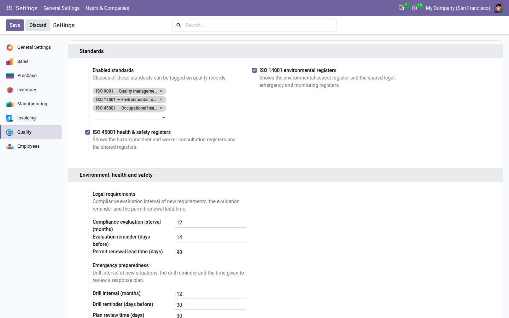
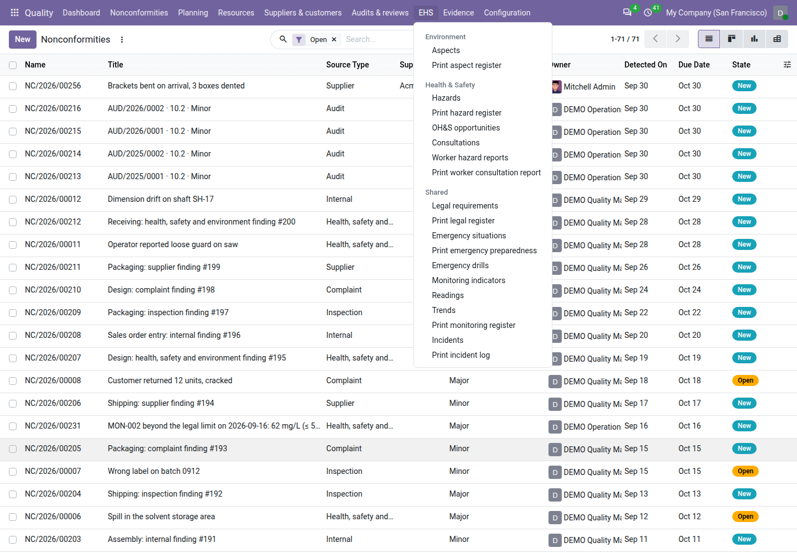
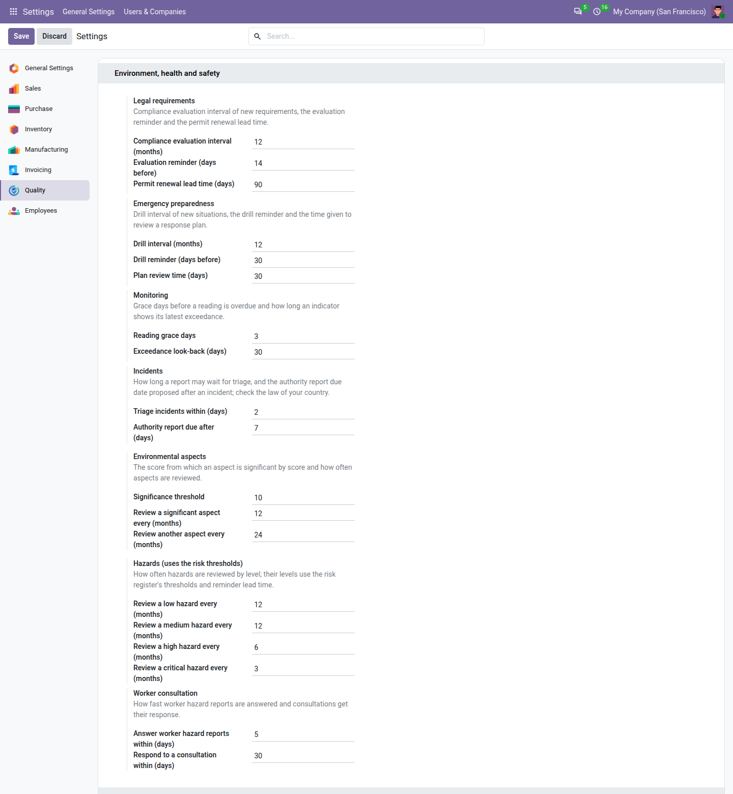

====================================
Environment, health and safety setup
====================================

With **QMS Advanced** installed, the **Quality** app also keeps the registers that ISO 14001 (environment) and
ISO 45001 (occupational health and safety) ask for: environmental aspects, hazards, incidents, worker consultation, and
the registers both standards share — legal requirements, emergency preparedness and monitoring. They are part of
QMS Advanced: nothing else to buy or install.

Most companies work to ISO 9001 only, so these registers are **off** until a quality manager switches them on. Two
check boxes decide what everyone sees; this page explains them, the settings they show, and who sees which menu.

.. seealso::
   - :doc:`legal_requirements`, :doc:`emergency_preparedness`, :doc:`monitoring` — the registers both standards share
   - :doc:`environmental_aspects` — ISO 14001
   - :doc:`hazards`, :doc:`incidents`, :doc:`worker_consultation` — ISO 45001 (incidents serve both)
   - :doc:`safety_reports` — the page for employees who only report

Switch the registers on
=======================

#. Go to :menuselection:`Settings --> Quality`, block :guilabel:`Standards`.
#. Tick :guilabel:`ISO 14001 environmental registers`, :guilabel:`ISO 45001 health & safety registers`, or both.
#. Click :guilabel:`Save`. The page reloads.

         14001 environmental registers and ISO 45001 health & safety registers, ticked.

What a box does when you tick it:

- it adds its standard to :guilabel:`Enabled standards` if it was not there yet, so the registers can tag its clauses;
- it shows the :menuselection:`Quality --> EHS` menu with the sections of that standard, the :guilabel:`Safety
  reports` app for every employee, the block :guilabel:`Environment, health and safety` of the settings, the
  dashboard tiles, the management review inputs and the audit pack files of the registers;
- it changes no user's type: a user who counts as a light user in Odoo stays one.

.. important::
   Switching a toggle off hides the registers; nothing is deleted. The records, their trail and their signatures stay
   as they are and come back when the box is ticked again. While a box is off, the scheduled reminders of its
   registers stop; to-dos already given stay with their users.

The toggles apply to the whole database, for every company in it.

A standard cannot be disabled while its registers are on: removing *ISO 14001* from :guilabel:`Enabled standards`
while its box is ticked is refused with *Turn off the ISO 14001 environmental registers first.* (and *Turn off the ISO
45001 health & safety registers first.* for ISO 45001). Untick the box and remove the standard in the same save, or in
two saves. Unticking a box leaves its standard enabled, so the clauses already tagged stay valid.

What each box shows
===================

.. list-table::
   :header-rows: 1
   :widths: 34 22 22 22

   * - Menu or register
     - ISO 14001 box only
     - ISO 45001 box only
     - Both
   * - :menuselection:`Quality --> EHS --> Environment`: :guilabel:`Aspects`, :guilabel:`Print aspect register`
     - Yes
     - —
     - Yes
   * - :menuselection:`Quality --> EHS --> Health & Safety`: :guilabel:`Hazards`, :guilabel:`Print hazard register`,
       :guilabel:`OH&S opportunities`, :guilabel:`Consultations`, :guilabel:`Worker hazard reports`, :guilabel:`Print
       worker consultation report`
     - —
     - Yes
     - Yes
   * - :menuselection:`Quality --> EHS --> Shared`: :guilabel:`Legal requirements`, :guilabel:`Print legal register`,
       :guilabel:`Emergency situations`, :guilabel:`Print emergency preparedness`, :guilabel:`Emergency drills`,
       :guilabel:`Monitoring indicators`, :guilabel:`Readings`, :guilabel:`Trends`, :guilabel:`Print monitoring
       register`, :guilabel:`Incidents`, :guilabel:`Print incident log`
     - Yes
     - Yes
     - Yes
   * - :menuselection:`Safety reports --> Report an incident` and :guilabel:`My incident reports`
     - Yes (environmental incidents)
     - Yes (injuries, ill health, near misses, dangerous occurrences)
     - Yes (all types)
   * - :menuselection:`Safety reports --> Report a hazard` and :guilabel:`My hazard reports`
     - —
     - Yes
     - Yes

The shared registers are one list for both standards. Each record says which standard it serves in
:guilabel:`Applies to` (*Environment*, *Health & safety* or *Both*); the search filters :guilabel:`Environment` and
:guilabel:`Health & Safety` and the grouping :guilabel:`Applies to` split the list. A record keeps its value when a box
is switched off: an obligation recorded while ISO 45001 was on stays listed.

         Health & Safety (Hazards, OH&S opportunities, Consultations, Worker hazard reports and their print entries)
         and Shared (Legal requirements, Emergency situations, Emergency drills, Monitoring indicators, Readings,
         Trends, Incidents and their print entries).

Who sees what
=============

- **Quality users, internal auditors and quality managers** see the :menuselection:`Quality --> EHS` menu of the
  standards switched on, with the rights of their role (see :doc:`roles`). Internal auditors read every register and
  change nothing.
- **Every other employee** — any internal user, with or without a Quality role — sees the small **Safety reports**
  app, to report an incident or a hazard and follow their own reports. They do not see the **Quality** app. See
  :doc:`safety_reports`.
- **Portal users** see neither.

Settings: Environment, health and safety
========================================

While at least one box is ticked, :menuselection:`Settings --> Quality` shows the block :guilabel:`Environment, health
and safety`. Its settings follow the boxes: the shared ones show with either box, the aspect settings with ISO 14001,
the hazard and worker consultation settings with ISO 45001. The :guilabel:`Setup profile` sets most of them (see
:doc:`small_company_setup`); the two settings with legal consequences — the significance threshold and the authority
report delay — are left out of the profiles on purpose.

         preparedness, Monitoring, Incidents, Environmental aspects, Hazards and Worker consultation settings.

.. list-table::
   :header-rows: 1
   :widths: 22 34 11 11 11 11

   * - Setting
     - What it does
     - Lean
     - Standard (default)
     - Regulated
     - Shown with
   * - :guilabel:`Legal requirements`: :guilabel:`Compliance evaluation interval (months)`
     - Proposed evaluation interval of a new obligation. At least 1.
     - 12
     - 12
     - 6
     - either box
   * - :guilabel:`Evaluation reminder (days before)`
     - When the obligation's owner gets the *Evaluate compliance* to-do before the next evaluation.
     - 14
     - 14
     - 30
     - either box
   * - :guilabel:`Permit renewal lead time (days)`
     - How long before its expiry a permit shows *Expiring* and its owner gets the renewal to-do.
     - 60
     - 90
     - 180
     - either box
   * - :guilabel:`Emergency preparedness`: :guilabel:`Drill interval (months)`
     - Proposed drill interval of a new emergency situation. At least 1.
     - 12
     - 12
     - 6
     - either box
   * - :guilabel:`Drill reminder (days before)`
     - When the situation's responsible gets the *Plan the drill* to-do, and from when the drill shows *Due soon*.
     - 14
     - 30
     - 30
     - either box
   * - :guilabel:`Plan review time (days)`
     - How long a requested review of a response plan may wait before the dashboard counts it as late. At least 1.
     - 30
     - 30
     - 14
     - either box
   * - :guilabel:`Monitoring`: :guilabel:`Reading grace days`
     - Days after its due date before a reading counts as overdue.
     - 7
     - 3
     - 0
     - either box
   * - :guilabel:`Exceedance look-back (days)`
     - How far back the indicator and the dashboard count exceedances. At least 1.
     - 30
     - 30
     - 90
     - either box
   * - :guilabel:`Incidents`: :guilabel:`Triage incidents within (days)`
     - How long a reported incident may wait for triage before its tile turns red and a manager gets a to-do.
     - 3
     - 2
     - 1
     - either box
   * - :guilabel:`Authority report due after (days)`
     - The due date proposed for an authority report, counted from the day of the incident. Not in the profiles:
       check the law of your country.
     - 7
     - 7
     - 7
     - either box
   * - :guilabel:`Environmental aspects`: :guilabel:`Significance threshold`
     - The score from which an aspect is significant by score, between 2 and 25. Not in the profiles.
     - 10
     - 10
     - 10
     - ISO 14001
   * - :guilabel:`Review a significant aspect every (months)`
     - Review interval of a significant aspect; 0: no periodic review.
     - 24
     - 12
     - 6
     - ISO 14001
   * - :guilabel:`Review another aspect every (months)`
     - Review interval of an aspect that is not significant; 0: no periodic review.
     - 36
     - 24
     - 12
     - ISO 14001
   * - :guilabel:`Hazards (uses the risk thresholds)`: :guilabel:`Review a low hazard every (months)` … :guilabel:`Review
       a critical hazard every (months)`
     - Review interval of a hazard by its level (low, medium, high, critical); 0: no periodic review.
     - 24 / 24 / 12 / 6
     - 12 / 12 / 6 / 3
     - 12 / 6 / 3 / 1
     - ISO 45001
   * - :guilabel:`Worker consultation`: :guilabel:`Answer worker hazard reports within (days)`
     - Days from submission to close a worker hazard report before it is overdue. At least 1.
     - 10
     - 5
     - 2
     - ISO 45001
   * - :guilabel:`Respond to a consultation within (days)`
     - Days from **Held** to close a consultation with the response given to the workers. At least 1.
     - 30
     - 30
     - 14
     - ISO 45001

Hazard levels and aspect scores use the grid of the risk register: the :guilabel:`Level thresholds` and the
:guilabel:`Risk review reminder` of the :guilabel:`Risks` block say *(also used by hazards and environmental aspects)*
while a box is ticked. See :doc:`risks`.

A value out of its limits is refused when you click :guilabel:`Save`, and nothing is saved.

Demo data
=========

On a database created with demo data, QMS Advanced switches both boxes on and adds a small EHS demonstration: four
fictitious legal obligations (one permit expiring, one evaluated non-compliant with its nonconformity), three emergency
situations with their plans, four monitoring indicators (one reading above its legal limit), three environmental
aspects, three hazards, three incidents, three consultations, four worker hazard reports and a demo audit pack of ISO
9001, 14001 and 45001. Every legal text in the demo is marked *Fictitious demo obligation*: the app ships no legal
content. The demo employee **DEMO Press Operator** has no Quality role and shows what an employee sees in
:doc:`safety_reports`.

.. note::
   **Known limits**

   - The app ships no legal content for any country: you record the obligations that apply to you. See
     :doc:`legal_requirements`.
   - The toggles apply to the whole database; a multi-company database cannot switch the registers on for one company
     only.
