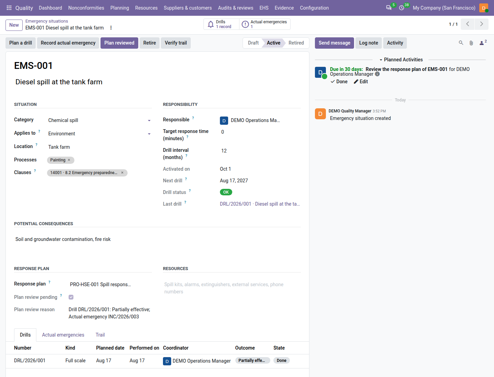
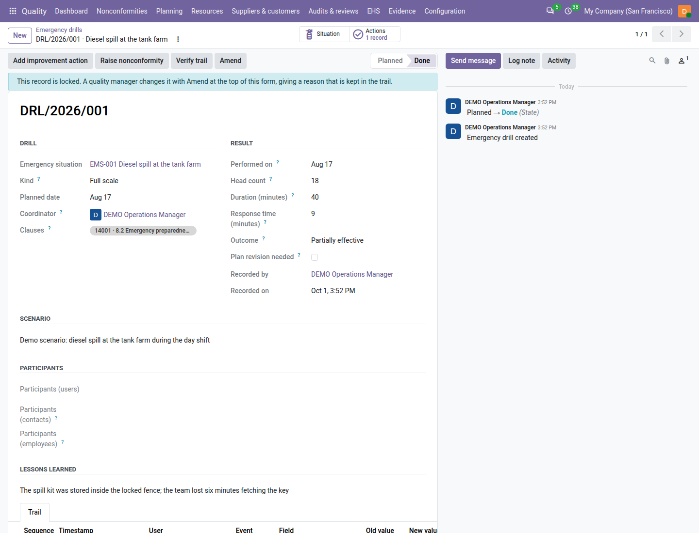

======================
Emergency preparedness
======================

ISO 14001 and ISO 45001 ask you to prepare for the emergencies that could happen on your site, to test the response
periodically, and to revise it after a test or a real emergency (clause 8.2). With the environment, health and safety
registers switched on (see :doc:`ehs_setup`), the **Quality** app keeps each potential emergency as an *emergency
situation* with its consequences, response plan, responsible and drill interval, and each test as a *drill* with what
happened and what was learned.

Everything is under :menuselection:`Quality --> EHS --> Shared`: :guilabel:`Emergency situations` and
:guilabel:`Emergency drills`.

.. list-table::
   :header-rows: 1
   :widths: 25 75

   * - State
     - Meaning
   * - **Draft** (situation)
     - Being written; can be deleted.
   * - **Active** (situation)
     - Prepared for: drilled at its interval, reminded, counted on the dashboard.
   * - **Retired** (situation)
     - Can no longer arise (for example the tank farm was dismantled). Its planned drills are cancelled; it and its
       drills stay as records.
   * - **Planned** (drill)
     - Scheduled. It can be recorded as done, cancelled with a reason, or deleted.
   * - **Done** (drill)
     - Performed and recorded; locked.
   * - **Cancelled** (drill)
     - Did not take place; it never counts as performed.

Register an emergency situation
===============================

#. Go to :menuselection:`Quality --> EHS --> Shared --> Emergency situations` and click :guilabel:`New`.
#. Enter the name, for example *Diesel spill at the tank farm*.
#. In :guilabel:`Situation`, choose the :guilabel:`Category` (:guilabel:`Fire`, :guilabel:`Explosion`,
   :guilabel:`Chemical spill`, :guilabel:`Gas leak`, :guilabel:`Serious injury`, :guilabel:`Flood`,
   :guilabel:`Power failure`, :guilabel:`Natural event` or :guilabel:`Other`), :guilabel:`Applies to`, the
   :guilabel:`Location` and the :guilabel:`Processes`.
#. In :guilabel:`Responsibility`, choose the :guilabel:`Responsible` — the quality user who keeps the response ready
   and organises the drills — and set the :guilabel:`Target response time (minutes)` if there is one (for example
   *spill contained within 15 minutes*; leave 0 otherwise) and the :guilabel:`Drill interval (months)` (12 by
   default).
#. Under :guilabel:`Potential consequences`, describe what could happen to people, the environment and property (at
   least 20 characters).
#. Under :guilabel:`Response plan`, choose the controlled document people follow in the emergency. It needs a version
   in force (see :doc:`documents`).
#. Under :guilabel:`Resources`, list the equipment, spill kits, alarms, external services and phone numbers the
   response needs.
#. Save — Odoo gives the code, for example ``EMS-0004`` — then click :guilabel:`Activate`.

Activate needs the name, category, standard and responsible, the consequences, a drill interval of at least 1 month
and a response plan in force. While something is missing, a line at the top of the form says *Needed for Activate:*
and lists all of it, for example *Link a response plan that has a version in force.* Clicking
:guilabel:`Activate` anyway opens a window titled *Before you press Activate* with the same list; click :guilabel:`Got
it`, fill the fields it names and click :guilabel:`Activate` again. It is shown to the responsible and to quality
managers. Clause 8.2 of the standard(s) the situation serves is tagged on it.

When the plan document loses its version in force, a red line on the situation says *The response plan … has no
version in force.* The form also says how many people have not yet acknowledged the plan's version in force.

         interval, next drill date and status, the Plan review pending line, and the Plan a drill, Record actual
         emergency and Plan reviewed buttons.

Plan and record a drill
=======================

The situation's :guilabel:`Next drill` is its last drill date (or its activation) plus the drill interval. Some days
before (:guilabel:`Drill reminder (days before)`, 30 by default) its :guilabel:`Drill status` becomes :guilabel:`Due
soon` and the responsible gets the to-do *Plan the drill of EMS-0004*; after the date it is :guilabel:`Overdue`.

#. On the situation, click :guilabel:`Plan a drill`. A drill opens with the situation and the responsible as
   :guilabel:`Coordinator`. The drill carries the name of its situation wherever it is listed, for example
   *DRL/2026/007 · Diesel spill at the tank farm*.
#. Choose the :guilabel:`Kind` (:guilabel:`Tabletop`, :guilabel:`Partial` or :guilabel:`Full scale`) and the
   :guilabel:`Planned date`, and save. Odoo numbers it, for example ``DRL/2026/007``.
#. After the drill, fill in :guilabel:`Performed on`, :guilabel:`Head count`, :guilabel:`Duration (minutes)`,
   :guilabel:`Response time (minutes)`, the :guilabel:`Scenario` (at least 20 characters) and, if you want to name
   them, the :guilabel:`Participants (users)` and :guilabel:`Participants (contacts)` (contractors, the fire brigade).
#. Choose the :guilabel:`Outcome`: :guilabel:`Effective`, :guilabel:`Partially effective` or :guilabel:`Not
   effective`, write the :guilabel:`Lessons learned`, and tick :guilabel:`Plan revision needed` if the plan must
   change.
#. Click :guilabel:`Done`. The drill is locked; the situation's next drill moves one interval on and the drill to-do
   is marked done. While something is missing, a line at the top of the form says *Needed for Done:* and lists
   every missing item, for example *Performed on: the day the drill was performed; Head count: how many people took
   part; Duration (minutes): how long the drill lasted; Outcome: how the response went; Scenario: what was
   simulated, in at least 20 characters.* Clicking :guilabel:`Done` anyway opens a window titled *Before you press
   Done* with the same list, all at once. Click :guilabel:`Got it`, fill the fields and click :guilabel:`Done` again.

A done drill is locked: a line says so, and a quality manager changes it with :guilabel:`Amend` at the top of the
form, giving a reason that is kept in the trail.

         outcome Partially effective, with its lessons learned and the Actions smart button.

The outcome decides what else the drill needs:

.. list-table::
   :header-rows: 1
   :widths: 25 75

   * - Outcome
     - Needs before Done
   * - :guilabel:`Effective`
     - A response time within the target, if the situation has one. Otherwise: *The response took 18 minutes against a
       target of 15: record the drill as partially or not effective.*
   * - :guilabel:`Partially effective`
     - Lessons learned of at least 20 characters and a follow-up: an improvement action or a nonconformity. Otherwise:
       *Record the lessons learned and at least one follow-up action or nonconformity.*
   * - :guilabel:`Not effective`
     - Lessons learned and a nonconformity raised from the drill. Otherwise: *A drill that was not effective needs a
       nonconformity raised from it.*

Add the follow-up while the drill is still **Planned**, with :guilabel:`Add improvement action` (a preventive action,
see :doc:`corrective_actions`) or :guilabel:`Raise nonconformity`, then click :guilabel:`Done`. The
:guilabel:`Actions` and :guilabel:`Nonconformities` smart buttons list them.

Other rules you may meet: *A drill cannot be recorded as performed in the future.*, *The head count (3) is lower than
the 5 people named.*, *The response time cannot exceed the drill's duration.*

A drill recorded while the situation's plan has no version in force shows *Drilled without a plan in force.*

To cancel a planned drill, click :guilabel:`Cancel drill`, write the reason (at least 10 characters) in the window
that opens and click :guilabel:`Cancel drill` again. The :guilabel:`Cancelled` step then appears in the status bar,
which shows only :guilabel:`Planned` and :guilabel:`Done` until then. Done, Cancel drill and the follow-up buttons
are for the coordinator, the situation's responsible and quality managers.

Review the response plan
========================

A drill that was not fully effective, a drill with :guilabel:`Plan revision needed`, or an actual emergency asks for
the response plan to be reviewed: the situation shows :guilabel:`Plan review pending` with the reason (for example
*Drill DRL/2026/007: Partially effective*), and the responsible gets the to-do *Review the response plan of
EMS-0004*.

#. Revise the plan document if needed (a new version, see :doc:`documents`).
#. On the situation, click :guilabel:`Plan reviewed`.
#. Say what the review decided (at least 20 characters), for example *plan version 4 adds the spill-kit location and a
   second key holder*, and click :guilabel:`Plan reviewed`.

The pending line clears and :guilabel:`Plan reviewed on` shows the date. A review still pending after the
:guilabel:`Plan review time (days)` (30 by default) counts as late on the dashboard.

Record an actual emergency
==========================

When the emergency really happens, click :guilabel:`Record actual emergency` on its situation. An incident opens,
linked to the situation: record it as described in :doc:`incidents`. The situation lists it on its
:guilabel:`Actual emergencies` tab and smart button, and asks for a plan review.

Retire a situation
==================

A quality manager clicks :guilabel:`Retire` and gives a reason of at least 20 characters. Retiring cancels the planned
drills and the open to-dos of the situation; it and its drills stay as records.

Find and print
==============

Situation filters: :guilabel:`Active`, :guilabel:`Draft`, :guilabel:`Retired`, :guilabel:`Environment`,
:guilabel:`Health & Safety`, :guilabel:`Drill due`, :guilabel:`Drill overdue`, :guilabel:`Never drilled`,
:guilabel:`Plan review pending`, :guilabel:`My situations`, :guilabel:`Past retention`. Drill filters:
:guilabel:`Planned`, :guilabel:`Done`, :guilabel:`Cancelled`, :guilabel:`Environment`, :guilabel:`Health & Safety`,
:guilabel:`Not fully effective`, :guilabel:`My drills`.

To print, go to :menuselection:`Quality --> EHS --> Shared --> Print emergency preparedness` (or select situations
in the list and choose it from :guilabel:`Actions`); set :guilabel:`From` and :guilabel:`To` and click :guilabel:`Print`; the window closes when the PDF has downloaded. The same report is file
``18_emergency_preparedness.pdf`` of the audit pack (see :doc:`audit_pack`).

On the dashboard and in the review
==================================

- The tile :guilabel:`Emergency drills due` counts the active situations whose drill is due soon or overdue. Its badge
  joins *1 overdue*, *1 plan(s) not in force* and *1 review(s) late*; it is red when a drill is overdue or a plan is
  not in force. A quality user counts the situations they are responsible for. See :doc:`dashboard`.
- The management review input *Monitoring and measurement results* of each standard lists the drills of the period by
  outcome and the situations overdue. See :doc:`management_reviews`.

Employees (with HR installed)
=============================

When the **Employees** app is installed, a drill also has :guilabel:`Participants (employees)`, for shop-floor
workers without an Odoo user. On a planned drill, :guilabel:`Add department` adds every active employee of the chosen
departments and of their child departments who is not listed yet. The :guilabel:`Head count` must be at least the
number of people named.

Who can do what
===============

.. list-table::
   :header-rows: 1
   :widths: 40 20 20 20

   * - Action
     - Quality user
     - Internal auditor
     - Quality manager
   * - Register a situation
     - Yes
     - No (reads)
     - Yes
   * - Activate, Plan reviewed
     - As its responsible
     - No
     - Yes
   * - Plan a drill, Record actual emergency
     - Yes
     - No
     - Yes
   * - Record a drill done, cancel it, add follow-ups
     - As its coordinator or the situation's responsible
     - No
     - Yes
   * - Retire a situation
     - No
     - No
     - Yes

On a situation you are not responsible for, a line under the header says *Only the responsible (…) or a quality
manager can work on this emergency situation.*
