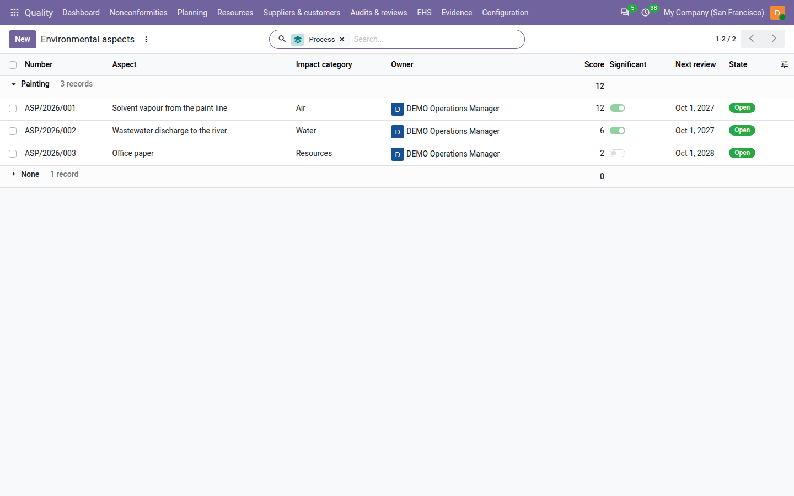
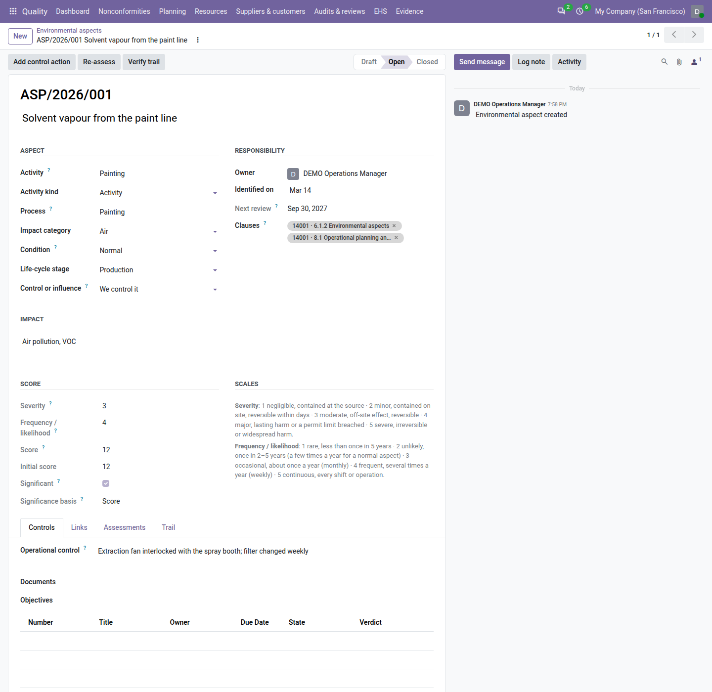
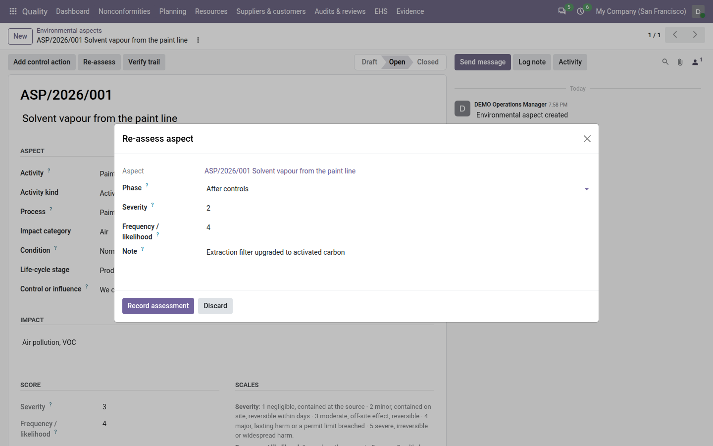

=====================
Environmental aspects
=====================

ISO 14001 asks you to know the environmental aspects of your activities, products and services — what they do to the
environment — to decide which are *significant*, and to control those (clauses 6.1.2, 6.1.4 and 8.1). With the ISO
14001 registers switched on (see :doc:`ehs_setup`), the **Quality** app keeps the aspect register: each aspect with
its activity, impact, condition and life-cycle stage, scored by severity and frequency, significant by one rule the
same for every process, and controlled.

Everything is under :menuselection:`Quality --> EHS --> Environment --> Aspects`.

.. list-table::
   :header-rows: 1
   :widths: 20 80

   * - State
     - Meaning
   * - **Draft**
     - Being identified and scored. It has no number yet and can be deleted.
   * - **Open**
     - In the register: numbered, reviewed at its interval, counted as evidence of clause 6.1.2.
   * - **Closed**
     - The aspect no longer occurs (for example the paint line was dismantled). Closed by a quality manager with a
       reason; kept with its history.

         score, significant, next review and state; the solvent vapour and wastewater aspects significant.

Record an aspect
================

#. Go to :menuselection:`Quality --> EHS --> Environment --> Aspects` and click :guilabel:`New`.
#. Enter the aspect, for example *Solvent vapour from the paint line*.
#. In :guilabel:`Aspect`, enter the :guilabel:`Activity` (for example *Painting*) and choose the :guilabel:`Activity
   kind` (activity, product or service), the :guilabel:`Process`, the :guilabel:`Impact category` (air, water, land,
   resources, energy, waste, noise, biodiversity, other), the :guilabel:`Condition` (:guilabel:`Normal`,
   :guilabel:`Abnormal` such as start-up or maintenance, or :guilabel:`Emergency`), the :guilabel:`Life-cycle stage`
   (raw materials to end of life) and :guilabel:`Control or influence`: :guilabel:`We control it` or :guilabel:`We can
   only influence it` (a supplier's transport, a customer's disposal).
#. Under :guilabel:`Impact`, write what the aspect does to the environment, for example *Air pollution, VOC*.
#. In :guilabel:`Responsibility`, choose the :guilabel:`Owner` and the :guilabel:`Identified on` date.
#. In :guilabel:`Score`, set :guilabel:`Severity` and :guilabel:`Frequency / likelihood` from 1 to 5; the scales are
   printed next to them. Odoo shows the :guilabel:`Score` (severity × frequency) and whether it is
   :guilabel:`Significant`.
#. For an emergency aspect, link the emergency situation that would cause it on the :guilabel:`Links` tab (see
   :doc:`emergency_preparedness`).
#. Save, then click :guilabel:`Open`. Odoo numbers the aspect, for example ``ASP/2026/001``, and records its initial
   assessment row.

Open needs every field above filled, the aspect scored and a clause tagged (clause 6.1.2 of ISO 14001 is proposed),
and a significant aspect needs a control (see below). While something is missing, a line at the top of the form says
*Needed for Open:* and lists all of it, for example *Severity and Likelihood under Score*. Clicking :guilabel:`Open`
anyway opens a window titled *Before you press Open* with the same list: click :guilabel:`Got it`, fill the fields it
names and click :guilabel:`Open` again. Open is shown to the aspect's owner and to quality managers.

         significant by score, with the scales and the Controls tab showing its operational control.

Significance
============

An aspect is significant for the first reason that applies:

.. list-table::
   :header-rows: 1
   :widths: 28 72

   * - :guilabel:`Significance basis`
     - When
   * - :guilabel:`Compliance obligation`
     - A compliance obligation in force is linked on the :guilabel:`Links` tab (see :doc:`legal_requirements`). Such
       an aspect is always significant, whatever its score.
   * - :guilabel:`Override`
     - A quality manager decided it, with a signed justification (see below).
   * - :guilabel:`Score`
     - The score reached the :guilabel:`Significance threshold` of the settings (10 by default).
   * - :guilabel:`None`
     - None of the above: not significant.

For example, severity 3 and frequency 4 give 12: significant by score; severity 2 and frequency 3 give 6: not
significant — unless the discharge permit is linked, which makes it significant by compliance obligation.

Override the significance
-------------------------

When the score does not tell the whole story, a quality manager decides:

#. Open the aspect and click :guilabel:`Override significance`.
#. Choose the :guilabel:`Decision` — *Significant*, *Not significant*, or *None* to remove the override — and write
   the :guilabel:`Justification` (at least 20 characters), for example *Discharge point 50 m from the river intake of
   the village water supply*.
#. Click :guilabel:`Sign override`. Odoo asks for your password, unless it was confirmed in the last ten minutes.

The form shows who overrode it and when. An aspect covered by a compliance obligation cannot be made not significant
(*An aspect covered by a compliance obligation is always significant.*). If an edit tries to change the significance
directly, the window *Overriding significance* explains that nothing was saved and offers a quality manager
:guilabel:`Override now…`; anyone else reads *Only a quality manager can override the significance; ask one, or
re-assess the aspect to change its score.*

Control significant aspects
===========================

Every significant aspect needs at least one control, on the :guilabel:`Controls` tab:

- an :guilabel:`Operational control` of at least 20 characters, for example *Extraction fan interlocked with the spray
  booth; filter changed weekly*;
- a controlled document (:guilabel:`Documents`), such as a work instruction;
- a control action: click :guilabel:`Add control action` to create a preventive action linked to the aspect (see
  :doc:`corrective_actions`);
- an :guilabel:`Objectives` link (see :doc:`objectives`).

Opening a significant aspect without any control is refused: *A significant aspect needs a control: an operational
control, a document, an action or an objective.* An open aspect that becomes significant later (a new obligation, a
re-assessment) without a control shows the red line *Control missing: …* and its owner gets the to-do *Add a control
to the aspect ASP/2026/001*.

Re-assess and review
====================

Once open, the score changes only by a re-assessment, which keeps the history (*Re-assess the aspect to change its
score.*):

#. Click :guilabel:`Re-assess`.
#. Choose the phase — :guilabel:`After controls`, :guilabel:`Periodic review` or :guilabel:`Change` — and set the new
   severity and frequency.
#. Write a note (required after controls and on a change), then click :guilabel:`Record assessment`.

The :guilabel:`Assessments` tab adds a row with the score, the threshold of that day, the previous score and the
change. When a control action is still open the dialog warns *Controls not all done: a control action is still open.*
When the last control action is done, the owner gets the to-do *Re-assess the aspect …*.

The :guilabel:`Next review` is the last assessment plus the review interval of the settings: 12 months for a
significant aspect, 24 for another (by default). The owner gets the to-do *Review the aspect …* before it, and the
aspect shows in the :guilabel:`Overdue review` filter after it.

Close an aspect
===============

A quality manager clicks :guilabel:`Close`, writes why the aspect no longer occurs (at least 10 characters) and clicks
:guilabel:`Close aspect`. Control actions must be finished or cancelled first (*Finish or cancel the control actions
first.*). Only a draft aspect can be deleted.

Find and print
==============

The register shows the number, aspect, impact category, owner, score, significance, next review and state; the other
fields are available from the column selector at the right of the header. Filters: :guilabel:`Draft`, :guilabel:`Open`, :guilabel:`Closed`, :guilabel:`Significant`, :guilabel:`Control
missing`, :guilabel:`Overdue review`, :guilabel:`Normal`, :guilabel:`Abnormal`, :guilabel:`Emergency`,
:guilabel:`We control it`, :guilabel:`We can only influence it`, :guilabel:`My aspects`, :guilabel:`Past retention`;
group by :guilabel:`Process`, :guilabel:`Life-cycle stage`, :guilabel:`Condition`, :guilabel:`Impact category`,
:guilabel:`Significance basis` or :guilabel:`Owner`.

To print the register, go to :menuselection:`Quality --> EHS --> Environment --> Print aspect register` (or select
aspects in the list and choose it from :guilabel:`Actions`); choose the :guilabel:`Date` (the aspects open that day are printed as they stood then) and click
:guilabel:`Print`; the window closes when the PDF has downloaded. The same register is file ``20_environmental_aspects.pdf`` of the audit pack.

The :guilabel:`Links` tab also lists the monitoring indicators of the aspect (see :doc:`monitoring`), and the
:guilabel:`Incidents` tab the environmental incidents linked to it (see :doc:`incidents`).

On the dashboard and in the review
==================================

- The tile :guilabel:`Significant aspects` counts the open significant aspects; it is red when one of them lacks a
  control or is overdue for review. See :doc:`dashboard`.
- The ISO 14001 review input *Changes in significant environmental aspects* shows the significant aspects at the end
  of the period, those that became or ceased significant, and the controls missing. See :doc:`management_reviews`.

Who can do what
===============

.. list-table::
   :header-rows: 1
   :widths: 40 20 20 20

   * - Action
     - Quality user
     - Internal auditor
     - Quality manager
   * - Record an aspect, edit a draft
     - Yes
     - No (reads)
     - Yes
   * - Open, re-assess, add a control action
     - Their own aspects
     - No
     - Yes
   * - Override significance (signed), close
     - No
     - No
     - Yes

On an aspect you do not own, a line under the header says *Only the owner (…) or a quality manager can work on this
aspect.*

.. note::
   **Known limits**

   - No carbon or greenhouse-gas accounting, emission factors or life-cycle assessment: the aspect register scores and
     controls aspects; quantities go in :doc:`monitoring`.
   - No chemical or safety data sheet register and no waste manifests.
