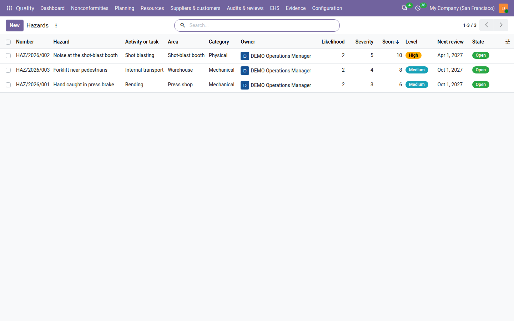
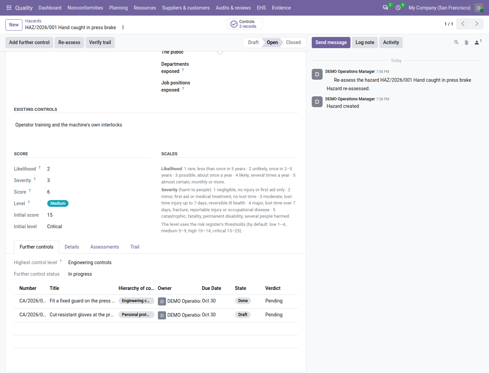

==============================
Hazards and OH&S opportunities
==============================

ISO 45001 asks you to identify the hazards of your work, assess the risk each one carries, and control it following
the *hierarchy of controls* — eliminate the hazard first, protective equipment last (clauses 6.1.2, 6.1.4 and 8.1.2).
With the ISO 45001 registers switched on (see :doc:`ehs_setup`), the **Quality** app keeps the hazard register: each
hazard of a task and area, who may be harmed, the controls already in place, its score on the same grid as your risks,
and the further controls that reduce it.

Everything is under :menuselection:`Quality --> EHS --> Health & Safety`: :guilabel:`Hazards` and :guilabel:`OH&S
opportunities`.

.. list-table::
   :header-rows: 1
   :widths: 20 80

   * - State
     - Meaning
   * - **Draft**
     - Being identified and scored. It has no number yet and can be deleted.
   * - **Open**
     - In the register: numbered, reviewed at the interval of its level, counted as evidence.
   * - **Closed**
     - The hazard no longer exists (for example the press was scrapped). Closed by a quality manager with a reason.

         press brake hazard, with their score, level badge, next review and state.

Record a hazard
===============

#. Go to :menuselection:`Quality --> EHS --> Health & Safety --> Hazards` and click :guilabel:`New`.
#. Enter the hazard in one line, for example *Hand caught in press brake*.
#. In :guilabel:`Hazard`, enter the :guilabel:`Activity or task` (*Bending*) and the :guilabel:`Area` (*Press
   shop*), and choose the :guilabel:`Process`, the :guilabel:`Category` (physical, chemical, biological, ergonomic,
   psychosocial, mechanical, electrical, fire and explosion, other) and :guilabel:`Routine or not` (a non-routine task
   is maintenance, cleaning or a breakdown).
#. In :guilabel:`Responsibility`, choose the :guilabel:`Owner` and the :guilabel:`Identified on` date.
#. Under :guilabel:`What could happen`, describe the harm (*Crushed fingers*); under :guilabel:`Who may be harmed`,
   tick :guilabel:`Employees`, :guilabel:`Contractors`, :guilabel:`Visitors` or :guilabel:`The public`; under
   :guilabel:`Existing controls`, write the controls already in place (*Light curtain*), or *None*.
#. In :guilabel:`Score`, set :guilabel:`Likelihood` and :guilabel:`Severity` from 1 to 5; the scales are printed next
   to them. Odoo shows the :guilabel:`Score` and the :guilabel:`Level` — low, medium, high or critical — with the
   thresholds of the risk register (by default low 1–4, medium 5–9, high 10–14, critical 15–25).
#. On the :guilabel:`Details` tab, add a description and the :guilabel:`Safe work procedures` (controlled documents)
   if useful.
#. Save. While the hazard is a draft, a banner (*Needed for Open: …*) names what Open still needs, for example *Who
   may be harmed: tick Employees, Contractors, Visitors or The public*, and shortens as you fill it in. Then click
   :guilabel:`Open`. Odoo numbers the hazard, for example ``HAZ/2026/001``, and records its initial
   assessment.

Open checks the hazard, task, category, harm, routine and owner, who may be harmed, the existing controls, the score
and a clause (clauses 6.1.2.1 and 6.1.2.2 of ISO 45001 are tagged when the hazard is created; 6.1.4 and 8.1.2 are
added once it has a further control). A **high** or **critical** hazard also needs a
further control first (*A high or critical hazard needs at least one further control.*). Open is shown to the owner
and to quality managers.

         level badge, the initial score 15 Critical, and the Further controls tab with an engineering control done and
         a PPE control planned.

Add further controls
====================

A further control is a preventive action classified by the hierarchy of controls:

.. list-table::
   :header-rows: 1
   :widths: 30 70

   * - :guilabel:`Hierarchy of controls`
     - Example
   * - :guilabel:`Elimination`
     - Stop the task, remove the hazard.
   * - :guilabel:`Substitution`
     - A less hazardous substance or machine.
   * - :guilabel:`Engineering controls`
     - A fixed guard, an interlock, extraction.
   * - :guilabel:`Administrative controls`
     - A procedure, rotation, training, signs.
   * - :guilabel:`Personal protective equipment`
     - Gloves, hearing protection — the last resort.

#. Open the hazard and click :guilabel:`Add further control`.
#. Choose the :guilabel:`Hierarchy of controls`, write the title and description, the owner, due date and
   effectiveness date, and save. The action is linked to the hazard and tagged 8.1.2 (see :doc:`corrective_actions`
   for the life of an action).

The :guilabel:`Further controls` tab shows the :guilabel:`Highest control level` used and the :guilabel:`Further
control status` (planned, in progress, done, re-assessed).

A high or critical hazard with no further control shows the red line *Further control needed: a high or critical
hazard needs at least one further control.* and its owner gets the to-do *Add a further control to the hazard …*. A
high hazard controlled by protective equipment only shows *Only PPE controls this hazard — consider a higher control.*
A **critical** hazard controlled by protective equipment only needs a :guilabel:`PPE justification` of at least 20
characters: why nothing higher in the hierarchy is possible. Cancelling its last control above PPE is refused until the
justification is written (*This is the last control above PPE of a critical hazard; record the PPE justification on
the hazard first.*).

Re-assess and review
====================

When the last further control is done, the owner gets the to-do *Re-assess the hazard …*.

#. Click :guilabel:`Re-assess`.
#. Choose the phase — :guilabel:`After further controls`, :guilabel:`Periodic review`, :guilabel:`Change` or
   :guilabel:`After an incident` (then choose the :guilabel:`Incident`, among those linked to the hazard) — and set the
   new likelihood and severity.
#. Write a note (required except for a periodic review) and click :guilabel:`Record assessment`.

The :guilabel:`Assessments` tab adds a row with the score and level, the previous score and the change: for example 6
(medium) after 15 (critical), a change of −9. A hazard whose level after controls is still critical asks its owner to
add controls.

The :guilabel:`Next review` is the last assessment plus the interval of the hazard's level (by default 12 months for
low and medium, 6 for high, 3 for critical). When an incident is linked to the hazard, its owner gets the to-do *Review
hazard HAZ/2026/001 after incident INC/2026/004* (see :doc:`incidents`).

Close a hazard
==============

A quality manager clicks :guilabel:`Close`, writes why the hazard no longer exists (at least 10 characters) and clicks
:guilabel:`Close hazard`. Further controls in progress must be finished or cancelled first.

Once a hazard is open, its score changes only by a re-assessment (*Re-assess the hazard to change its score.*).

OH&S opportunities
==================

ISO 45001 also asks for the opportunities to improve health and safety (6.1.2.3). They are kept in the risk register,
not in the hazard register: :menuselection:`Quality --> EHS --> Health & Safety --> OH&S opportunities` lists the
opportunities of the risk register tagged with ISO 45001, and :guilabel:`New` there creates an opportunity tagged
45001 6.1.2.3. They follow the rules of :doc:`risks`.

Find and print
==============

The list opens flat, highest level first. Filters: :guilabel:`Draft`, :guilabel:`Open`, :guilabel:`Closed`, the levels :guilabel:`Low` to :guilabel:`Critical`,
:guilabel:`Further control needed`, :guilabel:`Routine`, :guilabel:`Non-routine`, :guilabel:`Overdue review`,
:guilabel:`My hazards`, :guilabel:`Past retention`; group by :guilabel:`Area`, :guilabel:`Level`,
:guilabel:`Category`, :guilabel:`Process`, :guilabel:`Routine or not` or :guilabel:`Owner`.

To print the register, go to :menuselection:`Quality --> EHS --> Health & Safety --> Print hazard register` (or
select hazards in the list and choose it from :guilabel:`Actions`); choose the :guilabel:`Date` and click :guilabel:`Print`. The PDF lists each hazard with its scores before
and after, its further controls by hierarchy level and its PPE justification. The same register is file
``21_hazard_register.pdf`` of the audit pack.

The :guilabel:`Incidents`, :guilabel:`Worker reports` and :guilabel:`Consultations` tabs show the incidents, worker
hazard reports and consultations linked to the hazard.

On the dashboard and in the review
==================================

- The tile :guilabel:`High and critical hazards` counts the open high and critical hazards; it is red when one of them
  needs a further control, is overdue for review, or is critical with protective equipment only and no justification.
  See :doc:`dashboard`.
- The ISO 45001 review input *OH&S risks and opportunities* shows the hazards by level at the end of the period, the
  controls re-assessed in the period and how many reduced the level. See :doc:`management_reviews`.

Employees (with HR installed)
=============================

When the **Employees** app is installed, :guilabel:`Who may be harmed` also has :guilabel:`Departments exposed` and
:guilabel:`Job positions exposed`, and :guilabel:`Employees exposed` counts the active employees of the company in
those departments or positions, each counted once — for example *12*. Child departments count only when selected too.
Without Employees, the hazard form has no such fields.

Who can do what
===============

.. list-table::
   :header-rows: 1
   :widths: 40 20 20 20

   * - Action
     - Quality user
     - Internal auditor
     - Quality manager
   * - Record a hazard, edit a draft
     - Yes
     - No (reads)
     - Yes
   * - Open, re-assess, add a further control
     - Their own hazards
     - No
     - Yes
   * - Close
     - No
     - No
     - Yes

On a hazard you do not own, a line under the header says *Only the owner (…) or a quality manager can work on this
hazard.*

.. note::
   **Known limits**

   - No PPE issue register, no medical surveillance, no permit-to-work and no contractor management.
   - Hazards are scored on the 5 × 5 grid of the risk register; there is no separate scoring method.
