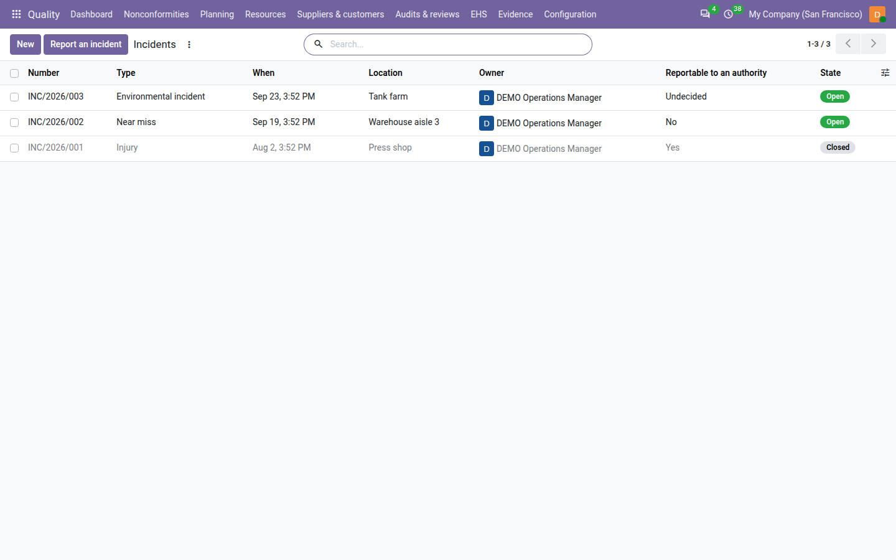
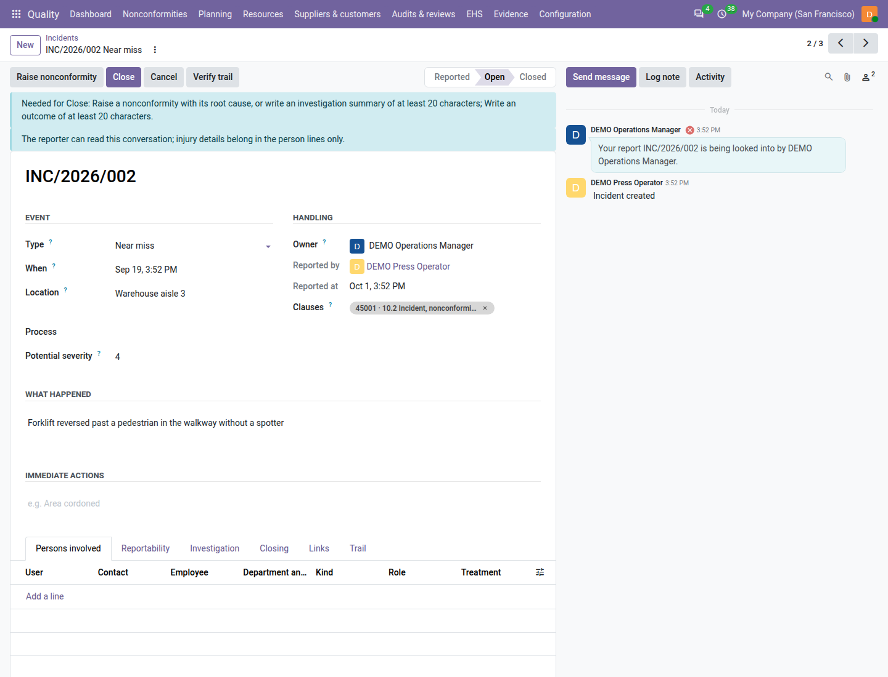

=========
Incidents
=========

ISO 45001 asks you to report, investigate and act on incidents — injuries, ill health and near misses — and ISO 14001
on environmental incidents (clause 10.2). With the environment, health and safety registers switched on (see
:doc:`ehs_setup`), the **Quality** app keeps one incident log: anyone reports in under a minute from the **Safety
reports** app (see :doc:`safety_reports`), a quality user triages the report, the investigation runs through a
nonconformity with its root cause and corrective actions, and the incident closes only when everything its type needs
is recorded.

Injury details are health data: only quality managers read them.

The log is under :menuselection:`Quality --> EHS --> Shared --> Incidents`. To report an incident yourself, click
:guilabel:`Report an incident` at the top of the list: it opens the same short window as in the Safety reports app, and
after :guilabel:`Report` you land on the full incident form.

.. list-table::
   :header-rows: 1
   :widths: 20 80

   * - State
     - Meaning
   * - **Reported**
     - Just reported, waiting for triage. The reporter sees it in *My incident reports*.
   * - **Open**
     - Triaged: it has an owner who investigates it.
   * - **Closed**
     - Everything its type needs is recorded; the reporter reads the outcome.
   * - **Cancelled**
     - Not an incident (a duplicate, a mistake); the reporter reads the reason.

The types offered follow the registers switched on:

.. list-table::
   :header-rows: 1
   :widths: 30 70

   * - :guilabel:`Type`
     - Offered while
   * - :guilabel:`Injury`, :guilabel:`Ill health`, :guilabel:`Near miss` (nobody hurt), :guilabel:`Dangerous
       occurrence`
     - the ISO 45001 registers are on
   * - :guilabel:`Environmental incident`
     - the ISO 14001 registers are on

         warehouse and the open environmental spill, with their type, date, location, owner, reportability and
         state.

Triage a report
===============

New reports arrive in the **Reported** state; the tile :guilabel:`Incidents to triage` counts them and the filter
:guilabel:`To triage` lists them. A report waiting longer than :guilabel:`Triage incidents within (days)` (2 by
default) turns the tile red, and a to-do *Triage incident INC/2026/007* is given.

#. Open the report. Read what happened, when, where and who was involved.
#. Click :guilabel:`Open`. You become its :guilabel:`Owner`, the clauses of its type are tagged (10.2 of the
   standard; 8.2 as well when an emergency situation is linked), and the reporter is told *Your report INC/2026/007 is
   being looked into by …*.

A quality user who is not the owner may still triage; once open, the owner or a quality manager works on it. The type
can be corrected afterwards by the owner.

         happened and the Persons involved, Reportability, Investigation, Closing and Links tabs.

Persons involved
================

On the :guilabel:`Persons involved` tab, add a line per person: the :guilabel:`User` or the :guilabel:`Contact` (a
contractor's worker, a visitor), the :guilabel:`Kind` (employee, contractor, visitor, member of the public) and the
role: :guilabel:`Injured` (on an injury only), :guilabel:`Made ill` (on ill health only), :guilabel:`Witness` or
:guilabel:`Involved`.

Open a person's line to record the :guilabel:`Injury details`: :guilabel:`Body part`, :guilabel:`Nature of injury`,
:guilabel:`Treatment` (first aid, medical treatment, lost time, fatality), :guilabel:`Days lost` (only with lost time
or a fatality) and an :guilabel:`Injury note`.

.. important::
   The injury details are visible to **quality managers only**. Quality users and internal auditors see the person's
   name and role, never the injury fields, and the incident log PDF prints neither names nor injuries. The
   nonconformity raised from an incident receives none of them: do not write health details in the nonconformity or
   in the incident's messages — the line above the chatter reminds you that *The reporter can read this conversation;
   injury details belong in the person lines only.* Every change of injury details records who changed them and when.

Decide reportability
====================

Some incidents must be notified to an authority (a labour inspectorate, an environment agency). On the
:guilabel:`Reportability` tab, a quality manager decides:

#. Set :guilabel:`Reportable to an authority` to :guilabel:`Yes` or :guilabel:`No` (it starts :guilabel:`Undecided`).
#. For *Yes*, choose the :guilabel:`Authority`. Odoo proposes the :guilabel:`Report due` date — the day of the incident
   plus :guilabel:`Authority report due after (days)` (7 by default; check the law of your country) — and the owner
   gets the to-do *Notify the authority of incident …* due that day.
#. Once notified, enter :guilabel:`Reported to the authority on` and the :guilabel:`Authority reference`.

Past its due date without a notification date, the incident shows the red line *The authority report is overdue:
record the date the authority was notified.* and the tile :guilabel:`Authority reports due` turns red. Changing *Yes*
back to *No* needs a :guilabel:`Reportability note` of at least 20 characters. Only quality managers write these fields
(*Only a quality manager decides whether an incident is reportable.*).

Investigate through a nonconformity
===================================

#. On the open incident, click :guilabel:`Raise nonconformity`. A nonconformity of source *Health, safety and
   environment* opens, linked to the incident, with a proposed severity: **critical** for a reportable incident,
   **major** for an injury, ill health, a dangerous occurrence or a potential severity of 4 or 5, **minor** otherwise.
   Its description carries no person and no injury detail.
#. Record the containment, correction, root cause (5 Whys or Ishikawa) and corrective actions on the nonconformity (see
   :doc:`nonconformities` and :doc:`corrective_actions`).
#. On the incident's :guilabel:`Investigation` tab, name the :guilabel:`Investigators (users)` — workers included — and
   :guilabel:`Investigators (contacts)`, and write the :guilabel:`Investigation summary`.

An incident has one live nonconformity (*This incident already has a live nonconformity: …*). The
:guilabel:`Open nonconformity` smart button opens it.

For a **near miss**, a nonconformity is optional: an investigation summary of at least 20 characters is enough.

Link what the incident concerns
===============================

On the :guilabel:`Links` tab, choose the :guilabel:`Emergency situation` it realised, the :guilabel:`Hazards` (ISO
45001) and the :guilabel:`Environmental aspects` (ISO 14001). Linking a hazard gives its owner the to-do *Review
hazard … after incident …* (see :doc:`hazards`); linking an emergency situation asks for its plan review (see
:doc:`emergency_preparedness`). The :guilabel:`Worker reports` and :guilabel:`Consultations` tabs list the reports and
consultations linked to it.

For an environmental incident, the :guilabel:`Release to the environment` group records where the release went
(:guilabel:`Air`, :guilabel:`Water`, :guilabel:`Land`, or :guilabel:`None` for an environmental near miss), the
substance and the quantity with its unit.

Close or cancel
===============

A quality manager closes the incident: write the :guilabel:`Outcome` on the :guilabel:`Closing` tab (at least 20
characters; the reporter reads it) and click :guilabel:`Close`. While something is missing, a banner above the form
says so (*Needed for Close: …*) and shortens as you fill things in. If you click :guilabel:`Close` anyway, Odoo lists
everything still missing at once, for example::

   Before closing INC/2026/004:
   - Body part, nature and treatment for DEMO Press Operator
   - Decide whether the incident is reportable
   - Record the root cause on NC/2026/0042
   - Name at least one investigator

.. list-table::
   :header-rows: 1
   :widths: 35 65

   * - Type
     - Needs before closing
   * - Injury, ill health
     - The injured or ill person with body part (injury), nature and treatment; days lost for lost time; reportability
       decided; a nonconformity with its root cause; an investigator; the outcome.
   * - Dangerous occurrence
     - Reportability decided; a nonconformity with its root cause; an investigator; the potential severity (1–5); the
       outcome.
   * - Near miss
     - A nonconformity with its root cause or an investigation summary of 20 characters; the potential severity; the
       outcome.
   * - Environmental incident
     - Reportability decided; the release medium; a nonconformity with its root cause; an investigator; the potential
       severity; the outcome.

A reportable incident also needs the date the authority was notified. The reporter is told *Your report … is closed.
Outcome: …*.

To cancel a report that is not an incident, click :guilabel:`Cancel`, give the reason (at least 10 characters; the
reporter reads it) and click :guilabel:`Cancel incident`. Cancel its nonconformity first if it has one. Incidents are
never deleted.

Find and print
==============

Filters: :guilabel:`To triage`, :guilabel:`Open`, :guilabel:`Closed`, :guilabel:`Cancelled`, the types,
:guilabel:`Reportability undecided`, :guilabel:`Reportable`, :guilabel:`Authority report due`, :guilabel:`Authority
report overdue`, :guilabel:`My incidents`, :guilabel:`Past retention`; group by :guilabel:`Type`, :guilabel:`State`,
:guilabel:`Owner`, :guilabel:`Process` or :guilabel:`Occurred` (month).

To print the log, go to :menuselection:`Quality --> EHS --> Shared --> Print incident log` (or select incidents in the
list and choose it from :guilabel:`Actions`);
set :guilabel:`From` and :guilabel:`To` and click :guilabel:`Print`. The PDF lists the incidents that occurred in the
period (cancelled ones excluded) with type, date, reportability and nonconformity state, and a totals table by type and
treatment — without person names or body parts. The same log is file ``22_incident_log.pdf`` of the audit pack.

On the dashboard and in the review
==================================

- :guilabel:`Incidents to triage` counts the reported incidents; red when one waits longer than the triage days.
- :guilabel:`Authority reports due` counts the open reportable incidents not yet notified; red when one is overdue.
- The ISO 45001 review input *Incidents, nonconformities and corrective actions* shows the incidents of the period by
  type, the total days lost and the authority reports made late. See :doc:`management_reviews`.

Employees (with HR installed)
=============================

When the **Employees** app is installed:

- a person line can name an :guilabel:`Employee` — for example a shop-floor worker without an Odoo user — and shows
  their :guilabel:`Department and job position`;
- the :guilabel:`Investigation` tab also has :guilabel:`Investigators (employees)`.

Without Employees, only users and contacts are offered.

Who can do what
===============

.. list-table::
   :header-rows: 1
   :widths: 40 20 20 20

   * - Action
     - Quality user
     - Internal auditor
     - Quality manager
   * - Report an incident
     - Yes (so can every employee without a Quality role)
     - No: the entry is not shown to them (they read the log and record nothing in it)
     - Yes
   * - Triage (Open)
     - Yes
     - No (reads)
     - Yes
   * - Persons, investigation, links, raise the nonconformity
     - As the owner
     - No
     - Yes
   * - Read and write injury details
     - No
     - No
     - Yes
   * - Decide reportability, close
     - No
     - No
     - Yes
   * - Cancel
     - As the owner
     - No
     - Yes

On an incident you do not own, a line under the header says *Only the owner (…) or a quality manager can work on
this incident.*

.. note::
   **Known limits**

   - No country forms (OSHA 300, RIDDOR or others) and no frequency rates (LTIFR, TRIR): the log and the review give
     the counts and days lost to build them.
   - No portal or anonymous reporting: reports come from internal users (see :doc:`safety_reports`).
