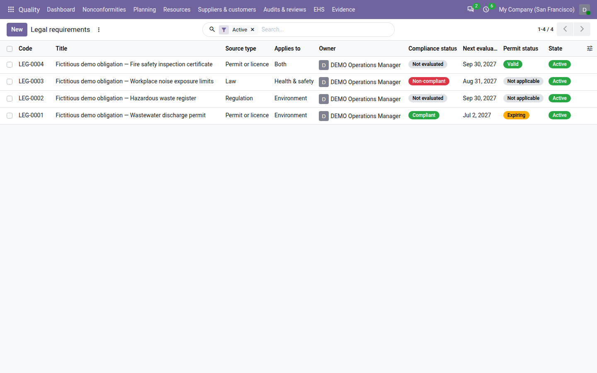
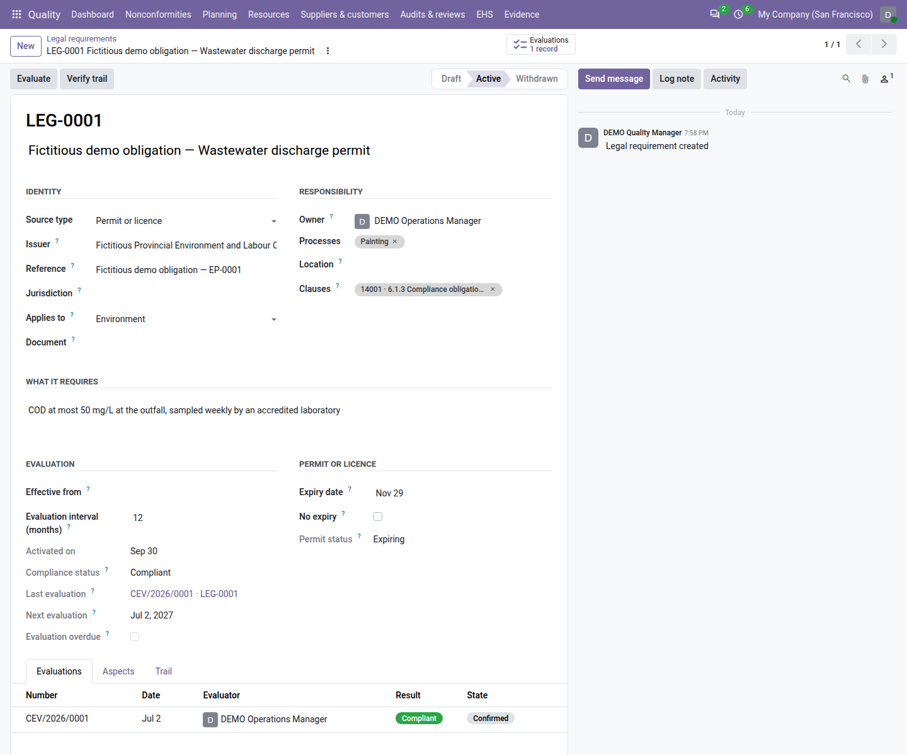
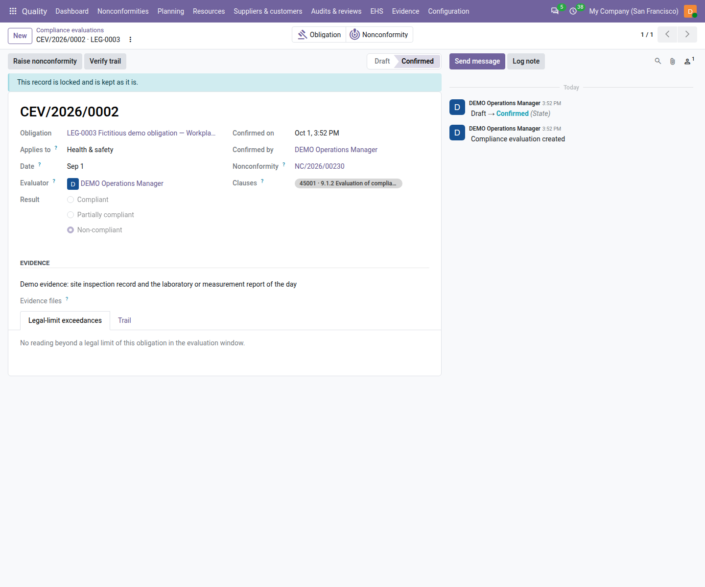

==================
Legal requirements
==================

ISO 14001 and ISO 45001 both ask you to know the legal and other requirements that apply to you (clause 6.1.3), to
evaluate at planned intervals whether you comply with them (clause 9.1.2), and to keep evidence of the result. With the
environment, health and safety registers switched on (see :doc:`ehs_setup`), the **Quality** app keeps one legal
register for both standards: each law, regulation, permit, customer requirement or voluntary commitment, who owns it,
how often it is evaluated, and every evaluation with its evidence.

A partial or failed evaluation raises a nonconformity, and a monitoring reading beyond a legal limit is listed on the
next evaluation, so an obligation is never declared compliant while the figures say otherwise.

Everything is under :menuselection:`Quality --> EHS --> Shared --> Legal requirements`.

.. list-table::
   :header-rows: 1
   :widths: 20 80

   * - State
     - Meaning
   * - **Draft**
     - Being written. It can still be deleted.
   * - **Active**
     - In force: it is evaluated at its interval, its permit expiry is watched, and it counts on the dashboard.
   * - **Withdrawn**
     - No longer applies (repealed law, surrendered permit). It keeps its evaluations and leaves the active register.

         evaluation, permit status and state; the non-compliant one in red.

Record an obligation
====================

#. Go to :menuselection:`Quality --> EHS --> Shared --> Legal requirements` and click :guilabel:`New`.
#. Enter the title, for example *Wastewater discharge limits*.
#. In :guilabel:`Identity`, choose the :guilabel:`Source type` (:guilabel:`Law`, :guilabel:`Regulation`,
   :guilabel:`Permit or licence`, :guilabel:`Customer requirement`, :guilabel:`Voluntary commitment` or
   :guilabel:`Other`), then the :guilabel:`Issuer`, the :guilabel:`Reference` (the issuer's identifier, for example
   *EP-2025-114*) and the :guilabel:`Jurisdiction`. In :guilabel:`Applies to`, choose the standard it serves:
   *Environment*, *Health & safety* or *Both* (only the standards switched on are offered). In
   :guilabel:`Document`, you may link the controlled external document that holds the text of the law or the permit.
#. In :guilabel:`Responsibility`, choose the :guilabel:`Owner` — the quality user who keeps the obligation current
   and evaluates it — and, if useful, the :guilabel:`Processes` and :guilabel:`Location` it concerns.
#. Under :guilabel:`What it requires`, write in your own words what the obligation asks of you (at least 20
   characters), for example *COD at most 50 mg/L at the outfall, sampled weekly by an accredited laboratory*.
#. In :guilabel:`Evaluation`, check :guilabel:`Effective from` and the :guilabel:`Evaluation interval (months)`
   (12 by default, from the settings).
#. For a permit or licence, enter its :guilabel:`Expiry date` or tick :guilabel:`No expiry`.
#. Save. Odoo gives the obligation its code, for example ``LEG-0003``, which never changes.
#. Click :guilabel:`Activate`. The obligation needs its title, source type, issuer, reference, standard and owner, the
   requirement text, and, for a permit, the expiry date or :guilabel:`No expiry`. While something is missing, a line at
   the top of the form says *Needed for Activate:* and lists all of it; clicking :guilabel:`Activate` anyway opens a
   window titled *Before you press Activate* with the same list. Click :guilabel:`Got it`, fill the fields and click
   :guilabel:`Activate` again. Otherwise the obligation is put in force.

Activate is shown to the obligation's owner and to quality managers. The clause 6.1.3 of the standard it serves is
tagged on the obligation.

         requirement text, evaluation interval, next evaluation, permit expiry and status Expiring, the Evaluate
         button and the Evaluations list.

Evaluate compliance
===================

The obligation's :guilabel:`Next evaluation` is its last evaluation date (or the day it applies from) plus the
interval. Some days before (14 by default, :guilabel:`Evaluation reminder (days before)`), the owner gets the to-do
*Evaluate compliance with LEG-0003*. After that date the obligation shows :guilabel:`Evaluation overdue` and is red in
the list.

#. Open the obligation and click :guilabel:`Evaluate`. A draft compliance evaluation opens, with you as the
   :guilabel:`Evaluator`.
#. Enter the :guilabel:`Date` of the evaluation (not in the future) and the :guilabel:`Result`: *Compliant*,
   *Partially compliant* or *Non-compliant*.
#. Under :guilabel:`Evidence`, write what was checked (at least 20 characters) — records, readings, an inspection,
   the permit conditions — and attach the lab reports or photos in :guilabel:`Evidence files`.
#. Open the :guilabel:`Legal-limit exceedances` tab: it lists the monitoring readings beyond a legal limit of this
   obligation in the evaluation window (see :doc:`monitoring`).
#. Click :guilabel:`Confirm`. Until it can be confirmed, a line at the top of the draft evaluation says *Needed for
   Confirm:* and lists everything missing (the result and the evidence); clicking :guilabel:`Confirm` early opens a
   window titled *Before you press Confirm* with the same list.

Odoo numbers the evaluation, for example ``CEV/2026/0001``, locks it with its evidence files, and moves the
obligation's :guilabel:`Compliance status` and :guilabel:`Next evaluation` on. The evaluation to-do is marked done.
Confirm is shown to the evaluator, to the obligation's owner and to quality managers; internal auditors read
evaluations and record none.

         obligation smart button and the Nonconformity smart button.

Rules you may meet when confirming:

- *A compliance evaluation cannot be dated in the future.*
- With readings beyond the legal limit listed and the result *Compliant*: *Justify the compliant result against the 2
  legal-limit exceedances listed (at least 20 characters).* Write the :guilabel:`Justification` (for example, both
  exceedances were corrected and the following readings are within the limit), then confirm again.
- *Only an active obligation can be evaluated.*

When the permit is expired or expiring on the evaluation date, a red line on the evaluation says so, for example
*Permit expired on 2026-09-01*.

When compliance fails: the nonconformity
----------------------------------------

Confirming *Partially compliant* raises a **minor** nonconformity, *Non-compliant* a **major** one, of source
*Health, safety and environment*, named for example *LEG-0003 non-compliant on 2026-09-30*. Its owner is the
obligation's owner, its source is the evaluation, and it is tagged with clause 9.1.2 of the enabled standards. Open it
from the :guilabel:`Nonconformity` smart button and treat it like any other (see :doc:`nonconformities`).

That nonconformity cannot be closed until a later evaluation of the same obligation is confirmed *Compliant*: its
closure list shows *Record a compliant re-evaluation of LEG-0003*.

A confirmed evaluation also offers :guilabel:`Raise nonconformity`, to raise another one by hand — for an observation
worth treating although the result was compliant.

Permits and licences
====================

For an obligation with an expiry date, :guilabel:`Permit status` shows :guilabel:`Valid`, :guilabel:`Expiring`
(within the :guilabel:`Permit renewal lead time (days)`, 90 by default) or :guilabel:`Expired`. When the permit starts
expiring, the owner gets the to-do *Renew EP-2025-114 (LEG-0003)*. Enter the new expiry date once the permit is
renewed: the permit is valid again and the to-do ends.

Withdraw an obligation
======================

When a law is repealed or a permit surrendered, a quality manager withdraws the obligation:

#. Open the active obligation and click :guilabel:`Withdraw`.
#. Write the :guilabel:`Reason` (at least 20 characters) and, if another obligation replaces it, choose it in
   :guilabel:`Superseded by`.
#. Click :guilabel:`Sign and withdraw`. Odoo asks for your password, unless it was confirmed in the last ten minutes.

The obligation becomes **Withdrawn** with its date, reason and successor, keeps its evaluations, and leaves the
dashboard and the reminders. It is never deleted: only a draft obligation can be deleted (*Only a draft obligation can
be deleted; withdraw an active one.*).

Changing the state by hand
==========================

The state of an obligation moves only with its buttons, which check the obligation and record the date. If an edit
tries to change it, a window titled *Changing an obligation's state* explains that nothing was saved:

- to the owner or a quality manager of a draft obligation, it offers :guilabel:`Activate now`, which does it for you;
- to a quality manager on an active obligation, it offers :guilabel:`Withdraw now…`, which opens the withdrawal;
- to anyone else it says who can act — *Only the owner (…) or a quality manager can activate it; ask them.* or *Only
  a quality manager can withdraw it; ask one. You can still evaluate it with the Evaluate button at the top of this
  form.* — and offers no button.

:guilabel:`Got it` closes the window.

On a draft obligation you do not own, a line under the header says *Only the owner (…) or a quality manager can
activate this obligation.* Internal auditors read *Auditors have read-only access.*

Find and print
==============

The list opens on the :guilabel:`Active` filter. Other filters: :guilabel:`Draft`, :guilabel:`Withdrawn`,
:guilabel:`Environment`, :guilabel:`Health & Safety`, :guilabel:`Evaluation due` (within 30 days),
:guilabel:`Evaluation overdue`, :guilabel:`Permit expiring`, :guilabel:`Not compliant`, :guilabel:`My obligations`
and :guilabel:`Past retention`; group by :guilabel:`Applies to`, :guilabel:`Owner` or :guilabel:`Source type`.

To print the register, go to :menuselection:`Quality --> EHS --> Shared --> Print legal register` (or select
obligations in the list and choose it from :guilabel:`Actions`); set :guilabel:`From` and :guilabel:`To` and click :guilabel:`Print`; the window closes when the PDF has downloaded. The PDF shows
the status of every obligation as at the :guilabel:`To` date and the evaluations of the period. The same register is
file ``17_legal_register.pdf`` of the audit pack (see :doc:`audit_pack`).

On an obligation, the :guilabel:`Aspects` tab lists the environmental aspects it applies to (see
:doc:`environmental_aspects`), and the :guilabel:`Trail` tab its history (see :doc:`trail`).

On the dashboard and in the review
==================================

- The tile :guilabel:`Legal compliance` counts the active obligations whose evaluation is overdue, whose permit is
  expiring or expired, or whose latest result is not compliant; it is red with the badge *1 permit(s) expired* or
  *1 evaluation(s) overdue*. A quality user counts the obligations they own. See :doc:`dashboard`.
- The management review input *Fulfilment of compliance obligations* (ISO 14001 9.3 d 3) and *Fulfilment of legal and
  other requirements* (ISO 45001 9.3 d 3) show the evaluations of the period by result. See
  :doc:`management_reviews`.

Who can do what
===============

.. list-table::
   :header-rows: 1
   :widths: 40 20 20 20

   * - Action
     - Quality user
     - Internal auditor
     - Quality manager
   * - Record an obligation
     - Yes
     - No (reads)
     - Yes
   * - Activate
     - Their own
     - No
     - Yes
   * - Evaluate and confirm
     - Yes (confirm: as evaluator or owner)
     - No
     - Yes
   * - Withdraw (signed)
     - No
     - No
     - Yes

.. note::
   **Known limits**

   - The app ships no legal content: no list of laws, no regulatory text of any country, no update service. You record
     the obligations that apply to you, in your own words, and keep the official text as an external document.
   - The app does not fetch changes in the law; a quality manager reviews the register (the management review input
     on changes in compliance obligations helps).
