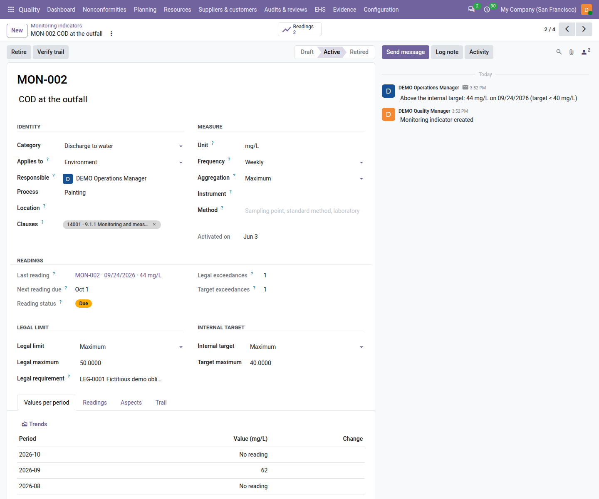
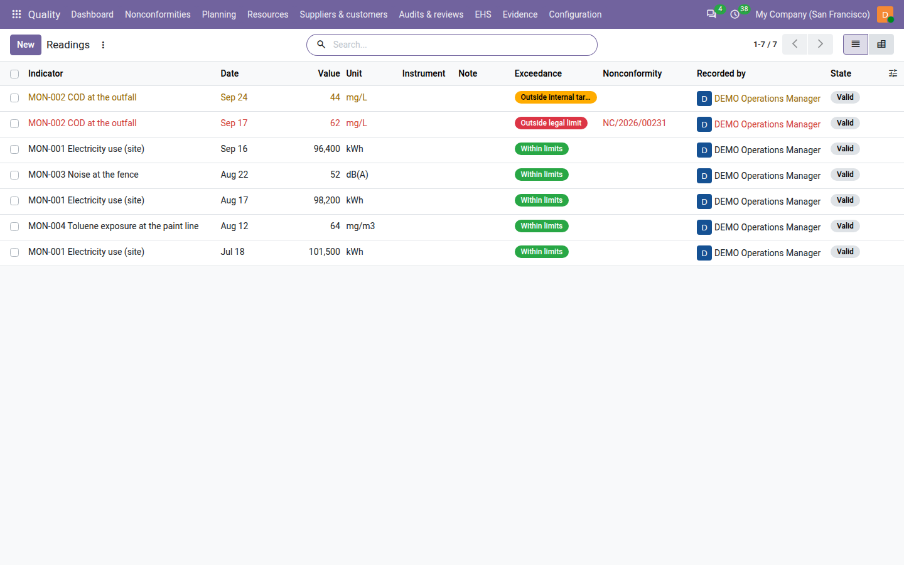
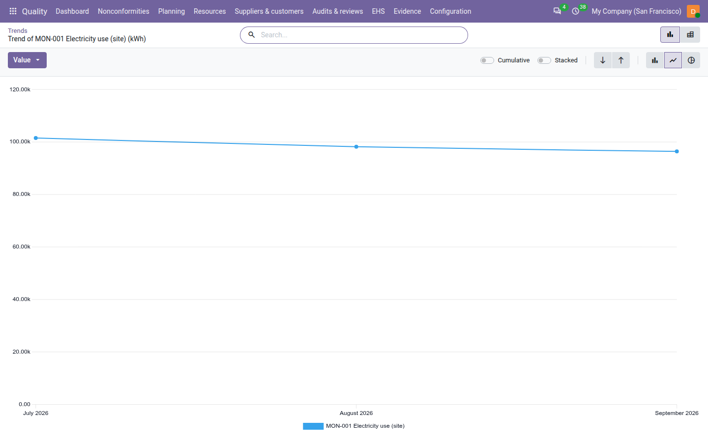

==========================
Monitoring and measurement
==========================

ISO 14001 and ISO 45001 ask you to decide what you monitor and measure, how, against which criteria, and to keep the
results (clause 9.1.1): energy and water use, waste, discharges and emissions, noise, the exposure of workers to
chemicals or dust. With the environment, health and safety registers switched on (see :doc:`ehs_setup`), the
**Quality** app keeps each thing you monitor as an *indicator* with its unit, frequency, legal limit and internal
target, and each measurement as a *reading* classified the moment it is entered.

A reading beyond the legal limit raises a nonconformity at once; a reading above your internal target warns the
indicator's responsible without one.

The register is under :menuselection:`Quality --> EHS --> Shared`: :guilabel:`Monitoring indicators`,
:guilabel:`Readings` and :guilabel:`Trends`.

.. list-table::
   :header-rows: 1
   :widths: 20 80

   * - Indicator state
     - Meaning
   * - **Draft**
     - Being defined. It takes no reading yet and can be deleted.
   * - **Active**
     - Measured at its frequency: readings are expected, reminded and counted.
   * - **Retired**
     - No longer monitored. Its readings stay.

Define an indicator
===================

#. Go to :menuselection:`Quality --> EHS --> Shared --> Monitoring indicators` and click :guilabel:`New`.
#. Leave the code empty to have one proposed on save (for example ``MON-0005``), or type the code of your sampling
   point. It never changes afterwards.
#. Enter the name, for example *COD at the outfall*.
#. In :guilabel:`Identity`, choose the :guilabel:`Category` (:guilabel:`Energy`, :guilabel:`Water`,
   :guilabel:`Waste`, :guilabel:`Air emission`, :guilabel:`Discharge to water`, :guilabel:`Noise`,
   :guilabel:`Workplace exposure` or :guilabel:`Other`), :guilabel:`Applies to` (*Environment*, *Health & safety* or
   *Both*), the :guilabel:`Responsible` — the quality user who is told of due readings and exceedances — and the
   :guilabel:`Process` and :guilabel:`Location`.
#. In :guilabel:`Measure`, enter the :guilabel:`Unit` (text only, for example *mg/L*; no conversion is made), the
   :guilabel:`Frequency` (daily to annual), the :guilabel:`Aggregation` of a period (:guilabel:`Sum` for a
   consumption, :guilabel:`Average`, :guilabel:`Maximum` for an emission, :guilabel:`Minimum` or :guilabel:`Last
   value`), the calibrated :guilabel:`Instrument` if any (see :doc:`calibration`) and the :guilabel:`Method`. Choosing an instrument
   that is overdue, out of tolerance, never calibrated or out of service shows a warning on the form before you save;
   readings taken with it will be flagged.
#. Under :guilabel:`Legal limit`, choose :guilabel:`None`, :guilabel:`Maximum`, :guilabel:`Minimum` or
   :guilabel:`Range`, enter the value(s) and the active :guilabel:`Legal requirement` the limit comes from (see
   :doc:`legal_requirements`).
#. Under :guilabel:`Internal target`, set your own, stricter limit the same way.
#. Save, then click :guilabel:`Activate`. Odoo checks the code, name, category, standard, frequency, aggregation and
   responsible.

Activate and :guilabel:`Retire` are shown to the indicator's responsible and to quality managers. Clause 9.1.1 of the
standard it serves is tagged on the indicator.

When the internal target is looser than the legal limit, or the legal requirement was withdrawn, a yellow line on the
form says so (*The internal target is looser than the legal limit.*, *The legal requirement of this limit was
withdrawn.*).

         permit, its internal target maximum of 40, the next reading due, the legal exceedances count and the
         Values per period tab.

Record a reading
================

#. Go to :menuselection:`Quality --> EHS --> Shared --> Readings` and click :guilabel:`New`. A new line opens at the
   top of the list.
#. Choose the :guilabel:`Indicator`, enter the :guilabel:`Date` (not in the future) and the :guilabel:`Value`, and
   if useful the :guilabel:`Instrument` (proposed from the indicator) and a :guilabel:`Note`. Values show without
   trailing zeros: *44*, not *44.0000*.
#. Save. The reading is classified at once against the limits in force that day:

.. list-table::
   :header-rows: 1
   :widths: 28 72

   * - Classification
     - What happens
   * - **Within limits**
     - Nothing more: the reading is charted and moves the next due date.
   * - **Outside internal target** (orange)
     - The indicator's chatter gets *Above the internal target: 45 mg/L on 09/23/2026 (…)* — or *Below the internal
       target: …* for a value under a minimum. No nonconformity.
   * - **Outside legal limit** (red)
     - A **major** nonconformity of source *Health, safety and environment* is raised, named for example *MON-002
       beyond the legal limit on 09/16/2026: 62 mg/L (…)*, owned by the indicator's responsible. While it is open,
       the next reading beyond the limit joins it (its chatter says *Also beyond the legal limit: …*) instead of raising
       another one.

When a reading goes beyond the legal limit, a notification tells you at once which nonconformity it raised or joined,
with an :guilabel:`Open` button: *Outside the legal limit: NC/2026/00231 raised.* or *Outside the legal limit: added to
NC/2026/00231, still open.* Dates in these texts follow your own date format.

A value equal to a limit is within it: a permit "at most 50 mg/L" is met by 50. The limits used are written on the
reading in :guilabel:`Limits applied` and never recomputed, so changing a limit later does not rewrite past readings.

A value below a minimum limit (for example a pH below its legal range) is outside the limit just like a value above a
maximum.

A reading dated before the indicator was activated is marked :guilabel:`Historical`: it is charted, but raises no
nonconformity or message and does not move the due date. When the instrument was not fit for use on the reading date
(overdue, out of tolerance, out of service), the reading says so in :guilabel:`Instrument not fit for use`.

A reading is never changed or deleted once saved (*A reading is never deleted; void it instead.*); only its note can be
corrected by its recorder the same day.

         in orange (Outside internal target) and other readings within limits.

Close the nonconformity of an exceedance
----------------------------------------

The nonconformity of a legal exceedance cannot be closed while the limit is still exceeded: its closure list shows
*The latest reading of MON-002 (62 mg/L on …) still exceeds the legal limit*. Record the next reading within the
limit, then close it (see :doc:`nonconformities`). The evaluation of the obligation also lists the exceedance (see
:doc:`legal_requirements`).

Readings due and overdue
========================

An active indicator's :guilabel:`Next reading due` is its last reading date (or its activation) plus one period of
its frequency. From that day its :guilabel:`Reading status` is :guilabel:`Due` and the responsible gets the to-do
*Record a reading of MON-002*; after the :guilabel:`Reading grace days` (3 by default) it becomes :guilabel:`Overdue`
and counts on the dashboard tile :guilabel:`Monitoring readings overdue`.

Void a wrong reading
====================

A mistyped reading is voided, not edited: it stays listed as **Voided** with who voided it and why, and leaves the
charts and the figures.

#. Open the reading and click :guilabel:`Void`.
#. Write the :guilabel:`Reason` (at least 20 characters), for example *typo: the lab sheet says 38.0 mg/L*.
#. Click :guilabel:`Void` — or :guilabel:`Sign and void` for a reading beyond the legal limit, which asks for your
   password. Its nonconformity stays as it is.
#. Enter the correct value as a new reading.

Who may void: a quality manager voids any reading; the person who recorded a reading within limits or above the target
may void it the same day. Otherwise Odoo refuses with *Only a quality manager can void a reading beyond the legal
limit.*, *Only the person who recorded the reading, the same day, or a quality manager can void it.* or *A reading
recorded on another day is voided by a quality manager.*

If an edit tries to void a reading directly, the window *Voiding a reading* explains that nothing was saved and, to
someone who may void it, offers :guilabel:`Void now…`, which opens the void dialog.

Trends and values per period
============================

- :menuselection:`Quality --> EHS --> Shared --> Trends` lists the active indicators with their unit, aggregation,
  frequency and number of readings. Click a row, or :guilabel:`Show trend`, to open the chart of that indicator alone,
  titled *Trend of <indicator> (<unit>)*, in its own unit and measured by its own aggregation, with a pivot table
  next to it. Indicators with different units are never drawn on one axis.
- On an indicator, the :guilabel:`Values per period` tab shows the value of each of the last 12 periods, with its
  own aggregation and the change against the period before; :guilabel:`Trends` opens the chart of that indicator
  measured by its own aggregation (sum, average, maximum or minimum; an indicator whose aggregation is the last value
  shows the average, the same number when there is one reading a period).
  The :guilabel:`Readings` smart button lists its readings. The readings list itself has a list and a pivot view,
  but no chart: use the trend of the indicator.

Find and print
==============

Indicator filters: :guilabel:`Active`, :guilabel:`Draft`, :guilabel:`Retired`, :guilabel:`Environment`,
:guilabel:`Health & Safety`, :guilabel:`Readings overdue`, :guilabel:`Readings due`, :guilabel:`With a legal limit`,
:guilabel:`My indicators`, :guilabel:`Past retention`. Reading filters: :guilabel:`Valid`, :guilabel:`Voided`,
:guilabel:`Environment`, :guilabel:`Health & Safety`, :guilabel:`Outside legal limit`, :guilabel:`Outside internal
target`, :guilabel:`Instrument not fit for use`, :guilabel:`Historical` and :guilabel:`Date`; group by
:guilabel:`Indicator`, :guilabel:`Classification` or :guilabel:`Month`.

To print the register, go to :menuselection:`Quality --> EHS --> Shared --> Print monitoring register` (or select
indicators in the list and choose it from :guilabel:`Actions`); set :guilabel:`From` and :guilabel:`To` and click :guilabel:`Print`. The same
register is file ``19_monitoring_register.pdf`` of the audit pack (see :doc:`audit_pack`).

To retire an indicator, click :guilabel:`Retire` and give a reason of at least 10 characters.

On the dashboard and in the review
==================================

- The tile :guilabel:`Monitoring readings overdue` counts the active indicators whose reading is overdue. Next to it,
  the tile :guilabel:`Legal limits exceeded (30 days)` counts the readings beyond a legal limit within the
  :guilabel:`Exceedance look-back (days)` (30 by default) and opens them; it is red while there are some. A quality
  user counts the indicators they are responsible for. See :doc:`dashboard`.
- The management review input *Monitoring and measurement results* of ISO 14001 and of ISO 45001 lists each indicator
  of that standard with its period value and change, the exceedances and the overdue readings, and the drills of the
  period (see :doc:`emergency_preparedness`).

Who can do what
===============

.. list-table::
   :header-rows: 1
   :widths: 40 20 20 20

   * - Action
     - Quality user
     - Internal auditor
     - Quality manager
   * - Define an indicator
     - Yes
     - No (reads)
     - Yes
   * - Activate, retire
     - As its responsible
     - No
     - Yes
   * - Record a reading
     - Yes
     - No
     - Yes
   * - Void a reading
     - Their own, the same day, not beyond the legal limit
     - No
     - Yes (signed beyond the legal limit)

.. note::
   **Known limits**

   - No carbon or greenhouse-gas accounting: no emission factors, no CO₂-equivalent conversion, no life-cycle
     assessment. Record the quantities you measure, in their own units.
   - No unit conversion and no import from meters or laboratory systems: readings are entered by hand.
