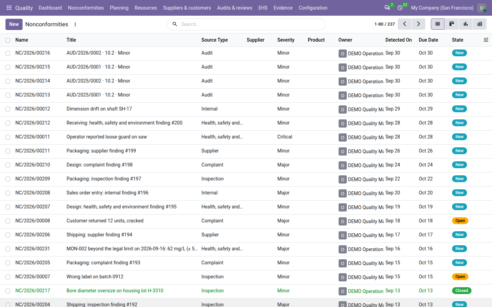
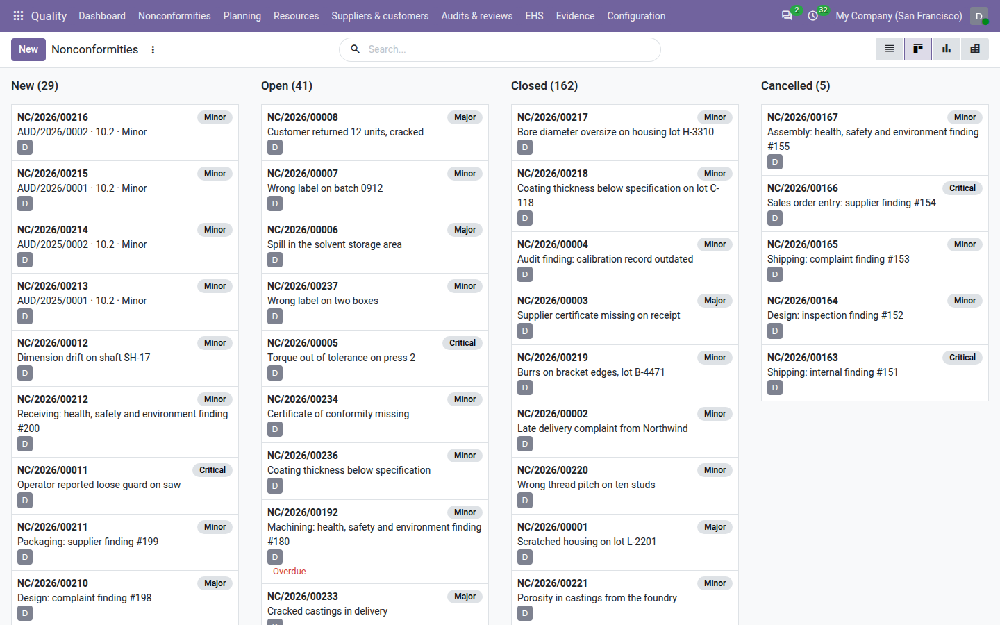
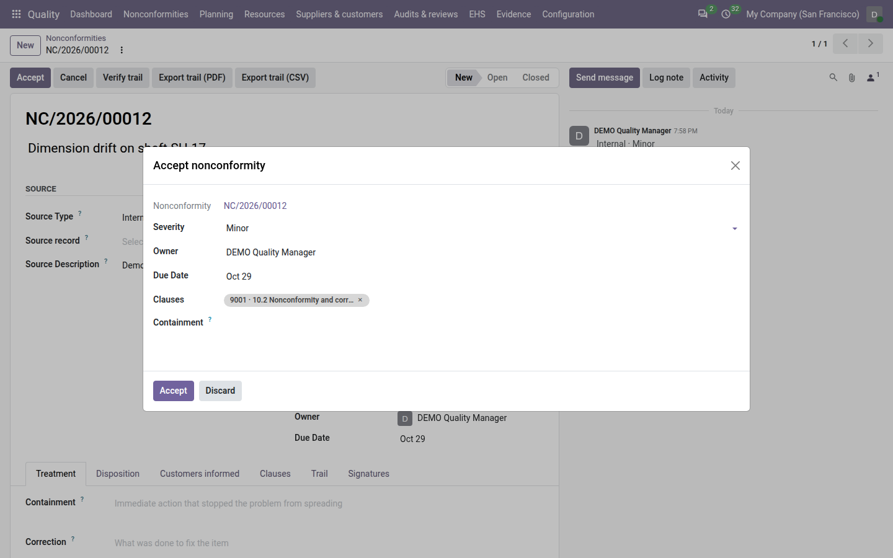
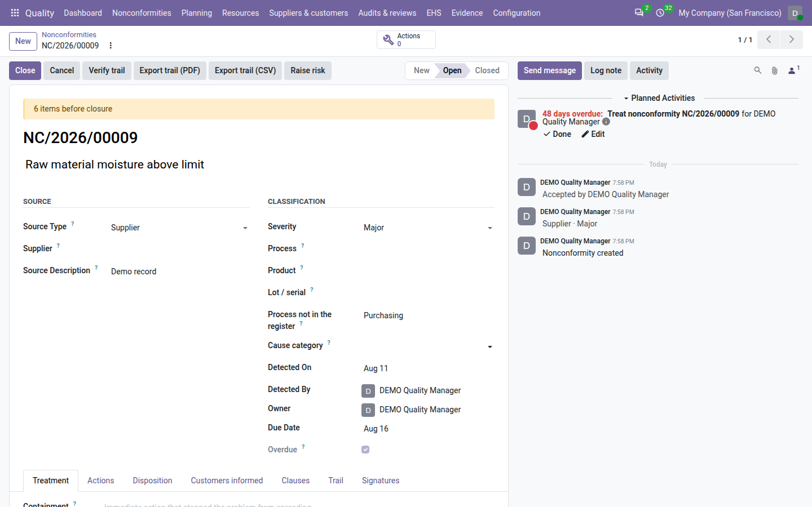
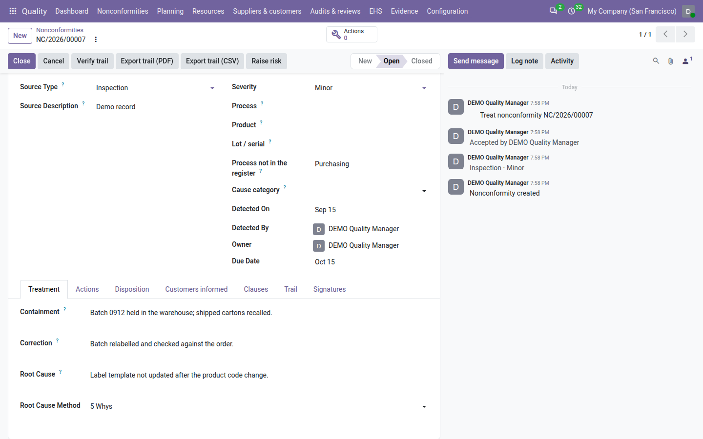
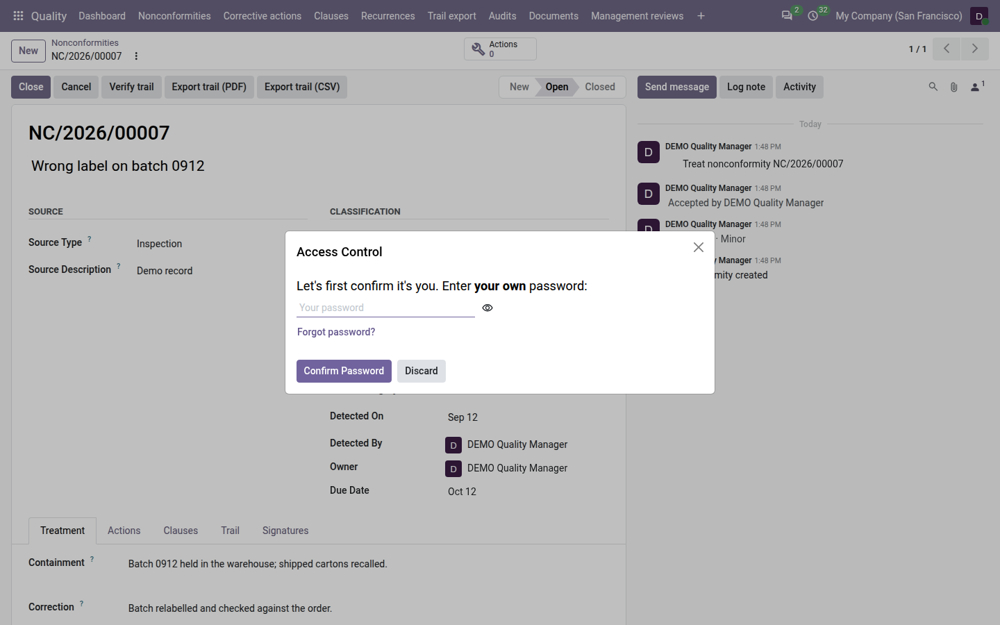
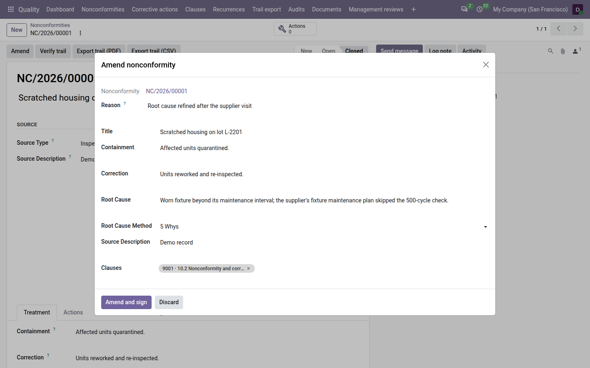

=================
Nonconformities
=================

A *nonconformity* (NC) is anything that did not meet a requirement: a customer complaint, a supplier defect, an
inspection failure, an audit finding, a health and safety event, or an internal problem. The **Quality** app keeps
them in one register, follows each through treatment, and closes it with an electronic signature, so that you can
show an auditor who decided what, and when.

Every nonconformity moves through four states:

.. list-table::
   :header-rows: 1
   :widths: 15 85

   * - State
     - Meaning
   * - **New**
     - Recorded, not yet reviewed.
   * - **Open**
     - Accepted: it has an owner, a due date and the ISO clause it breaks, and is being treated.
   * - **Closed**
     - Treatment complete and signed. The record is locked.
   * - **Cancelled**
     - Recorded by mistake, or a duplicate. The number is kept, with the reason. The record is locked.

Find nonconformities in the register
====================================

Go to :menuselection:`Quality --> Nonconformities`. The register opens on the :guilabel:`Open` filter, which shows
the nonconformities that are still **New** or **Open**. Remove the filter to see every record.

Each row shows the number, the :guilabel:`Title`, the :guilabel:`Source Type`, the :guilabel:`Severity`, the
:guilabel:`Owner`, the :guilabel:`Detected On` date, the :guilabel:`Due Date` and the state. Colours help you read
the list:

- an **overdue** row is shown in red;
- a **closed** row is shown in green;
- a **cancelled** row is greyed out.

In the search bar, type a number or words of a title and choose :guilabel:`Number or title` to find a record. You
can also search by :guilabel:`Title`, :guilabel:`Owner` or :guilabel:`Clauses`.

The :guilabel:`Filters` menu offers:

.. list-table::
   :header-rows: 1
   :widths: 25 75

   * - Filter
     - Shows
   * - :guilabel:`My NCs`
     - The nonconformities you own or that you detected.
   * - :guilabel:`Overdue`
     - New or open nonconformities whose due date has passed.
   * - :guilabel:`Open`
     - New and open nonconformities (the default filter).
   * - :guilabel:`Closed`
     - Closed nonconformities.
   * - :guilabel:`Cancelled`
     - Cancelled nonconformities.

The :guilabel:`Group By` menu groups the list by :guilabel:`Source`, :guilabel:`Severity`, :guilabel:`Owner` or
:guilabel:`State` (and by :guilabel:`Product` when the product link is installed, see :ref:`nc-product`).

Besides the list, the register has four other views, available from the view switcher at the top right:

- **Kanban**: one column per state, one card per nonconformity with its number, severity, title, owner and, in red,
  the word *Overdue* when it is late. Use it as the team board.
- **Form**: the full record.
- **Graph**: a bar chart of nonconformities by source type and severity.
- **Pivot**: a table with source types in rows and severities in columns.

.. tip::
   Every tile of the :doc:`dashboard` opens the register filtered on exactly the records the tile counts.

Record a nonconformity
======================

#. Go to :menuselection:`Quality --> Nonconformities` and click :guilabel:`New`.
#. Enter a :guilabel:`Title`: one line saying what was found, for example *Wrong label on batch 0912*.
#. Choose the :guilabel:`Source Type`: :guilabel:`Audit`, :guilabel:`Complaint`, :guilabel:`Inspection`,
   :guilabel:`Supplier`, :guilabel:`Internal` or :guilabel:`Health, safety and environment`. The list is fixed so that
   statistics compare across sites.
#. Set the :guilabel:`Severity` (:guilabel:`Minor`, :guilabel:`Major` or :guilabel:`Critical`; *Minor* by default)
   and, if you know it, the :guilabel:`Process` concerned.
#. Check the :guilabel:`Detected On` date (today by default) and describe what the source record says in
   :guilabel:`Source Description`.
#. Save. The nonconformity gets its number, such as ``NC/2026/00007``, and starts in the **New** state.

When you save, Odoo also fills in:

- :guilabel:`Detected By` and :guilabel:`Owner`: you, until someone else is chosen;
- :guilabel:`Due Date`, if you left it empty: the detection date plus the number of days set in
  :ref:`Days to treat <config-days-to-treat>` (30 by default);
- a first note in the chatter with the source type and severity, for example *Inspection · Minor*.

Numbers run per company and per year: the counter starts again at ``00001`` in January.

.. note::
   The detection date cannot be in the future, and the due date cannot be before the detection date.

.. tip::
   Nonconformities found in the warehouse, in manufacturing, on a purchase order or during a repair can be raised
   from that record directly, with a :guilabel:`Raise nonconformity` button. The source is filled in for you, and so
   are the product and the lot when there is only one of each. See :doc:`sources`.

Accept it
=========

Accepting a nonconformity says who owns it, by when, and which requirement it breaks. Any quality user can accept a
nonconformity they can edit.

#. Open the nonconformity and click :guilabel:`Accept`.
#. In the dialog, confirm the :guilabel:`Severity`, choose the :guilabel:`Owner` (an internal user) and the
   :guilabel:`Due Date`, and tag the :guilabel:`Clauses` of the standard it breaks. When nothing is tagged yet, the
   dialog proposes *ISO 9001 · 10.2 Nonconformity and corrective action*.
#. If the immediate action is already known, write it in :guilabel:`Containment`. You can also record it later.
#. Click :guilabel:`Accept`.

The nonconformity moves to **Open**, the chatter records *Accepted by* and your name, and the owner receives a
*Nonconformity to treat* activity. The activity falls due a few days before the nonconformity's due date: how many
is set by :ref:`Owner reminder <config-owner-reminder>` (3 days by default).

.. important::
   A nonconformity cannot become **Open** without at least one clause. If you remove every clause, Odoo refuses with
   *Tag at least one clause before Open*.

Overdue nonconformities
-----------------------

A new or open nonconformity whose due date has passed is *overdue*:

- it shows in red in the register and is marked *Overdue* on its kanban card;
- the :guilabel:`Overdue` box appears, ticked, on its form;
- it is counted on the :guilabel:`Overdue nonconformities` tile of the :doc:`dashboard`.

Every day, Odoo checks the due dates. The first time a nonconformity becomes overdue, its owner receives a
*Nonconformity overdue* activity due that day, with the summary *Nonconformity NC/… is overdue*. It is sent only
once per nonconformity. If the owner's user was deactivated, the reminder goes to the
:ref:`Fallback owner <config-fallback-owner>` or, if none is set, to the first active quality manager of the company.

Treat it
========

The :guilabel:`Treatment` tab follows the order the standard asks for. Fill in each answer separately:

- :guilabel:`Containment`: the immediate action that stopped the problem from spreading, such as quarantining the
  batch.
- :guilabel:`Correction`: what was done to fix the nonconforming item itself.
- :guilabel:`Root Cause`: why it happened, and the :guilabel:`Root Cause Method` you used — :guilabel:`5 Whys`,
  :guilabel:`Ishikawa` or :guilabel:`Other`.

When the work is done, the owner marks the *Nonconformity to treat* activity as done in the chatter.

While a nonconformity is open, a yellow banner at the top of the form says how many items are still missing before
it can be closed, for example *3 items before closure*. The banner disappears when nothing is missing.

Tag clauses
-----------

The :guilabel:`Clauses` tab lists the clauses this nonconformity is evidence for. Add them in the
:guilabel:`Clauses` field; only clauses of the enabled standards are offered, and new clauses cannot be created
from here. The :guilabel:`Standards` field below shows the standards those clauses belong to; it fills itself.

Each tagged clause counts the nonconformity as evidence in the clause view. See :doc:`clauses`.

.. _nc-product:

Product and lot
---------------

When the free *QMS — Product link* module is installed (it installs itself as soon as an app that uses products,
such as Inventory, Purchase or Sales, is installed), the :guilabel:`Classification` section gets a :guilabel:`Product` field, the
register gets an optional :guilabel:`Product` column, and you can group the register by :guilabel:`Product`. With
*QMS — Stock sources* installed, a :guilabel:`Lot / serial` field appears under the product. Both are filled in
automatically when a nonconformity is raised from an operation that involves exactly one product or one lot; you
can also set them by hand. See :doc:`sources`.

Close it with a signature
=========================

Closing is an electronic signature: it records who closed the nonconformity, when, and the state of the record at
that moment. Only a quality manager can close.

#. Open the nonconformity and click :guilabel:`Close`.
#. If something is still missing, Odoo says exactly what: the containment, the correction, the root cause, at least
   one clause, or the owner's activity (mark the *Nonconformity to treat* activity as done). Complete it and try
   again.
#. When Odoo asks for your password, enter your own. This is what makes the closure a signature.

The nonconformity moves to **Closed** and is locked. The :guilabel:`Treatment` tab shows :guilabel:`Closed On` and
:guilabel:`Closed By`, the :guilabel:`Signatures` tab shows the signature with the reason *Nonconformity closure*,
and every change since it was created is kept in its :doc:`trail <trail>`.

.. note::
   - Odoo does not ask for the password again if you confirmed it in the last ten minutes.
   - A manager can turn the password request off with :ref:`Ask the password before signing
     <config-password>`, for example on a single sign-on install. The closure is still signed.
   - Only an open nonconformity can be closed. A new one must be accepted first.

.. note::
   With **QMS Advanced** installed, a major or critical nonconformity also needs a verified corrective action before it
   can close. See :doc:`corrective_actions`.

What is locked after closing
----------------------------

A closed or cancelled nonconformity is locked. Any attempt to change its title, source, classification, owner, due
date, treatment or clauses is refused with *This record is locked; use Amend.* You can still post messages in the
chatter and schedule activities.

A closed or cancelled nonconformity can never be deleted, by anyone, and neither can any nonconformity that carries a
signature.

.. _nc-cancel-amend:

Cancel or amend
===============

**Cancel** a new or open nonconformity that was recorded by mistake or twice:

#. Click :guilabel:`Cancel`.
#. In the dialog, write the :guilabel:`Reason`, at least ten characters: for example *Duplicate of NC/2026/00012*.
#. Click :guilabel:`Cancel nonconformity`.

The nonconformity moves to **Cancelled** and the reason shows in the :guilabel:`Cancellation` section of the
:guilabel:`Treatment` tab. The number stays, so the register has no gaps. A cancelled nonconformity no longer counts
on the dashboard, as clause evidence, or on the smart buttons of the operations it was raised from. A closed
nonconformity cannot be cancelled, and a cancelled one cannot be reopened or amended.

**Amend** a closed nonconformity when something in it must be corrected:

#. Click :guilabel:`Amend`.
#. Change what needs correcting. Only these fields can be amended: :guilabel:`Title`, :guilabel:`Containment`,
   :guilabel:`Correction`, :guilabel:`Root Cause`, :guilabel:`Root Cause Method`, :guilabel:`Source Description` and
   :guilabel:`Clauses`.
#. Give the :guilabel:`Reason` for the change, at least ten characters.
#. Click :guilabel:`Amend and sign`. If Odoo asks for your password, enter your own: the amendment is applied once
   it is confirmed.

Only the fields you actually changed are recorded. For each one, the trail keeps the original value next to the new
one, with your reason. The amendment is signed like the closure (reason *Amendment*), and the
:guilabel:`Amendment Count` on the :guilabel:`Trail` tab goes up by one. The nonconformity then counts on the
:guilabel:`Amended nonconformities` tile of the :doc:`dashboard`.

The severity, owner, due date and source cannot be amended.

Both cancelling and amending are reserved to quality managers.

Who can do what
===============

.. list-table::
   :header-rows: 1
   :widths: 40 20 20 20

   * - Action
     - User
     - Internal auditor
     - Manager
   * - See nonconformities
     - Those they own, detected or follow
     - All of their companies
     - All of their companies
   * - Record, raise from an operation, edit, accept
     - Yes, on those they can see
     - Yes, on those they own, detected or follow
     - Yes
   * - Close, cancel, amend
     - No
     - No
     - Yes
   * - Delete a new or open nonconformity
     - No
     - No
     - Yes
   * - Verify and export the trail
     - Yes
     - Yes
     - Yes

The administrator is a quality manager from installation. See :doc:`roles` for the full list of roles.

.. tip::
   A quality user who is not the owner or the detector can still work on a nonconformity when they are added as a
   follower in its chatter.

.. seealso::
   - :doc:`sources`
   - :doc:`trail`
   - :doc:`clauses`
   - :doc:`dashboard`
