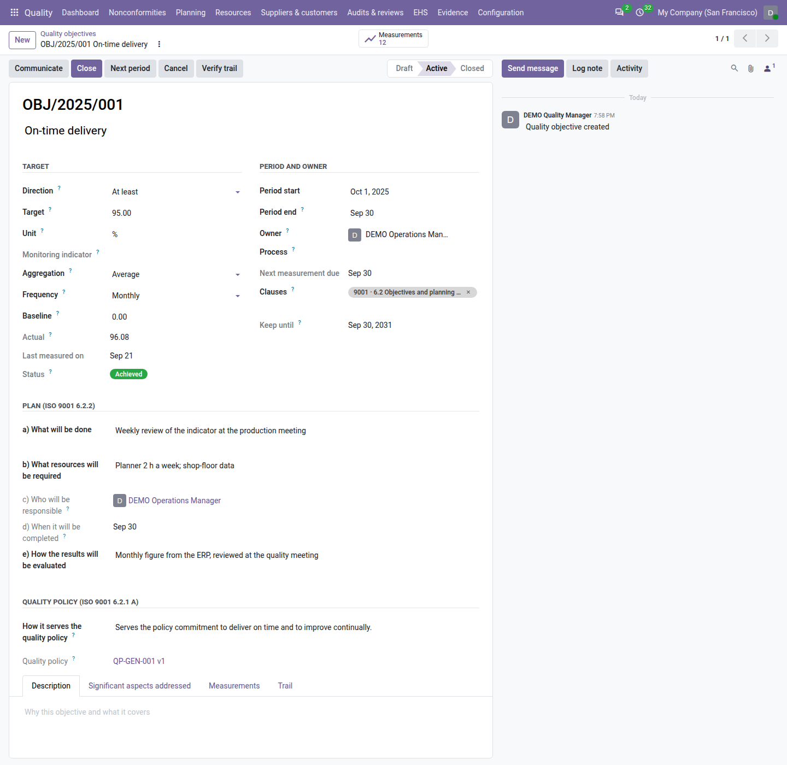

==================
Quality objectives
==================

ISO 9001 clause 6.2 asks for measurable quality objectives, consistent with the quality policy, communicated, and
planned: what will be done, with which resources, by whom, by when, and how the results are evaluated. With **QMS
Advanced** installed, the **Quality** app keeps each objective with its target, its period, its owner and that plan,
records its measurements, computes whether it is on track, and freezes its result when it is closed.

.. list-table::
   :header-rows: 1
   :widths: 15 85

   * - State
     - Meaning
   * - **Draft**
     - Being written. The plan can be incomplete.
   * - **Active**
     - Activated by a quality manager with its plan complete. It is measured and reported.
   * - **Closed**
     - Closed with its result (achieved or not) and a conclusion. It is locked.
   * - **Cancelled**
     - Cancelled with a reason. It is locked.

While an objective is active, its :guilabel:`Status` says how it stands today:

.. list-table::
   :header-rows: 1
   :widths: 20 80

   * - Status
     - Meaning
   * - :guilabel:`No data`
     - The period runs and no measurement is recorded yet.
   * - :guilabel:`On track`
     - The period runs and the actual meets the target.
   * - :guilabel:`At risk`
     - The period runs and the actual does not meet the target.
   * - :guilabel:`Achieved`
     - The period has ended (its last day counts) and the actual meets the target.
   * - :guilabel:`Not achieved`
     - The period has ended and the actual does not meet the target, or nothing was measured.

*Meets the target* means: at least the target for an objective :guilabel:`At least`, at most the target for an
objective :guilabel:`At most`. Equality meets it.

Set an objective
================

#. Go to :menuselection:`Quality --> Planning --> Objectives --> Objectives` and click :guilabel:`New`.
#. Write the objective in one line, for example *On-time delivery*.
#. In :guilabel:`Target`: choose the :guilabel:`Direction` (:guilabel:`At least` or :guilabel:`At most`), the
   :guilabel:`Target`, for example ``95``, and the :guilabel:`Unit`, at most 20 characters, for example ``%``,
   ``days``, ``ppm`` or ``complaints``. Choose how the measurements make the :guilabel:`Actual`: the
   :guilabel:`Last value`, their :guilabel:`Average` or their :guilabel:`Sum`, and how often a measurement is expected
   (:guilabel:`Monthly`, :guilabel:`Quarterly`, :guilabel:`Half-yearly`, :guilabel:`Yearly` or :guilabel:`Once`).
   Enter the :guilabel:`Baseline` if you know it.
#. In :guilabel:`Period and owner`: the :guilabel:`Period start` and :guilabel:`Period end` (at most 36 months), the
   :guilabel:`Owner` who answers for it and records its measurements, and the :guilabel:`Process` it serves.
#. Fill in the :guilabel:`Plan (ISO 9001 6.2.2)`:

   - :guilabel:`a) What will be done`: the actions that will achieve the objective;
   - :guilabel:`b) What resources will be required`: people, time, tools, budget;
   - :guilabel:`c) Who will be responsible`: the owner, shown here;
   - :guilabel:`d) When it will be completed`: the period end, shown here;
   - :guilabel:`e) How the results will be evaluated`: which indicator, from which source, reviewed where.

#. In :guilabel:`Quality policy (ISO 9001 6.2.1 a)`, write in :guilabel:`How it serves the quality policy` which
   commitment of the policy the objective serves, for example *meeting customer requirements*.
#. Save.

The objective gets its number at once, ``OBJ/<year of the period start>/<nnn>``, for example ``OBJ/2026/004``. Clause
6.2 of ISO 9001 is proposed in :guilabel:`Clauses`.

         the quality policy link, the status badge and the Measurements smart button.

Activate it
===========

A quality manager clicks :guilabel:`Activate`. Odoo lists together everything still missing: the three plan texts
(*What will be done*, *What resources will be required*, *How the results will be evaluated*), a clause, and — when the
company has a :ref:`quality policy <documents-quality-policy>` in force — how the objective serves it, in at least 20
characters. The owner must hold a Quality role.

When the objective is activated:

- the quality policy in force is recorded on the objective (:guilabel:`Quality policy`). When a newer policy comes into
  force later, the objective shows *A newer policy is in force (<version>)*;
- when no quality policy is in force, the objective is activated with a warning, *No quality policy in force for
  <company>: this objective cannot be shown as consistent with it.*;
- an objective activated after its period has ended is activated with the warning *The period has ended; record its
  measurements and close it.*

Only a quality manager changes the target, unit, direction, aggregation or period of an active objective. When that
happens, the objective shows *Target changed during the period* with the original target.

Record the measurements
=======================

#. Click the :guilabel:`Measurements` smart button on the active objective.
#. Click :guilabel:`New` and enter :guilabel:`Measured on` (a date inside the objective's period), the
   :guilabel:`Value`, a :guilabel:`Note` on how it was obtained and, if you like, an :guilabel:`Evidence file`.
#. Save.

:guilabel:`Recorded by` is you. The objective's :guilabel:`Actual` and :guilabel:`Status` follow at once. There is one
measurement per date: to change a value, correct that measurement — the correction is on its trail. A measurement is
never deleted, and it is locked once the objective is closed.

:guilabel:`Next measurement due` follows the frequency. When a measurement is due and none was recorded, the owner gets
a *Record the measurement of <objective> due on <date>* to-do, 5 days after the due date by default (the
:ref:`Measurement reminder <config-objectives>` setting). Recording the measurement marks it done.

Communicate it
==============

An objective must be known to the people who work towards it.

#. Click :guilabel:`Communicate` on the active objective.
#. Choose the :guilabel:`Recipients`: internal users only. The owner and the objective's followers are proposed; add
   the people of the process concerned.
#. Click :guilabel:`Communicate`.

The recipients get the objective's summary — target, period, owner, status and how it serves the quality policy — as a
note in their inbox. The objective records :guilabel:`Communicated on`, :guilabel:`Communicated by` and the number of
:guilabel:`Recipients`, and the trail names them. Communicating again later records it again. The owner or a quality
manager can communicate.

An active objective never communicated after 14 days (the :ref:`Communication <config-objectives>` setting) appears
under the :guilabel:`Not communicated` filter.

Close it and start the next period
==================================

#. At the end of the period, a quality manager clicks :guilabel:`Close`. Before the period end, the dialog warns *The
   period ends on <date>. Close now?*
#. Write the :guilabel:`Conclusion`: what the result means and what follows from it. It is required, at least ten
   characters, when the objective was not achieved.
#. Click :guilabel:`Close objective`.

The :guilabel:`Result` (:guilabel:`Achieved` or :guilabel:`Not achieved`) and the :guilabel:`Result actual` are frozen,
with :guilabel:`Closed on` and :guilabel:`Closed by`. A closed objective is never reopened; its conclusion can be amended
by a quality manager with a reason.

To continue the objective, click :guilabel:`Next period` on an active or closed objective. Odoo creates a draft for the
following period of the same length, copying the target, unit, direction, aggregation, frequency, plan, owner,
process, clauses and policy link, without measurements; :guilabel:`Continues` names the previous objective. An
objective is continued once.

A draft or active objective can be cancelled by a quality manager with :guilabel:`Cancel` and a reason of at least ten
characters. Only a draft objective can be deleted.

Find objectives and print them
==============================

Filters: :guilabel:`My objectives`, :guilabel:`Draft`, :guilabel:`Active`, :guilabel:`Closed`, :guilabel:`At risk` and
:guilabel:`Not communicated`; group by :guilabel:`State`, :guilabel:`Status`, :guilabel:`Owner` or :guilabel:`Process`.

To print, go to :menuselection:`Quality --> Planning --> Objectives --> Print objectives`, choose :guilabel:`From` and
:guilabel:`To` (the current year by default) and click :guilabel:`Print`. The *Objectives status* PDF lists each
objective whose period overlaps those dates, with its target, actual, status, plan and measurements. The
:doc:`audit pack <audit_pack>` includes it as ``12_quality_objectives.pdf``.

Evidence, review and dashboard
==============================

- **Evidence.** An active or closed objective counts for its clauses in the :doc:`clause view <clauses>` for its whole
  period.
- **Management review.** Input *9.3.2 c2 — Extent to which quality objectives were met* shows the objectives of the
  period, for example *Objectives: 4 · Achieved 1 · On track 1 · At risk 1 · No data 1*, then one line per objective
  with its target and actual. With none it reads *No quality objectives for the period*. See
  :doc:`management_reviews`.
- **Dashboard.** The :guilabel:`Objectives at risk` tile counts the active objectives at risk, or without data, whose
  next measurement is overdue. A new objective is not at risk on its first day.

Who can do what
===============

.. list-table::
   :header-rows: 1
   :widths: 25 75

   * - Role
     - Quality objectives
   * - **User**
     - Reads the objectives, records and corrects the measurements of the objectives they own, communicates them.
       Cannot change the target of an active objective.
   * - **Internal auditor**
     - Reads the objectives and their measurements; does not record them.
   * - **Manager**
     - Everything: sets, activates, closes, cancels and continues objectives, changes an active objective's target.

See :doc:`roles` for the full picture.

.. seealso::
   - :doc:`documents`
   - :doc:`management_reviews`
   - :doc:`audit_pack`
