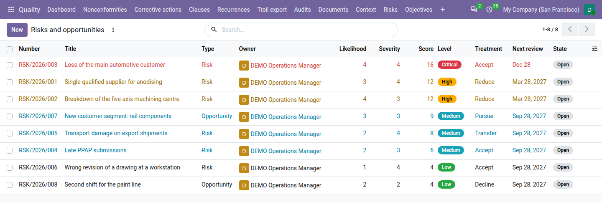
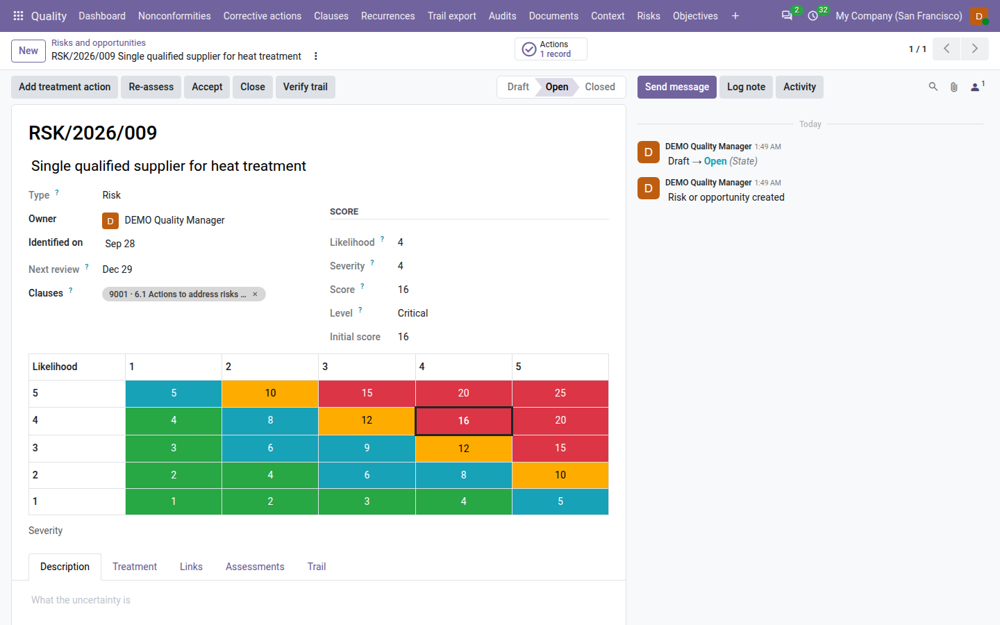
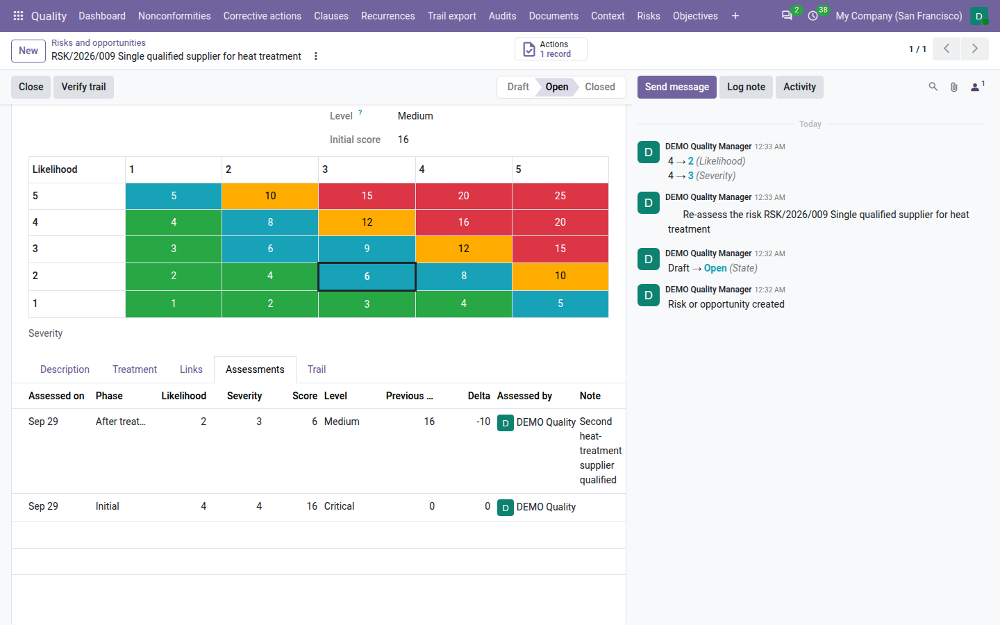

=======================
Risks and opportunities
=======================

ISO 9001 clause 6.1 asks you to determine the risks and opportunities of your quality system, to plan actions on
them, and to check that those actions worked. With **QMS Advanced** installed, the **Quality** app keeps a risk register:
each risk or opportunity is scored likelihood × severity on a 5 × 5 matrix, given a treatment, followed through
treatment actions — the same actions as for nonconformities — and re-assessed, so that the score before and after
treatment shows whether the treatment worked.

.. list-table::
   :header-rows: 1
   :widths: 15 85

   * - State
     - Meaning
   * - **Draft**
     - Being described and scored. It has no number yet and is not evidence.
   * - **Open**
     - Opened with its treatment: it has a number, such as ``RSK/2026/001``, and a first assessment. It is reviewed at
       the interval of its level.
   * - **Closed**
     - Closed by a quality manager with a reason. It is locked.

         treatment, next review and state, sorted by score.

Record a risk or an opportunity
===============================

#. Go to :menuselection:`Quality --> Risks --> Risks and opportunities` and click :guilabel:`New`.
#. Write the risk or the opportunity in one line, for example *Single qualified supplier for anodising*.
#. Choose the :guilabel:`Type`: :guilabel:`Risk` (it may harm conformity or customer satisfaction) or
   :guilabel:`Opportunity` (it may improve them). The type is fixed once the risk is open.
#. Check the :guilabel:`Owner` (you by default) and :guilabel:`Identified on` (today; it cannot be in the future).
#. Score it: :guilabel:`Likelihood` and :guilabel:`Severity` — :guilabel:`Benefit` for an opportunity — from 1 to 5.
#. On the :guilabel:`Description` tab, describe it, its :guilabel:`Cause` and its :guilabel:`Consequence`.
#. On the :guilabel:`Links` tab, add the :guilabel:`Processes` it concerns, the :guilabel:`Context issues` it stems
   from, the :guilabel:`Interested-party needs` it concerns (adopted needs of relevant parties only) and the
   :guilabel:`Nonconformities` where it materialised. Links stay within the risk's company.
#. Save.

Clause 6.1 of ISO 9001 is proposed in :guilabel:`Clauses`. The risk stays a **Draft** until it is opened.

.. tip::
   From an open or closed nonconformity, click :guilabel:`Raise risk`: Odoo opens a new risk already linked to the
   nonconformity and its process. The nonconformity's :guilabel:`Risks` smart button lists the risks linked to it.

The scales
----------

.. list-table::
   :header-rows: 1
   :widths: 10 30 30 30

   * - Value
     - Likelihood
     - Severity (risk)
     - Benefit (opportunity)
   * - 1
     - Rare: less than once in 5 years
     - Negligible
     - Minimal
   * - 2
     - Unlikely: once in 2–5 years
     - Minor
     - Small
   * - 3
     - Possible: once a year
     - Moderate
     - Moderate
   * - 4
     - Likely: several times a year
     - Major
     - Large
   * - 5
     - Almost certain: monthly or more
     - Critical
     - Transformational

The :guilabel:`Score` is likelihood × severity, from 1 to 25, and the :guilabel:`Level` follows from the company's
:ref:`Level thresholds <config-risks>`. A score equal to a threshold takes the higher level. With the default
thresholds:

.. list-table::
   :header-rows: 1
   :widths: 20 20 60

   * - Level
     - Score
     - Periodic review, by default
   * - **Low**
     - 1 to 4
     - Every 12 months
   * - **Medium**
     - 5 to 9
     - Every 12 months
   * - **High**
     - 10 to 14
     - Every 6 months
   * - **Critical**
     - 15 to 25
     - Every 3 months

For example, a risk scored likelihood 4 × severity 4 has a score of 16: it is **Critical**. The form shows the 5 × 5
matrix, each cell in the colour of its level, with the risk's cell outlined.

         likelihood 4 and severity 4, score 16, level Critical, and the 5 × 5 matrix with the risk's cell outlined.

Decide the treatment
====================

On the :guilabel:`Treatment` tab, choose the :guilabel:`Treatment`. What it needs before the risk can be opened:

.. list-table::
   :header-rows: 1
   :widths: 25 20 55

   * - Treatment
     - For
     - Needs
   * - :guilabel:`Reduce`, :guilabel:`Avoid`, :guilabel:`Transfer`
     - Risks
     - At least one treatment action that is not cancelled.
   * - :guilabel:`Accept`
     - Risks
     - A :guilabel:`Treatment note` of at least ten characters, recorded with :guilabel:`Accept`. A **High** or
       **Critical** risk is accepted by a quality manager, with a signature.
   * - :guilabel:`Pursue`
     - Opportunities
     - At least one treatment action that is not cancelled.
   * - :guilabel:`Decline`
     - Opportunities
     - A :guilabel:`Treatment note` of at least ten characters.

Add treatment actions
---------------------

Click :guilabel:`Add treatment action` on a draft or open risk. Odoo opens a new **preventive** action linked to the
risk, tagged with clause 6.1 and owned by the risk's owner. Complete its title, due date and effectiveness date and
save. The action is then carried out, marked done and verified like any other action — see
:doc:`corrective_actions`. The :guilabel:`Actions` smart button and the :guilabel:`Treatment` tab list the risk's
actions, and :guilabel:`Treatment progress` says where they stand: :guilabel:`No treatment action`,
:guilabel:`Planned`, :guilabel:`In progress`, :guilabel:`Done` or :guilabel:`Re-assessed`. Cancelled actions do not
count.

When an open risk treated by actions has none left, the form shows *No treatment action: add one or choose another
treatment.* When a treatment action is judged ineffective, the owner gets a *Re-decide the treatment* to-do.

Accept a risk
-------------

#. Click :guilabel:`Accept` on the risk.
#. Write why the risk is accepted, at least ten characters.
#. Click :guilabel:`Accept risk`.

A **Low** or **Medium** risk is accepted by its owner or a quality manager. A **High** or **Critical** risk is accepted
by a quality manager only: Odoo asks for their password and records an electronic signature with the reason *Risk
acceptance*. :guilabel:`Accepted by` shows who accepted it.

If an accepted risk later becomes High or Critical after a re-assessment, its acceptance lapses: the form shows
*Acceptance lapsed: the risk became high or critical after it was accepted. Re-decide the treatment.*, and the owner
and the quality managers get a *Re-decide the treatment* to-do. The risk stays open.

Open the risk
-------------

When the risk is described, scored and its treatment decided, its owner or a quality manager clicks :guilabel:`Open`.
Odoo checks the title, type, owner, score, at least one clause and the treatment table above, then:

- gives the risk its number, ``RSK/<year identified>/<nnn>``, for example ``RSK/2026/001``;
- records the first row of the :guilabel:`Assessments` tab, phase :guilabel:`Initial`, with the date, who assessed,
  the scores and the level.

From then on the score changes only through a re-assessment. The level of each row is frozen with the thresholds of
that day, so a later change of the thresholds never rewrites the history.

Re-assess the risk
==================

When the last treatment action of an open risk is done or verified, its owner gets a *Re-assess the risk <risk>*
to-do. To record a re-assessment:

#. Click :guilabel:`Re-assess` on the open risk.
#. Choose the :guilabel:`Phase`: :guilabel:`After treatment`, :guilabel:`Periodic review` or :guilabel:`Change`.
#. Enter the new :guilabel:`Likelihood` and :guilabel:`Severity` (or :guilabel:`Benefit`).
#. Write what changed and why. The note is required after treatment and on a change.
#. Click :guilabel:`Record assessment`.

A new row is added to the :guilabel:`Assessments` tab with the previous score and the change: a negative
:guilabel:`Delta` means the risk was reduced. When a treatment action is still open, the dialog warns that the
re-assessment records a partial treatment.

         Medium, previous score 16 and delta −10.

Review risks periodically
-------------------------

An open risk is due for review at its last assessment date plus the review interval of its level (see the table
above). :guilabel:`Next review` shows the date; a risk past it is marked with a red *Review overdue* ribbon and appears
under the :guilabel:`Overdue review` filter. Before the date — 14 days before by default — the owner gets a *Review the
risk <risk>* to-do. The review is recorded as a re-assessment of phase :guilabel:`Periodic review`, which moves the
next review date on. An interval of 0 in the settings means no periodic review for that level.

Close a risk
============

A quality manager closes an open risk that no longer needs treatment:

#. Click :guilabel:`Close`.
#. Write why, at least ten characters.
#. Click :guilabel:`Close risk`.

Odoo refuses while a treatment action is still in draft or in progress: *Finish or cancel the treatment actions
first.* The risk moves to **Closed**, the reason shows on its :guilabel:`Closing` tab, and it is locked. A closed risk
takes no new treatment action: record a new risk instead. Only a draft risk can be deleted.

Find risks and print the register
=================================

The register is sorted by score, highest first. Filters: :guilabel:`Risks`, :guilabel:`Opportunities`,
:guilabel:`High and critical`, :guilabel:`My risks`, :guilabel:`Overdue review`, :guilabel:`Draft`, :guilabel:`Open`
and :guilabel:`Closed`; group by :guilabel:`Level`, :guilabel:`Type` or :guilabel:`Owner`.

To print it, go to :menuselection:`Quality --> Risks --> Print risk register`, choose the :guilabel:`As at` date and
click :guilabel:`Print`. The PDF lists every risk open on that date with its scores before and after treatment, its
treatment and its actions. The :doc:`audit pack <audit_pack>` includes it as ``11_risk_register.pdf``.

Evidence, review and dashboard
==============================

- **Evidence.** In the :doc:`clause view <clauses>`, an open or closed risk counts for its clauses in every period from
  its identification until it is closed. Drafts never count.
- **Management review.** Input *9.3.2 e — Effectiveness of actions on risks and opportunities* shows the risks and
  opportunities open by level, those identified, closed and treated in the period, how many were reduced, unchanged
  or increased, the high risks accepted, the treatment actions open and overdue, and the risks overdue for review.
  With nothing in the period it reads *No risk register entries for the period*. See :doc:`management_reviews`.
- **Dashboard.** The :guilabel:`High and critical risks` tile counts the open risks of level High or Critical. It is
  red when one of them has no treatment action (and is not accepted) or is overdue for review, amber otherwise.
  Accepted high risks are counted but never turn it red.

Who can do what
===============

.. list-table::
   :header-rows: 1
   :widths: 25 75

   * - Role
     - Risks and opportunities
   * - **User**
     - Records risks, edits and opens the risks they own, adds treatment actions, accepts their own Low or Medium
       risks, and re-assesses them.
   * - **Internal auditor**
     - Reads the whole register; does not change it.
   * - **Manager**
     - Everything: opens and re-assesses any risk, accepts any risk (High and Critical with a signature) and closes
       risks.

See :doc:`roles` for the full picture.

.. seealso::
   - :doc:`corrective_actions`
   - :doc:`context`
   - :doc:`management_reviews`
   - :doc:`audit_pack`
