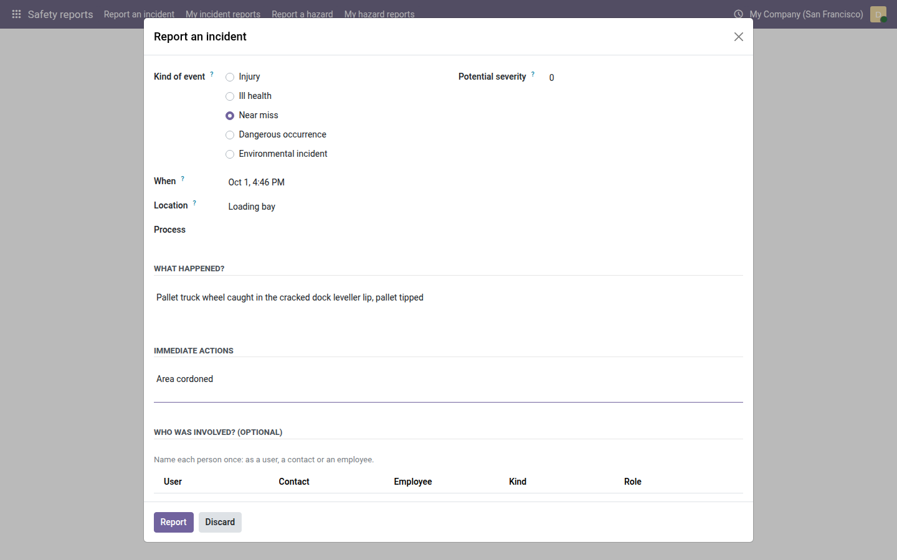
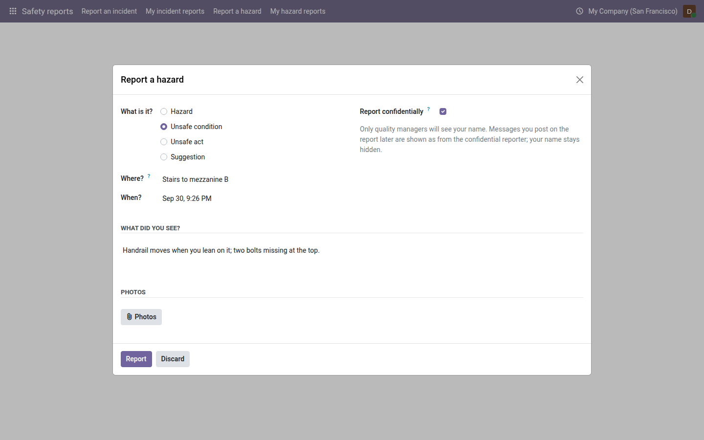
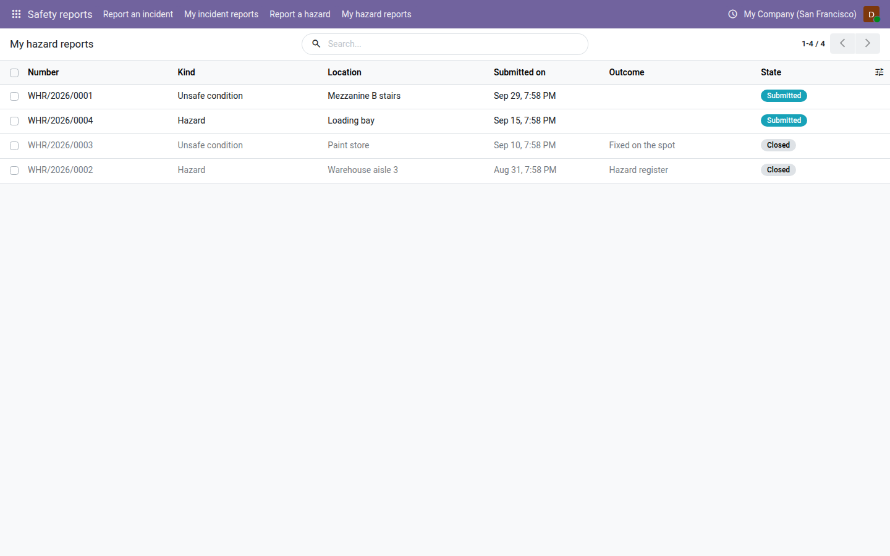

==============
Safety reports
==============

This page is for every employee. You do not need a Quality role: when your company has switched on its environment,
health and safety registers, the main menu shows the **Safety reports** app. Use it to report an incident — someone
hurt, a near miss, a spill — or a hazard you saw, and to follow what came of your reports.

Reporting takes under a minute. The quality team reads every report and tells you the outcome.

.. list-table::
   :header-rows: 1
   :widths: 35 65

   * - Menu
     - What it is for
   * - :menuselection:`Safety reports --> Report an incident`
     - Something happened: an injury, ill health, a near miss (nobody hurt, but it could have been), a dangerous
       occurrence or an environmental incident.
   * - :menuselection:`Safety reports --> My incident reports`
     - The incidents you reported, with their state and outcome.
   * - :menuselection:`Safety reports --> Report a hazard`
     - Something could hurt someone: a hazard, an unsafe condition, an unsafe act, or a suggestion.
   * - :menuselection:`Safety reports --> My hazard reports`
     - The hazards you reported, with their state and outcome.

The hazard menus show only when the company works with ISO 45001; the incident types offered follow the standards your
company works with.

Report an incident
==================

#. Go to :menuselection:`Safety reports --> Report an incident`. A short window opens, like the one for a hazard.
#. Under :guilabel:`Kind of event`, choose what happened, for example :guilabel:`Near miss`.
#. :guilabel:`When` starts at the current time: change it to when it happened (not in the future). Enter the :guilabel:`Location`, for example *Warehouse aisle
   3*, and choose the :guilabel:`Process` if you know it.
#. For a near miss, a dangerous occurrence or an environmental incident, rate the :guilabel:`Potential severity`: what
   could have happened, from 1 (negligible) to 5 (catastrophic). Leave 0 if you are not sure.
#. Under :guilabel:`What happened`, describe it in a few sentences, for example *Forklift reversed past a pedestrian in
   the walkway without a spotter*.
#. Under :guilabel:`Immediate actions`, write what was done at once, for example *Area cordoned*.
#. Under :guilabel:`Who was involved? (optional)`, add the people involved. Name each person once, as a user, a
   contact or an employee, with their kind (employee, contractor, visitor, member of the public) and their role
   (injured, made ill, witness, involved).
#. For an environmental incident, fill in :guilabel:`Release to the environment`: where it went, the substance and the
   quantity.
#. Click :guilabel:`Report`.

Odoo thanks you (*Your report INC/2026/007 was received. The quality team looks into it; you find it under My incident
reports.*) and opens your report, which has its number in the state **Reported**. You cannot change it afterwards: if you forgot something, write it in the messages at the bottom of the report.

         immediate actions, who was involved, and the Report and Discard buttons.

Do not write health details — the nature of an injury, a diagnosis, a treatment — in the report or its messages. The
quality manager records them in a protected place, visible to quality managers only.

Odoo refuses a report without its essentials: *When is required to report an incident.*, and the same for the type,
the location and what happened.

Report a hazard
===============

#. Go to :menuselection:`Safety reports --> Report a hazard`. A small window opens.
#. Under :guilabel:`What is it?`, choose :guilabel:`Hazard`, :guilabel:`Unsafe condition`, :guilabel:`Unsafe act` or
   :guilabel:`Suggestion`.
#. Enter :guilabel:`Where?`, for example *Stairs to mezzanine B*, and :guilabel:`When?` you saw it.
#. Under :guilabel:`What did you see?`, describe it (at least 20 characters), for example *Handrail loose at the top
   three steps, moves by 5 cm*.
#. Add :guilabel:`Photos` if you have some.
#. If you prefer, tick :guilabel:`Report confidentially` (see below).
#. Click :guilabel:`Report`.

Odoo thanks you (*Your report WHR/2026/0031 was received.*) and opens your report.

         Photos, and the Report button.

Report confidentially
---------------------

Tick :guilabel:`Report confidentially` when you would rather your colleagues did not know you reported it. Only quality
managers can see your name, so that they can ask you a question. Everyone else reads *Confidential reporter*; you read
*You (confidential)*. Messages you post on your report are shown as from the confidential reporter, and you still get
the outcome.

.. important::
   Confidential is not anonymous. The server's technical logs and the database administrator can still identify you:
   confidentiality is towards the people who use the application. There is no anonymous reporting.

You choose confidentiality when you report; it cannot be changed afterwards. On a confidential report you cannot add
reactions to messages (*Reactions would show your name on a confidential report.*).

Follow your reports
===================

:menuselection:`Safety reports --> My incident reports` and :menuselection:`Safety reports --> My hazard reports`
list only your own reports, with their state:

.. list-table::
   :header-rows: 1
   :widths: 25 75

   * - State
     - What it means for you
   * - **Reported** / **Submitted**
     - Received; the quality team has not taken it yet.
   * - **Open** / **In review**
     - Someone is looking into it. For an incident you are told *Your report … is being looked into by …*.
   * - **Closed**
     - Done. The report shows the :guilabel:`Outcome` and you get a message, for example *Your report WHR/2026/0031
       was reviewed* — *Added to the hazard register. Walkway barriers ordered.*
   * - **Cancelled**
     - An incident report that was not an incident (a duplicate, for example); the reason is shown.

         outcome and state.

.. note::
   **Known limits**

   - Reports are made by internal users only: there is no portal form and no anonymous reporting.
   - An internal auditor reads the incident log and records nothing in it, so :guilabel:`Report an incident` is not
     shown to them. Ask a colleague or a quality manager to report it, or report the hazard instead.

.. seealso::
   - :doc:`incidents` and :doc:`worker_consultation` — what the quality team does with your report
