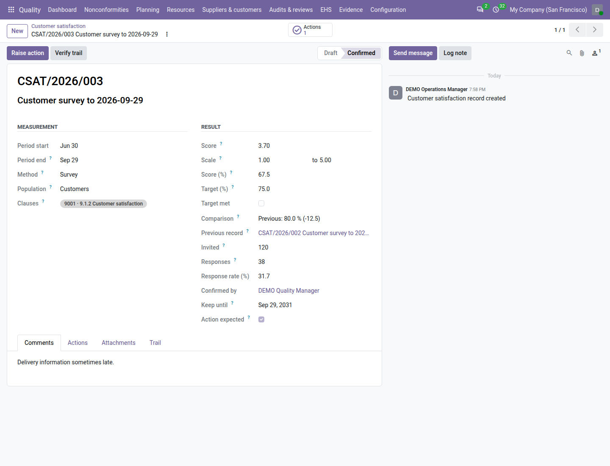

=====================
Customer satisfaction
=====================

ISO 9001 clause 9.1.2 asks you to monitor how customers perceive the degree to which their needs and expectations are
met. With **QMS Advanced** installed, the **Quality** app records the result of each satisfaction measurement — a
survey run in another tool, interviews, a feedback form, an analysis of complaints or market data — on its own scale,
makes it comparable as a percentage, compares it with its target and with the previous result, and expects an
improvement action when the result is poor. The app is not a survey tool: you run the survey where you like and type
in its result.

.. list-table::
   :header-rows: 1
   :widths: 15 85

   * - State
     - Meaning
   * - **Draft**
     - Typed in, not yet checked. It can change or be deleted.
   * - **Confirmed**
     - Checked and confirmed by a quality manager. It is locked and counts as evidence.

Record a satisfaction result
============================

#. Go to :menuselection:`Quality --> Suppliers & customers --> Customer satisfaction --> Records` and click :guilabel:`New`.
#. Write what was measured, for example *2026-Q3 customer survey*.
#. In :guilabel:`Measurement`, enter the :guilabel:`Period start` and :guilabel:`Period end` — the period is over
   before its result is recorded — and choose the :guilabel:`Method`: :guilabel:`Survey`, :guilabel:`Interview`,
   :guilabel:`Feedback form`, :guilabel:`Complaint analysis`, :guilabel:`Market data` or :guilabel:`Other`.
#. Choose the :guilabel:`Population`: :guilabel:`Customers`, :guilabel:`End users`, a :guilabel:`Segment` (name it,
   for example *Automotive*), a :guilabel:`Single customer` (choose the :guilabel:`Customer`) or an
   :guilabel:`Interested party` (choose it).
#. In :guilabel:`Result`, enter the :guilabel:`Score` and its :guilabel:`Scale`, from … to …: for example 4.2 on a
   scale from 1 to 5, or an NPS of 32 on −100 to 100. The score must lie within the scale.
#. Enter the :guilabel:`Target (%)` if you have one, from 0 to 100 (0 means no target), and how many people were
   :guilabel:`Invited` and how many gave :guilabel:`Responses` (0 invited for a method without invitations, such as
   market data).
#. Write the main findings on the :guilabel:`Comments` tab and attach the survey export or the interview minutes on the
   :guilabel:`Attachments` tab.
#. Save.

The record gets its number at once, ``CSAT/<year of the period end>/<nnn>``, for example ``CSAT/2026/003``. Clause 9.1.2
of ISO 9001 is proposed.

         target 75 % not met, comparison with the previous record (80.0 %, −12.5), invited 120, responses 38, and
         Action expected ticked.

How the result is compared
--------------------------

- :guilabel:`Score (%)` is the score as a percentage of its scale: (score − scale from) ÷ (scale to − scale from) × 100,
  rounded to one decimal. 4.2 on 1 to 5 gives **80.0 %**, so results on different scales can be compared.
- :guilabel:`Target met` is ticked when the percentage reaches the target: 75.0 % against a 75 % target is met.
- :guilabel:`Comparison` names the previous record — the latest confirmed record of the same method and population
  that ended before this period starts — with its percentage and the change in points, for example *Previous:
  75.0 % (+5.0)*, or *First record*.
- :guilabel:`Response rate (%)` is responses ÷ invited.

When another record already exists for the same period, method and population, the form warns that two surveys are
allowed and asks you to check it is not a duplicate.

Confirm it
==========

A quality manager checks the record and clicks :guilabel:`Confirm`. The comparison is taken a last time and frozen,
:guilabel:`Confirmed by` is recorded and the record is locked. Only its comments, attachments and the manager's
no-action reason can be amended afterwards, with a reason; the score never. A confirmed record is never deleted: when
it was wrong, record a new one and amend the comments of the wrong one.

When an action is expected
==========================

At confirmation, Odoo decides whether the result calls for an improvement action. :guilabel:`Action expected` is
ticked when:

- the result is **below its target**, for example *Below target (70.0 % < 75.0 %)*; or
- the result **dropped** since the previous record by at least the :ref:`Deterioration threshold
  <config-satisfaction>` (5 points by default; 0 flags every drop), for example *Deteriorating (−6.0 points since
  CSAT/2026/002)*.

A record with an action expected shows the amber banner *Action expected:* with the reason, and is listed under
:menuselection:`Quality --> Suppliers & customers --> Customer satisfaction --> Action expected` until a quality manager either raises an
action or records why none is needed.

Raise an improvement action
---------------------------

#. On the confirmed record, click :guilabel:`Raise action` (shown to quality managers; it is highlighted when an action
   is expected, but can be used on any confirmed record).
#. Check the :guilabel:`Title` (*Improve: <record>* by default), choose the :guilabel:`Owner` (a quality user), the
   :guilabel:`Due Date` and the :guilabel:`Effectiveness date` (proposed from the due date and the
   :guilabel:`Effectiveness gap` setting), and describe what will change.
#. Click :guilabel:`Raise action`.

Odoo creates a **preventive** action whose origin is the satisfaction record, tagged with clauses 9.1.2 and 10.1. It
is carried out and verified like any other action — see :doc:`corrective_actions`. The record's :guilabel:`Actions`
smart button and tab list the actions raised from it.

No action needed
----------------

When a poor result needs no action — for example a sample of six answers — a quality manager clicks :guilabel:`No
action needed` and writes why, in at least 20 characters, for example *Survey sample of 6 answers; repeat in Q1 before
acting.* The record leaves the *Action expected* list. The reason can later be amended, with a reason.

The complaint trend
===================

Complaints are read as a trend, not as a count. For a period, Odoo compares the number of nonconformities of source
*Complaint* detected in it with the period of the same length just before, for example *3 against 5 in the previous
period (-40 %)*, *new: 2 (none in the previous period)* or *No complaints in either period*, with the count per month.
The trend is printed with the satisfaction records and shown in the management review.

Print the satisfaction records
==============================

Go to :menuselection:`Quality --> Suppliers & customers --> Customer satisfaction --> Print satisfaction`, choose :guilabel:`From` and
:guilabel:`To` (the last 12 months by default) and click :guilabel:`Print`. The *Customer satisfaction* PDF lists each
confirmed record whose period overlaps those dates, with its method, score, sample and comments, what was done about
poor results or the manager's reason for none, and the complaint trend of the period. The :doc:`audit pack
<audit_pack>` includes it as ``16_customer_satisfaction.pdf``.

:menuselection:`Quality --> Suppliers & customers --> Customer satisfaction --> By method` lists the confirmed records grouped by method, to
follow each method over time. The records list can also be filtered on :guilabel:`Draft`, :guilabel:`Confirmed` and
:guilabel:`Action expected`, and grouped by :guilabel:`Method`, :guilabel:`Population` or :guilabel:`State`.

Evidence, review and dashboard
==============================

- **Evidence.** A confirmed record counts for clause 9.1.2 in the :doc:`clause view <clauses>` for the period it
  measured, whatever day it was typed in.
- **Management review.** Input *9.3.2 c1 — Customer satisfaction and feedback* shows the satisfaction records of the
  period, their average, each record, those below target, those awaiting an action and the improvement actions
  raised, then the complaints of the period by severity and the complaint trend. Without a record it reads *No
  satisfaction record for the period*. See :doc:`management_reviews`.
- **Dashboard.** The :guilabel:`Satisfaction records awaiting action` tile counts the confirmed records with an action
  expected and neither an action nor a reason for none.

Who can do what
===============

.. list-table::
   :header-rows: 1
   :widths: 25 75

   * - Role
     - Customer satisfaction
   * - **User**
     - Records and edits draft results, deletes a draft, prints.
   * - **Internal auditor**
     - Reads the records; does not record them.
   * - **Manager**
     - Everything: confirms records, raises improvement actions, records why no action is needed, amends confirmed
       records.

See :doc:`roles` for the full picture.

.. seealso::
   - :doc:`corrective_actions`
   - :doc:`management_reviews`
   - :doc:`audit_pack`
