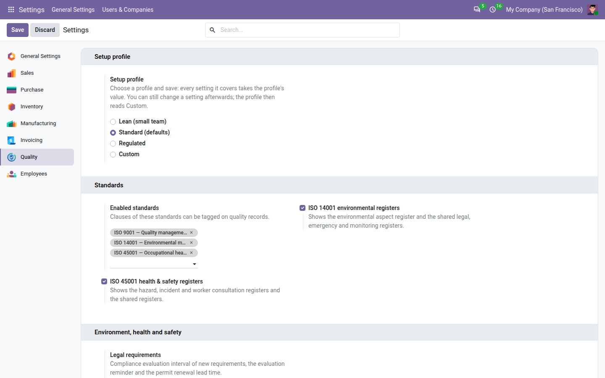

===================================
Minimal setup for a small company
===================================

The **Quality** app ships with settings tuned for a manufacturer with a certification to keep: a password prompt on every signature,
yearly reviews of every document, a reminder for every review date. A company of fifteen people can run ISO 9001 with
far less. This page shows the shortest way to a working quality system: choose the *Lean* setup profile, check the
ten settings that matter, leave the rest alone, and spend your first week on real records.

Nothing on this page weakens what an auditor relies on. Whatever profile you choose, every change is recorded in the
trail, closed records stay locked, nobody approves their own work, and every decision that needs a signature still gets
one. See :doc:`trail`.

Choose a setup profile
======================

A setup profile sets a group of settings in one go. It is only a shortcut: you can still change any setting afterwards.

#. Go to :menuselection:`Settings --> Quality`.
#. Under :guilabel:`Setup profile`, choose a profile:

   - :guilabel:`Lean (small team)`: fewer reminders and longer review cycles, no second password prompt when signing,
     and a corrective action required only for critical nonconformities.
   - :guilabel:`Standard (defaults)`: the values the app installs with. A database where nobody chose a profile is on
     Standard.
   - :guilabel:`Regulated`: shorter review cycles, earlier reminders, the customer's written approval on every
     concession, and purchase orders blocked for suppliers that are not approved.

#. Click :guilabel:`Save`. Every setting the profile covers takes the profile's value.

         Standard (defaults), Regulated and Custom.

If you then change one of the settings the profile covers, for example the owner reminder, the profile reads
:guilabel:`Custom` the next time you open the page. Choose the profile again and save to go back to its values.

.. note::
   When you install **QMS Advanced** or an add-on later, its settings arrive with their default values, so a database on
   Lean reads Custom. Choose :guilabel:`Lean (small team)` again and save: the new settings take their Lean values too.

What each profile sets
----------------------

Only the settings of the apps you have installed appear on the page. Settings not in this table keep their value,
whatever the profile.

.. list-table::
   :header-rows: 1
   :widths: 46 18 18 18

   * - Setting
     - Lean
     - Standard
     - Regulated
   * - :guilabel:`Ask the password before signing`
     - Off
     - On
     - On
   * - :guilabel:`Owner reminder` (days before the due date)
     - 3
     - 3
     - 7
   * - :guilabel:`Concessions need the customer's approval`
     - Off
     - Off
     - On
   * - Corrective actions: reminder interval (days)
     - 14
     - 7
     - 3
   * - Corrective actions: severities needing a corrective action
     - critical
     - major, critical
     - major, critical
   * - Corrective actions: recurrence window (days)
     - 180
     - 180
     - 365
   * - Documents: default review period (months)
     - 24
     - 12
     - 12
   * - Documents: acknowledgement grace (days)
     - 30
     - 14
     - 7
   * - Documents: edition check of external documents (months)
     - 24
     - 12
     - 12
   * - Context: issue review interval (months)
     - 24
     - 12
     - 12
   * - Risks: review a low / medium / high / critical risk every (months)
     - 24 / 24 / 12 / 6
     - 12 / 12 / 6 / 3
     - 12 / 6 / 3 / 1
   * - Objectives: measurement reminder (days)
     - 14
     - 5
     - 5
   * - Objectives: communicate within (days)
     - 30
     - 14
     - 14
   * - Retention: default retention (years)
     - 5
     - 5
     - 10
   * - Audit programme: base interval for a high / medium / low importance process (months)
     - 12 / 24 / 36
     - 6 / 12 / 24
     - 3 / 6 / 12
   * - Training & Competence: expiry warning (days)
     - 30
     - 60
     - 90
   * - Supplier evaluation: purchase confirmation control
     - Warn
     - Warn
     - Block
   * - Supplier evaluation: SCAR response (days)
     - 30
     - 30
     - 14

The first three rows belong to the free core; the others appear with **QMS Advanced** and the Training & Competence
and supplier evaluation add-ons. Lean never shortens how long records are kept.

The profiles also set the environment, health and safety settings while those registers are switched on; their values
are in the table of :doc:`ehs_setup`.

The ten settings that matter
============================

After choosing Lean, check these settings in :menuselection:`Settings --> Quality`. The others can wait until an audit
or your own experience tells you to change them.

.. list-table::
   :header-rows: 1
   :widths: 30 70

   * - Setting
     - Why it matters for a small company
   * - :guilabel:`Setup profile`
     - One choice that sets the cycles and reminders to a small team's pace.
   * - :guilabel:`Enabled standards`
     - Keep ISO 9001 only, unless you certify against another standard. Every extra standard adds clauses to every
       picker. See :ref:`config-standards`.
   * - :guilabel:`Ask the password before signing`
     - Lean turns the second password prompt off. The signature itself stays: signer, date and a fingerprint of the
       record. Turn it back on if your certification body or your customers expect it. See :ref:`config-password`.
   * - :guilabel:`Fallback owner`
     - Name the one person who receives the reminders of people who left. In a small team, that is usually you. See
       :ref:`config-fallback-owner`.
   * - :guilabel:`Days to treat`
     - 30 days suits most small teams. Shorten it only if your customers ask for faster answers. See
       :ref:`config-days-to-treat`.
   * - :guilabel:`Owner reminder`
     - How many days before the due date the owner is reminded. 3 is enough when everyone sits in the same room.
   * - :guilabel:`Corrective action required for` (QMS Advanced)
     - Lean asks for a corrective action on critical nonconformities only. Every nonconformity still needs its
       correction and root cause before it closes. See :doc:`corrective_actions`.
   * - :guilabel:`Review period` of documents (QMS Advanced)
     - Lean proposes a review every 24 months for new document types; existing types keep their own period. See
       :doc:`documents`.
   * - :guilabel:`Top management` (QMS Advanced)
     - Name the managing director, or the two or three people who run the company: they approve the quality policy. See
       :ref:`documents-top-management`.
   * - :guilabel:`Purchase confirmation control` (Supplier evaluation)
     - Set it to :guilabel:`Off` while you build the approved supplier list, then back to :guilabel:`Warn`. See
       :doc:`suppliers`.

What to leave alone
-------------------

These settings have safe defaults that suit a small company as well as a large one:

- :guilabel:`Dashboard age buckets` and :guilabel:`Trail PDF row limit`;
- the risk level thresholds, the audit programme factors and interval bounds, and the audit pack limits;
- the controlled-copy stamp, the satisfaction deterioration threshold and the calibration window;
- the auditor levels of Training & Competence, and the supplier score weights, points and grades;
- :guilabel:`Default retention`: keep at least 5 years unless a law or a customer asks for longer. Nothing is ever
  deleted automatically.

Your first week in five steps
=============================

#. **Day 1 — people and profile.** Give each person their **Quality** role (see :doc:`roles`), choose
   :guilabel:`Lean (small team)` and save, then check the ten settings above.
#. **Day 2 — scope.** Declare the ISO 9001 clauses that do not apply to you, with their justification, for example
   8.3 *Design and development* when you only make to your customers' drawings. See :ref:`clauses-not-applicable`.
#. **Day 3 — the documents you already have.** With **QMS Advanced**, name the top management, then record the quality
   policy and three short documents: the organisation chart, the knowledge register and the communication plan (see
   the next section).
#. **Day 4 — real problems.** Record three nonconformities from last month: a customer complaint, a supplier delay,
   an internal mistake. Accept them, fill the treatment and close one. See :doc:`nonconformities`.
#. **Day 5 — look at what you have.** Open the :doc:`dashboard` and the :doc:`clause view <clauses>`: the records of
   the week already show under clauses 5.2, 5.3, 7.1.6, 7.4 and 10.2. Book a date for your first internal audit
   (see :doc:`audits`).

Three short documents for clauses 5.3, 7.1.6 and 7.4
====================================================

ISO 9001 asks for three things that a small company usually has in someone's head. Write each as a one-page document
of type *Form* or *Procedure*, tag it with its clause, and the :doc:`clause view <clauses>` shows it as a record under
that clause for as long as it is in force.

.. list-table::
   :header-rows: 1
   :widths: 14 30 56

   * - Clause
     - Document
     - What to write
   * - 5.3 *Organizational roles, responsibilities and authorities*
     - Organisation chart and roles
     - Who reports to whom; for each role, what it decides and what it signs, for example "The workshop lead
       authorises rework up to 50 parts".
   * - 7.1.6 *Organizational knowledge*
     - Knowledge register
     - The knowledge your products depend on and where it lives: a setting sheet per machine, a supplier's
       instructions, the one person who knows how to repair the press, and who is learning it.
   * - 7.4 *Communication*
     - Communication plan
     - What you communicate about quality, when, to whom, how and who does it, for example "Monthly: quality results
       on the notice board, by the quality lead".

To record one of them:

#. Go to :menuselection:`Quality --> Resources --> Documents --> Documents` and click :guilabel:`New`.
#. Enter the title, for example *Organisation chart and roles*, and choose the type *Form*.
#. On the :guilabel:`Clauses` tab, tag the clause, for example *5.3 Organizational roles, responsibilities and
   authorities*.
#. Save, then write the first version, attach the file and submit it. Another person approves it. See
   :doc:`documents`.

.. note::
   Tagging a document to a clause is a record, not proof that you meet the clause. The auditor still reads the
   document. The clause view says so: *Records tagged to a clause show where to look. They are not proof of
   conformity: conformity is judged against the requirement.*

.. seealso::
   - :doc:`configuration`
   - :doc:`documents`
   - :doc:`clauses`
