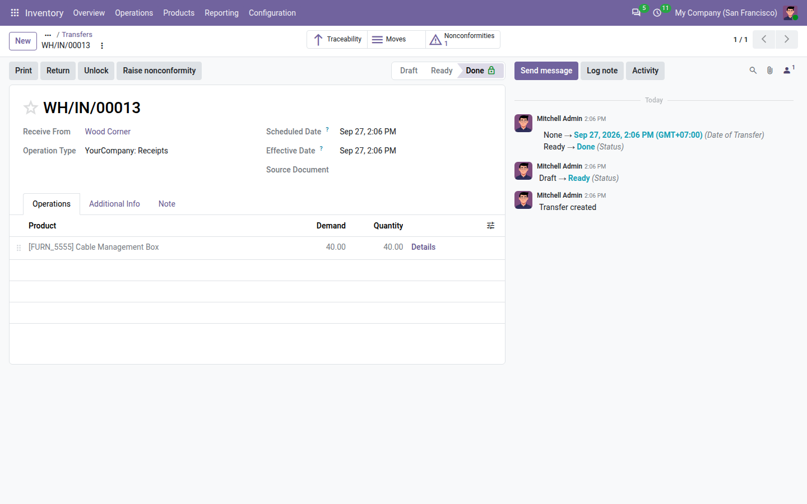
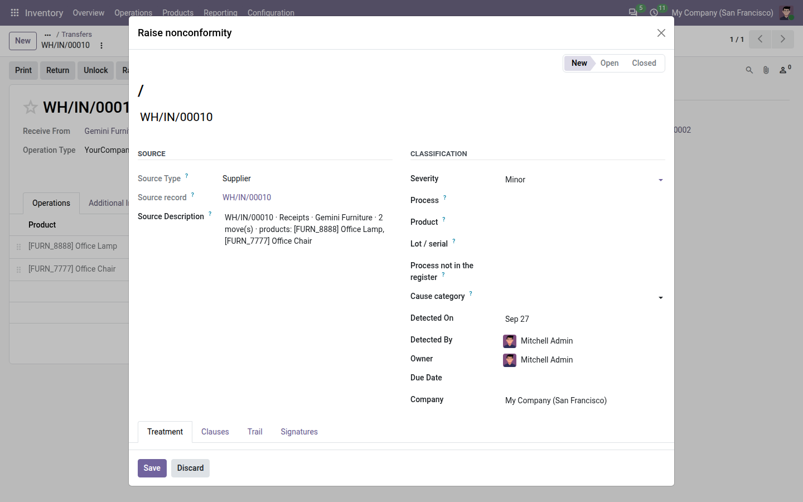

=======================================
Raising nonconformities from operations
=======================================

Most nonconformities are found on a record someone already has open: a receipt, a lot, a manufacturing order, a
purchase order, a repair. The free *source* modules add a :guilabel:`Raise nonconformity` button to those records.
One click opens a nonconformity that is already filled in; one more click saves it. The nonconformity stays linked
to the record it came from, and the record shows how many nonconformities it raised.

The source modules
==================

.. list-table::
   :header-rows: 1
   :widths: 25 35 40

   * - Module
     - Installs itself when
     - Adds
   * - *QMS — Product link*
     - Quality and any app that uses products are installed
     - The :guilabel:`Product` field on nonconformities, the :guilabel:`Product` column in the register and the
       :guilabel:`Product` grouping.
   * - *QMS — Stock sources*
     - Quality and **Inventory** are installed
     - The button on transfers (receipts, deliveries, internal transfers) and on lots and serial numbers, and the
       :guilabel:`Lot / serial` field on nonconformities.
   * - *QMS — Manufacturing sources*
     - Quality and **Manufacturing** are installed
     - The button on manufacturing orders and work orders.
   * - *QMS — Purchase sources*
     - Quality and **Purchase** are installed
     - The button on purchase orders.
   * - *QMS — Repair sources*
     - Quality and **Repairs** are installed
     - The button on repair orders.

You never need to install these modules yourself: each one installs automatically as soon as the Quality app and the
app it connects to are both installed, in any order. For example, installing Inventory on a database that already
has Quality adds the button to transfers and lots straight away. All of them are free.

.. note::
   With **Core QMS** installed, audit findings can also raise nonconformities. See :doc:`audits`.

Raise a nonconformity from a record
===================================

#. Open the record, for example a receipt.
#. Click :guilabel:`Raise nonconformity` at the top of the form.
#. A nonconformity form opens in a dialog, already filled in (see the table below). Replace the
   :guilabel:`Title` with one line saying what was found, and check the :guilabel:`Severity`.
#. Click :guilabel:`Save`.

         the source description, the product and the lot already filled in.

The nonconformity is created in the **New** state, like any other, and follows the usual path: accept, treat, close.
See :doc:`nonconformities`.

.. important::
   If the record already has nonconformities that are new or open, the dialog shows a blue banner: *Open
   nonconformities already exist for this source record.* Check them before saving, so that the same problem is not
   recorded twice.

What is filled in
-----------------

Whatever the record, the dialog fills in:

- :guilabel:`Source Type`, following the table below;
- :guilabel:`Source record`: the record you raised it from;
- :guilabel:`Title`: the record's name, such as its reference number, until you replace it;
- the company of the record;
- :guilabel:`Source Description`: a one-line summary of the record, kept even if the record is later deleted or you
  lose access to it. Very long summaries are cut at 500 characters;
- :guilabel:`Product` and :guilabel:`Lot / serial`, only when the record involves exactly one product or exactly one
  lot. When several are involved, the fields stay empty and the summary names up to three products.

.. list-table::
   :header-rows: 1
   :widths: 20 20 60

   * - Raised from
     - Source Type
     - Source Description and other fields
   * - Receipt from a vendor
     - :guilabel:`Supplier`
     - Reference, operation type, vendor, number of moves and up to three products. Product and lot when there is
       only one of each.
   * - Any other transfer (delivery, internal transfer, receipt with no partner)
     - :guilabel:`Inspection`
     - Same as above.
   * - Lot or serial number
     - :guilabel:`Inspection`
     - *Lot*, its number, the product and the quantity on hand. Product and lot always filled in.
   * - Manufacturing order
     - :guilabel:`Internal`
     - Reference, product and quantity, and the lot produced. Product always filled in; lot when the order produces
       exactly one.
   * - Work order
     - :guilabel:`Internal`
     - Work order, its manufacturing order and the work centre. Product of the manufacturing order; lot as for the
       manufacturing order.
   * - Purchase order
     - :guilabel:`Supplier`
     - Reference, vendor, number of lines and up to three products. Product when the order has only one.
   * - Repair order
     - :guilabel:`Complaint`
     - Reference, product, lot and customer. Product and lot when the repair has them.

For example, raising a nonconformity from receipt ``WH/IN/00012`` of *Acme Metals* with two products gives the source
type *Supplier*, an empty product, and the description *WH/IN/00012 · Receipts · Acme Metals · 2 move(s) ·
products: Housing A, Housing B*.

.. note::
   Only product names you are allowed to read appear in the summary.

The source type is locked
-------------------------

A nonconformity raised from a record keeps the source type that record gives it: the :guilabel:`Source Type` and the
:guilabel:`Source record` fields are read-only, before and after saving. This keeps the statistics by source
reliable. Everything else — title, severity, process, product, lot, description — can be changed as usual.

To record a problem under a different source type, create the nonconformity from :menuselection:`Quality -->
Nonconformities` instead.

.. tip::
   On a nonconformity you create yourself, the :guilabel:`Source record` field is available while it is **New**: pick
   the type of record, then the record. Only the types of records you are allowed to read are offered. Afterwards,
   the form also shows the record's name; it reads *restricted* if you are not allowed to see that record, and
   *deleted* if it no longer exists.

See the nonconformities of a record
===================================

Every record that has the :guilabel:`Raise nonconformity` button also has a :guilabel:`Nonconformities` smart button
at the top right of its form. It shows how many nonconformities were raised from that record, and clicking it opens
them in a list.

The count:

- includes new, open and closed nonconformities, and leaves out cancelled ones;
- only counts the nonconformities you are allowed to see, so a quality user may see a lower number than a quality
  manager.

Who can raise
=============

Only users with a Quality role (:guilabel:`User`, :guilabel:`Internal auditor` or :guilabel:`Manager`) see the
:guilabel:`Raise nonconformity` button and the :guilabel:`Nonconformities` smart button. A warehouse or production
user without a Quality role does not see them. To let shop-floor staff report problems, give them the Quality
:guilabel:`User` role: they will see the nonconformities they raise, own or follow. See :doc:`roles`.

.. seealso::
   - :doc:`nonconformities`
   - :doc:`dashboard`
   - :doc:`roles`
