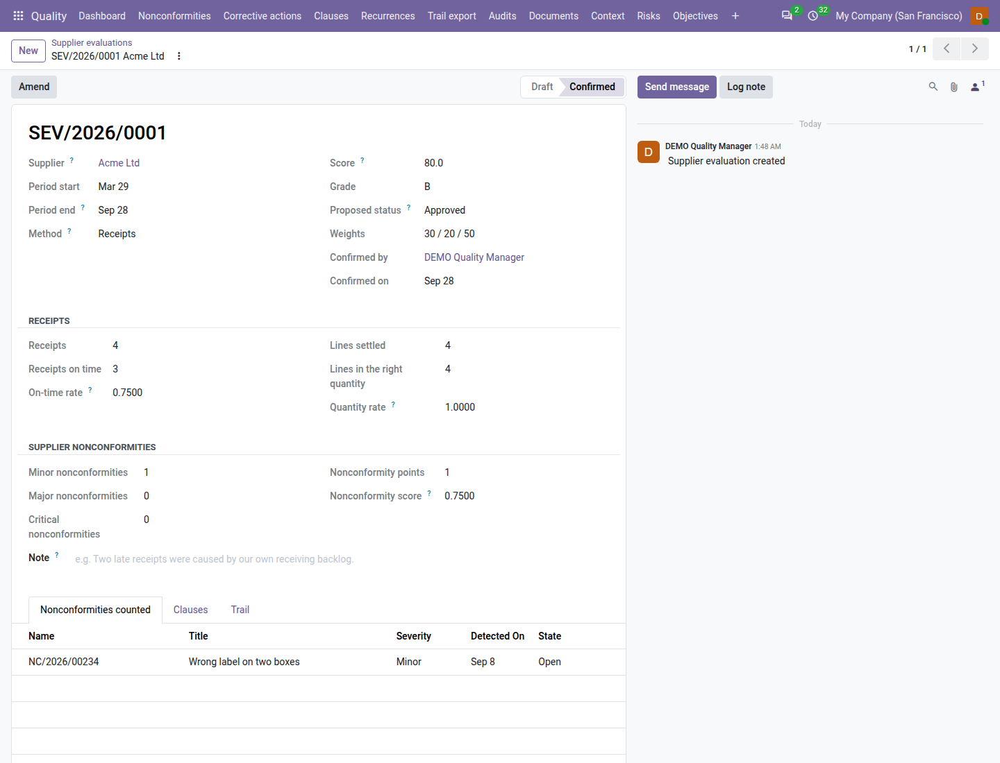
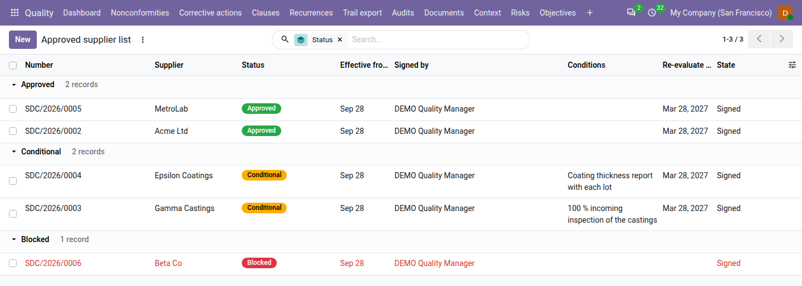

===================
Supplier evaluation
===================

ISO 9001 clause 8.4 asks you to decide which external providers you buy from, on criteria, to evaluate and re-evaluate
them on their performance, to tell them your requirements, and to act on their problems. The **Supplier evaluation**
add-on does this in the **Quality** app: every supplier nonconformity names its supplier, each supplier is rated for a
period from its receipts and its nonconformities — or by a periodic assessment for service providers — and an approved
supplier list is kept by signed decisions. A purchase order confirmed for a supplier nobody approved asks for a reason.

The add-on is free with **QMS Advanced**. It needs **Purchase** and is installed separately, on purpose: search for
*Supplier Evaluation* in **Apps**. It is never installed automatically, because from the day it arrives every
supplier is *Unapproved* (see `First steps after installing`_).

When **Inventory** is installed too, the free *Supplier receipt measures* connector installs itself and adds the
receipt figures — on time, right quantity — to the rating. Receipt measures need Inventory — installed automatically.
Without Inventory, suppliers rated from receipts show *Not rated*, and the approved supplier list, the decisions, the
requirements, the SCAR and the periodic assessment work unchanged.

Everything is under :menuselection:`Quality --> Suppliers`.

First steps after installing
============================

From installation, every supplier is **Unapproved**, and the :ref:`Purchase confirmation control <config-supplier>` is
set to **Warn**: confirming a purchase order for an unapproved supplier asks the buyer for a reason.

#. Go to :menuselection:`Settings --> Quality`, block :guilabel:`Supplier evaluation`, and set
   :guilabel:`Purchase confirmation control` to :guilabel:`Off` while you build the approved supplier list.
#. Mark the suppliers you do not control as exempt (see `Exempt suppliers`_).
#. Evaluate the suppliers of the last half-year and sign a decision for each (see below).
#. Set the control back to :guilabel:`Warn`, or to :guilabel:`Block`.

The supplier on supplier nonconformities
========================================

Every nonconformity of source type :guilabel:`Supplier` names its :guilabel:`Supplier` — the company, never a contact
person:

- raised from a purchase order or a receipt, the supplier is taken from it and is read-only: *The supplier follows the
  purchase order or receipt this nonconformity was raised from.*;
- otherwise, choose it. A supplier nonconformity cannot be accepted without it: *Name the supplier of this
  nonconformity.*

The register gets a :guilabel:`Supplier` column and a :guilabel:`Supplier` grouping. At installation, the existing
nonconformities raised from a purchase order or a receipt get their supplier from it; the others are left as they are.

Rate suppliers from their receipts
==================================

For a supplier and a period, the rating combines three measures, each from 0 to 1:

.. list-table::
   :header-rows: 1
   :widths: 25 75

   * - Measure
     - How it is counted
   * - On-time rate
     - Receipts validated on or before their deadline (plus the :guilabel:`Grace days`), divided by the receipts of the
       period. Needs Inventory.
   * - Quantity rate
     - Purchase lines received in the right quantity (within the :guilabel:`Quantity tolerance (%)`), divided by the
       lines settled in the period; 1 when no line was settled. Needs Inventory.
   * - Nonconformity score
     - 1 minus the nonconformity points per receipt, never below 0. Each supplier nonconformity detected in the period
       (not cancelled) counts its points: 1 for a minor, 3 for a major, 5 for a critical one by default.

The score is 100 × (30 × on-time rate + 20 × quantity rate + 50 × nonconformity score) ÷ 100 with the default
:guilabel:`Score weights` (30 / 20 / 50), rounded half up to one decimal. The grade follows:

.. list-table::
   :header-rows: 1
   :widths: 25 20 55

   * - Score
     - Grade
     - Proposed status
   * - 90 or more
     - A
     - Approved
   * - 75 to below 90
     - B
     - Approved
   * - 60 to below 75
     - C
     - Conditional
   * - Below 60
     - D
     - Blocked
   * - No receipt in the period
     - Not rated
     - None

**Worked example.** *Acme* for the first half of 2026: 20 receipts, 17 on time; 48 lines settled, 45 in the right
quantity; 2 minor and 1 major supplier nonconformities.

- On-time rate = 17 ÷ 20 = 0.85
- Quantity rate = 45 ÷ 48 = 0.9375
- Nonconformity points = 2 × 1 + 1 × 3 = 5; nonconformity score = 1 − 5 ÷ 20 = 0.75
- Score = 100 × (30 × 0.85 + 20 × 0.9375 + 50 × 0.75) ÷ 100 = 81.75, rounded to **81.8**: grade **B**, proposed
  **Approved**.

The weights and points used are kept on the evaluation (:guilabel:`Weights`), so the rating stays as it was when a
decision was taken, even if the settings change later.

Run the evaluation
------------------

#. Go to :menuselection:`Quality --> Suppliers --> Evaluate suppliers` (quality managers).
#. Check the :guilabel:`Company`, :guilabel:`Period start` and :guilabel:`Period end`: by default the last complete
   half-year, for example 2026-01-01 to 2026-06-30 when run in September 2026. The period must be over.
#. Click :guilabel:`Evaluate`.

Odoo creates a draft evaluation for every supplier with a receipt or a supplier nonconformity in the period, except the
exempt ones, recomputes the drafts that already exist, and skips the confirmed ones. A notification sums it up, for
example *3 created, 8 recomputed. Skipped (already confirmed): SEV/2026/0004 Acme*. Above 200 suppliers, the run goes on
in the background. Suppliers set to periodic assessment get an assessment instead, when it is due (see `Periodic
assessment`_).

Each evaluation, under :menuselection:`Quality --> Suppliers --> Evaluations`, shows its number (for example
``SEV/2026/0012``), the :guilabel:`Receipts` figures, the :guilabel:`Supplier nonconformities` by severity with the
:guilabel:`Nonconformities counted` tab, the :guilabel:`Score`, the :guilabel:`Grade` and the :guilabel:`Proposed
status`. Add your comments in the note.

         the right quantity, 1 minor nonconformity, score 80.0, grade B, proposed Approved.

A quality manager then clicks :guilabel:`Confirm`: the figures are frozen and the evaluation is evidence. A confirmed
evaluation is never deleted; its note can be amended. A draft can be deleted by a quality manager. Confirming never
changes the supplier's status: a decision does.

Periodic assessment
===================

Service providers and outsourced processes — a calibration laboratory, a heat-treatment shop — have no receipts to
rate. Rate them by a periodic assessment of criteria instead.

#. Open the supplier's contact, tab :guilabel:`Supplier quality`, and set :guilabel:`Evaluation method` to
   :guilabel:`Periodic assessment` and :guilabel:`Assessment every (months)`, for example 12. :guilabel:`Next assessment
   due` follows.
#. Check the criteria under :menuselection:`Quality --> Configuration --> Assessment criteria`. Three are shipped:
   *Quality of work* (weight 40), *Delivery / turnaround* (30) and *Certification or accreditation* (30), each with its
   scoring guidance.

When an assessment is due, the quality managers get an *Assess <supplier> by <date>* to-do, 30 days before by default.
The next *Evaluate suppliers* run whose period ends on or after the due date creates a draft assessment with the
criteria; before that date, the summary says *<supplier>: assessment not due until <date>*.

On the assessment's :guilabel:`Criteria` tab, score each criterion from 0 (unacceptable) to 5 (excellent); a note is
required for 0, 1 and 5. The weights can be adjusted while the assessment is a draft. The score is 100 × Σ(weight ×
score ÷ 5) ÷ Σ weights, on the same grade table. Every criterion must be scored before confirming.

**Worked example.** *MetroLab*, assessed every 12 months, gets a draft assessment in the second-half run. Scoring quality
of work 4, turnaround 3 and accreditation 5 with the weights 40 / 30 / 30 gives 100 × (40 × 4/5 + 30 × 3/5 + 30 × 5/5) ÷
100 = **80.0**: grade **B**, proposed **Approved**.

The supplier nonconformities of the period are listed on the assessment for information; they do not count in its
score.

The approved supplier list
==========================

A supplier's status in a company comes from its latest signed decision in force:

.. list-table::
   :header-rows: 1
   :widths: 20 80

   * - Status
     - Meaning
   * - **Approved**
     - Buy freely.
   * - **Conditional**
     - Buy under the written conditions, for example *100 % incoming inspection until Q4*.
   * - **Blocked**
     - Do not buy.
   * - **Unapproved**
     - Nobody decided on this supplier yet.
   * - **Exempt**
     - The company does not control this supplier, for example office supplies.

Sign a decision
---------------

#. Go to :menuselection:`Quality --> Suppliers --> Decisions` and click :guilabel:`New`.
#. Choose the :guilabel:`Supplier` and the :guilabel:`Status`. For a conditional supplier, write the
   :guilabel:`Conditions`.
#. Choose :guilabel:`Effective from` (today by default; a later day keeps the previous decision until then) and, unless
   blocked, :guilabel:`Re-evaluate by`: the date by which the supplier is evaluated again.
#. Choose the :guilabel:`Evaluation` the decision rests on and write the :guilabel:`Reason`, at least ten characters,
   for example *Rated 81.8 (B) for H1 2026; no critical nonconformity.*
#. Click :guilabel:`Sign` and, when Odoo asks for it, enter your password.

A decision that departs from the latest confirmed evaluation's proposal must cite that evaluation and explain why in at
least 30 characters: *This decision departs from SEV/2026/0012 (proposed approved): cite it and explain why in at least
30 characters.* The signature reads *Supplier decision*; the supplier's previous decision is superseded on the day the
new one takes effect. Only quality managers decide on suppliers.

When the :guilabel:`Re-evaluate by` date passes, the decision shows *The re-evaluation date has passed: evaluate the
supplier and sign a new decision. The status stands until then.* The status does not change by itself.

:menuselection:`Quality --> Suppliers --> Approved supplier list` lists the signed decisions grouped by status. To print
it, use :menuselection:`Quality --> Suppliers --> Print the approved supplier list`, choose :guilabel:`From` and
:guilabel:`As at`, and click :guilabel:`Print`: every supplier with its status at that date, its decision, signer and
conditions, its evaluations, its requirements communicated and its open SCARs.

         decision with its effective date, signer and re-evaluation date.

Exempt suppliers
----------------

On the supplier's contact, tab :guilabel:`Supplier quality`, a quality manager ticks :guilabel:`Exempt from supplier
approval` and writes the :guilabel:`Exemption reason`, for example *stationery only, no product impact*. The exemption
applies to the company you are working in. Exempt suppliers are never evaluated or flagged.

The same tab shows the :guilabel:`Supplier status`, the :guilabel:`Current decision` and the :guilabel:`Latest
evaluation`, and smart buttons open the supplier's evaluations, decisions and requirements.

Purchase confirmation
=====================

When a buyer confirms a purchase order, the :guilabel:`Purchase confirmation control` decides what happens:

.. list-table::
   :header-rows: 1
   :widths: 20 20 20 20 20

   * - Control
     - Approved or exempt
     - Conditional
     - Unapproved
     - Blocked
   * - :guilabel:`Off`
     - Confirmed
     - Confirmed
     - Confirmed
     - Confirmed
   * - :guilabel:`Warn` (default)
     - Confirmed
     - Confirmed, conditions noted on the order
     - Warning: confirm with a reason
     - Warning: confirm with a reason
   * - :guilabel:`Block`
     - Confirmed
     - Confirmed, conditions noted on the order
     - Refused
     - Refused

With **Warn**, the dialog *Supplier not approved* shows the warning, for example *Acme is not on the approved supplier
list.* or *Beta Co is blocked by SDC/2026/0007 (2026-07-05, Bao).* The buyer writes a reason, for example *Only source
for part 77-03 this week*, and clicks :guilabel:`Confirm anyway`. The order is confirmed, its chatter notes *Confirmed
despite supplier status <status>: <reason>*, and it is marked :guilabel:`Confirmed despite supplier status`.

With **Block**, the same messages refuse the confirmation. For a conditional supplier, the chatter of the order notes
*Conditional supplier: <conditions>*.

.. tip::
   Set the control to **Off** while you build the list, so that buyers are not asked for a reason on every order
   meanwhile.

Supplier corrective action requests (SCAR)
==========================================

When a supplier must fix the cause of a problem, ask them for a corrective action:

#. Open the supplier nonconformity (open, with its supplier) and click :guilabel:`Request corrective action from
   supplier`.
#. Odoo creates a corrective action marked as a SCAR, titled *SCAR <supplier>: <title>*, owned by you, verified by the
   nonconformity's owner, addressed to the supplier's first contact with an email. Check the :guilabel:`Supplier
   contact` on the :guilabel:`Supplier` tab.
#. Click :guilabel:`Send to supplier`. The *Supplier corrective action request* PDF is emailed to the contact, and
   :guilabel:`Response due` is set: the sending date plus the :guilabel:`SCAR response (days)` (30 by default).
#. When the supplier answers, record the :guilabel:`Supplier response` (cause found, correction and corrective action),
   :guilabel:`Response received on` and the :guilabel:`Response documents`, for example an 8D report.

The SCAR cannot be marked done until the supplier's response is recorded: *Record the supplier's response before marking
this SCAR done.* It is then verified like any corrective action. A response past its due date shows *The supplier's
response was due on <date>.* :menuselection:`Quality --> Suppliers --> SCARs` lists them all.

Requirements communicated to suppliers
======================================

ISO 9001 clause 8.4.3 asks you to tell suppliers what you require. Record each requirement and when it was
communicated:

#. Go to :menuselection:`Quality --> Suppliers --> Requirements` and click :guilabel:`New`, or click
   :guilabel:`Add requirement` on the :guilabel:`Quality requirements` tab of a purchase order.
#. Choose the :guilabel:`Supplier` and the :guilabel:`Category`: :guilabel:`Specification (8.4.3 a)`,
   :guilabel:`Acceptance and release (8.4.3 b)`, :guilabel:`Competence and qualification (8.4.3 c)`,
   :guilabel:`Interaction with our QMS (8.4.3 d)`, :guilabel:`Control of performance (8.4.3 e)` or
   :guilabel:`Verification at the provider (8.4.3 f)`.
#. Write the requirement, for example *Machine to drawing DRW-044-17 rev C*. A specification needs at least one
   controlled document with a version in force; acceptance, competence and verification need the :guilabel:`Acceptance
   criteria`.
#. Choose what it :guilabel:`Applies to`: :guilabel:`All orders`, :guilabel:`Some products` or :guilabel:`Some
   orders`.
#. Click :guilabel:`Communicate` (quality managers): by email to a contact of the supplier — the requirement sheet and
   the controlled copies of the document versions in force are sent — or by contract, meeting, letter or another way,
   with a note of at least ten characters.

The requirement becomes **Communicated**, numbered for example ``SRQ/2026/0012``, with the versions sent listed on its
:guilabel:`Versions sent` tab. It appears on the :guilabel:`Quality requirements` tab of every purchase order it applies
to. The supplier's acknowledgement reference can be recorded afterwards.

Revision flags
--------------

When a newer version of a document of the requirement comes into force, the requirement shows *Revision not
communicated: DRW-044-17 v4 in force since 2026-11-02; Acme has v3*, and the :guilabel:`Revision not communicated`
filter lists it. Click :guilabel:`Supersede`: a new draft is copied from it; communicating it supersedes the old one.
A requirement that no longer applies is ended with :guilabel:`Withdraw` and a reason; it leaves the purchase orders.

Suppliers needing attention
===========================

The dashboard's :guilabel:`Suppliers needing attention` tile counts the suppliers bought from in the last 12 months (and
the periodically assessed ones with a decision) that need a quality decision, with the reason: *No decision*,
*Evaluation proposes <status>* (stricter than the current one), *Re-evaluation overdue since <date>*, *Revision not
communicated: <document>* or *Assessment overdue since <date>*. Exempt suppliers never count. The tile opens the list
of those suppliers with their reasons.

Management review and audit pack
================================

- **Review input c7.** Input *9.3.2 c7 — Performance of external providers* of the :doc:`management review
  <management_reviews>` shows, for the review period, the suppliers evaluated and their grades (*Suppliers evaluated*,
  *By grade*), the *Average score* and the *Lowest scores*, the *Status at period end* (approved, conditional, blocked,
  and *Unapproved suppliers with purchases*), the *Decisions signed* by status, the *SCARs opened*, *SCARs closed* and
  *SCAR responses overdue*, the *Orders confirmed despite status*, and the supplier nonconformities by severity.
- **Pack file 15.** The :doc:`audit pack <audit_pack>` includes ``15_approved_supplier_list.pdf``: the approved supplier
  list at the end of the period.
- **Evidence and retention.** Confirmed evaluations count for clause 8.4.1 in the period of their confirmation, signed
  decisions for every period they governed, communicated requirements for 8.4.3 while in force. *Supplier evaluations*
  and *Supplier decisions* have their own retention periods (see :ref:`documents-retention`).

Who can do what
===============

.. list-table::
   :header-rows: 1
   :widths: 25 75

   * - Role
     - Supplier evaluation
   * - **User**
     - Reads evaluations, decisions and the approved supplier list; names the supplier of supplier nonconformities;
       records draft requirements; requests and sends SCARs and records the supplier's response; prints the list.
   * - **Internal auditor**
     - Reads everything; does not record requirements.
   * - **Manager**
     - Everything: runs the evaluation, confirms and deletes draft evaluations, scores assessments, signs decisions,
       exempts suppliers and sets their evaluation method, communicates, supersedes and withdraws requirements.
   * - **Purchase user**
     - Sees the supplier status and the decisions; confirms an order anyway with a reason when the control is Warn.

See :doc:`roles` for the full picture.

.. seealso::
   - :doc:`nonconformities`
   - :doc:`corrective_actions`
   - :doc:`sources`
   - :doc:`management_reviews`
   - :doc:`audit_pack`
