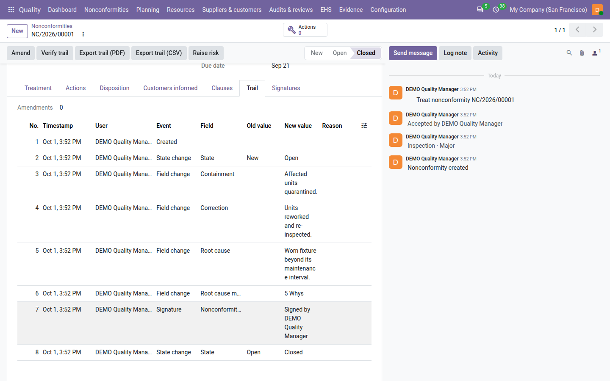
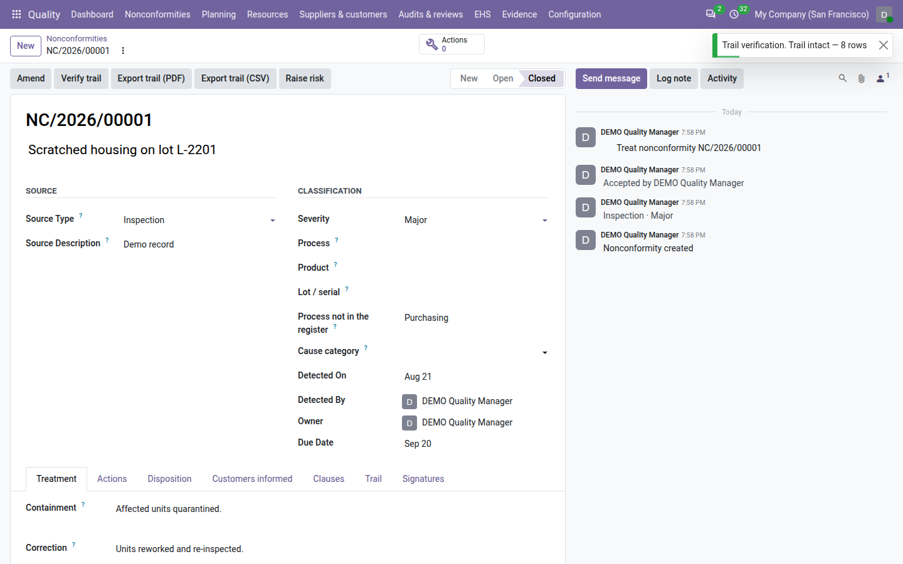
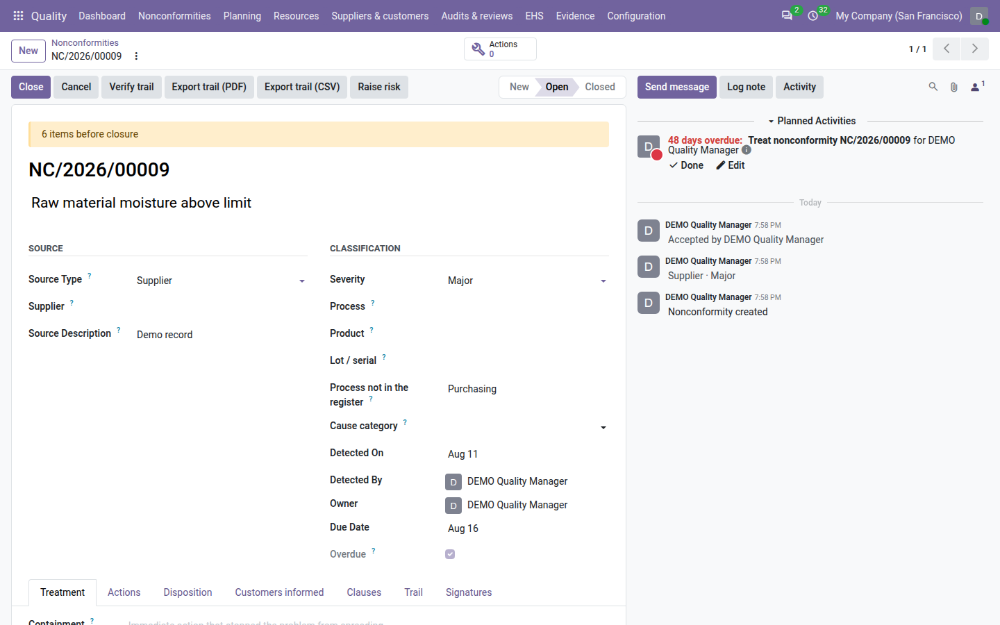
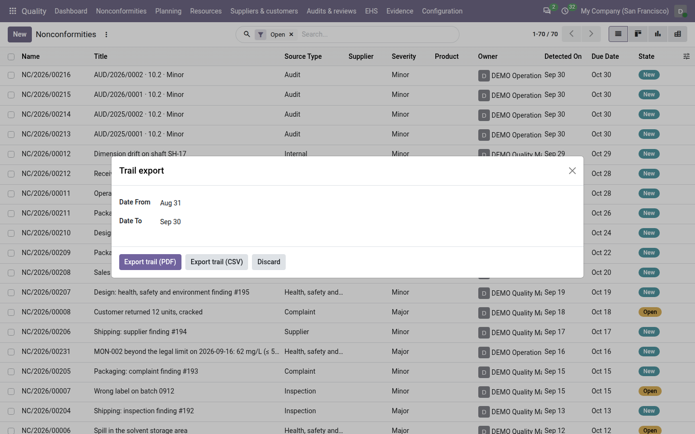
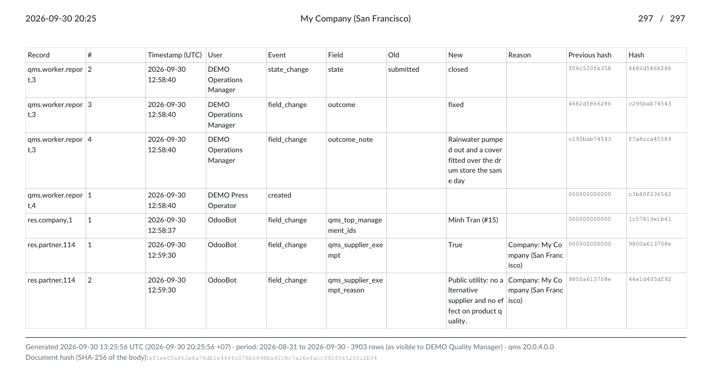
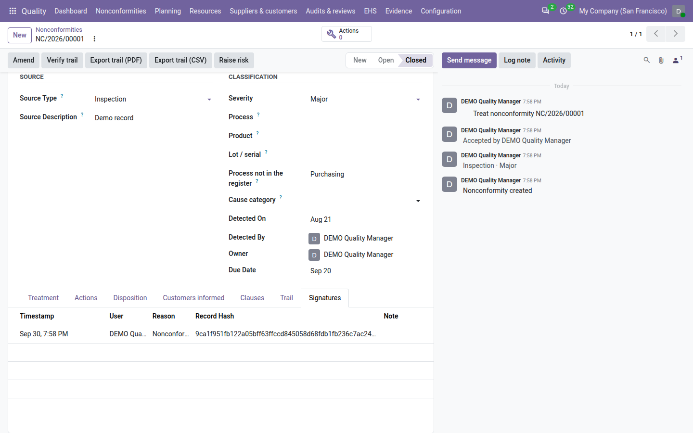

===================
Trail and integrity
===================

An auditor must be able to trust that a closed record was not quietly rewritten afterwards. The **Quality** app keeps
a *trail* for every quality record: a list of everything that happened to it, which nobody can edit or delete, and
which Odoo can check at any time for tampering. Signatures and amendments are part of the same trail.

What the trail records
======================

Open a nonconformity and go to its :guilabel:`Trail` tab. Each row is one event, numbered from 1:

.. list-table::
   :header-rows: 1
   :widths: 20 80

   * - Event
     - Recorded when
   * - **Created**
     - The record is saved for the first time.
   * - **State change**
     - The state changes, for example from *New* to *Open*, with the old and new state.
   * - **Field change**
     - One of the tracked fields changes, with the old and new value: the title, source type, severity, owner, due
       date, containment, correction, root cause and root cause method (and the product and lot when the
       :doc:`source modules <sources>` are installed).
   * - **Signature**
     - Someone signs the record, for example by closing it. See `Electronic signatures`_.
   * - **Amendment**
     - A locked record is amended: one row per changed field, with the old value, the new value and the reason.

Every row also shows the :guilabel:`Timestamp`, the :guilabel:`User` who made the change and its :guilabel:`Hash`
(see below). The trail is read-only: nobody, not even the administrator, can edit or delete a row from Odoo.

The trail reads in plain words: the :guilabel:`Field` column shows the label you see on the form (*Root cause method*,
not a technical name), choices show their label (*Open*, *5 Whys*), yes/no values read *Yes* and *No*, dates follow
your own date format, and people and records are shown by name. A signature row shows the signed step in the
:guilabel:`Field` column (for example *Nonconformity closure*) and *Signed by* followed by the signer's name in
:guilabel:`New value`. This is only how the trail is displayed: the values stored and fingerprinted are never changed.

Above the list, a number shows how many times the record was amended. The fingerprint of the latest row is not shown
on the form: :guilabel:`Verify trail` checks it for you.

.. note::
   Changes to the clauses are recorded in the trail when they are made by an amendment. Messages and activities in
   the chatter are not part of the trail.

How tampering is detected
-------------------------

Each row carries a *hash*: a 64-character fingerprint computed from the row's content **and** from the fingerprint of
the row before it. The rows are therefore chained together. If anyone changes a row directly in the database — even
a single character — its fingerprint no longer matches, and neither does any row after it. Deleting a row breaks the
chain too.

Verify the trail
================

#. Open the record.
#. Click :guilabel:`Verify trail`.

Odoo recomputes every fingerprint of the record's trail and shows the result:

- a green message, *Trail intact — 7 rows*, when every row matches;
- a red message, *Trail broken at row 4*, naming the first row that does not match. The message stays on screen until
  you close it.

Verifying changes nothing. Anyone who can open the record can verify its trail.

.. important::
   A broken trail means the database was changed outside Odoo. Do not try to correct it: export the trail as it is,
   and inform your quality manager and your system administrator.

Export the trail
================

For one record
--------------

Open the record and click :guilabel:`Export trail (PDF)` or :guilabel:`Export trail (CSV)`.

For a period
------------

#. Go to :menuselection:`Quality --> Evidence --> Trail export`.
#. Set :guilabel:`Date From` and :guilabel:`Date To`. By default the period covers the last month, ending today.
#. Click :guilabel:`Export trail (PDF)` or :guilabel:`Export trail (CSV)`.

The export contains every trail row dated in the period, of every quality record you are allowed to see, grouped by
record. This applies to quality managers too: on a database with several companies, a quality manager exports the
rows of the records of their own companies only. It also contains the rows recording changes to the :ref:`password setting <config-password>`.

What the PDF contains
---------------------

The PDF has one line per trail row: the record, the row number, the time (UTC), the user, the event, the field (by its
label), the old and new values (in words, as on the Trail tab), the reason, and the first characters of the previous row's hash and of the row's own hash.

Its footer states:

- when it was generated, in UTC and in your own time zone;
- the period (for a single record, the record's name);
- how many rows it contains, and for whom: *as visible to* followed by your name. Two people with different access
  may get different exports for the same period;
- the *document hash*: a fingerprint of the body of the document. Keep it with the printed copy: it lets you show
  later that the copy matches the document that was generated.

A PDF above the :ref:`Trail PDF row limit <config-trail-pdf-limit>` (5,000 rows by default) is refused: narrow the
period or use the CSV export, which has no limit.

What the CSV contains
---------------------

The CSV file has one line per row with the columns ``sequence``, ``timestamp``, ``user``, ``event``, ``field``,
``old_value``, ``new_value``, ``reason``, ``prev_hash`` and ``hash``, with the stored values and the full hashes, then
four columns in plain words: ``record``, ``field_label``, ``old_display`` and ``new_display``. The period export adds
two first columns naming the record. Auditors can use the stored columns to recompute the chain with their own tools.

Electronic signatures
=====================

Some actions are *signed*: closing a nonconformity and amending a locked record. With **QMS Advanced**, more decisions
are signed the same way, such as approving a document, approving a management review, issuing an audit report or
giving the effectiveness verdict of a corrective action. A signature records:

- who signed and when;
- the reason, for example *Nonconformity closure* or *Amendment*;
- the *record hash*: the fingerprint of the record's trail at the moment of signing. It proves exactly which version
  of the record was signed.

The signature also adds a **Signature** row to the trail. Signatures are listed in the record's :guilabel:`Signatures`
tab, and cannot be edited or deleted.

Password re-check
-----------------

By default, Odoo asks the signer for their own password before signing, in its standard *confirm your password*
dialog. This is what makes the signature personal: someone using an unattended session cannot sign. Odoo does not ask
again if you confirmed your password in the last ten minutes.

A quality manager can turn this off with :ref:`Ask the password before signing <config-password>` in
:menuselection:`Settings --> Quality`. Do so only on installations where users sign in through single sign-on and
have no Odoo password. Signatures are still recorded, without the password check. Every change of this setting is
itself recorded in the trail, with who changed it and when.

Locked records and amendments
=============================

When a record reaches a final state — a closed or cancelled nonconformity — it is *locked*:

- its content cannot be changed; Odoo answers *This record is locked; use Amend.*;
- it cannot be deleted, by anyone. Neither can any record that carries a signature.

When a closed record must be corrected, a quality manager uses :guilabel:`Amend`: the change needs a reason of at
least ten characters, is signed, and leaves the original value in the trail next to the new one. A cancelled record
cannot be amended. See :ref:`Cancel or amend <nc-cancel-amend>` in :doc:`nonconformities`.

With **QMS Advanced**, the same :guilabel:`Amend` dialog corrects the other locked records, each with the fields it allows:

.. list-table::
   :header-rows: 1
   :widths: 35 30 35

   * - Record
     - When :guilabel:`Amend` is shown
     - Fields that can be amended
   * - Corrective action
     - Verified or ineffective
     - :guilabel:`Title`, :guilabel:`Description`, :guilabel:`Evidence`, :guilabel:`Clauses`
   * - Internal audit
     - Reported or closed
     - :guilabel:`Summary`, :guilabel:`Audit conclusion` (still agreeing with the findings)
   * - Document version
     - Effective or obsolete
     - :guilabel:`Change summary`
   * - Management review
     - Approved
     - :guilabel:`Conclusion`

See :doc:`corrective_actions`, :doc:`audits`, :doc:`documents` and :doc:`management_reviews`.

On the :doc:`dashboard`, the :guilabel:`Amended nonconformities` tile counts the amended nonconformities.

.. seealso::
   - :doc:`nonconformities`
   - :doc:`configuration`
   - :doc:`audit_pack`
