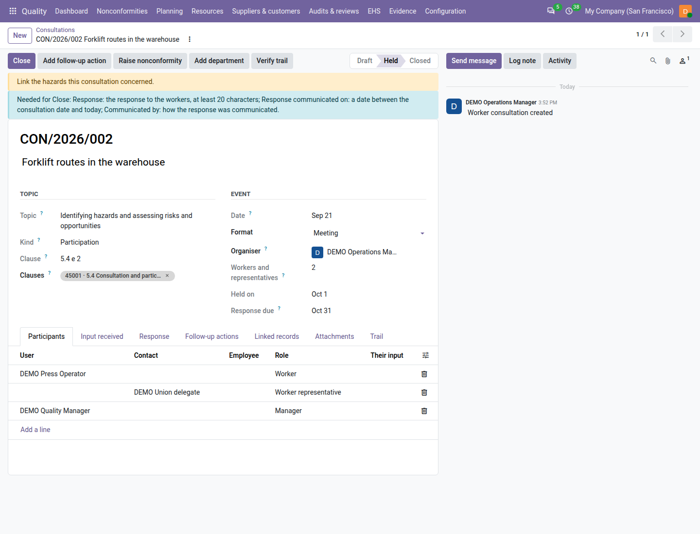
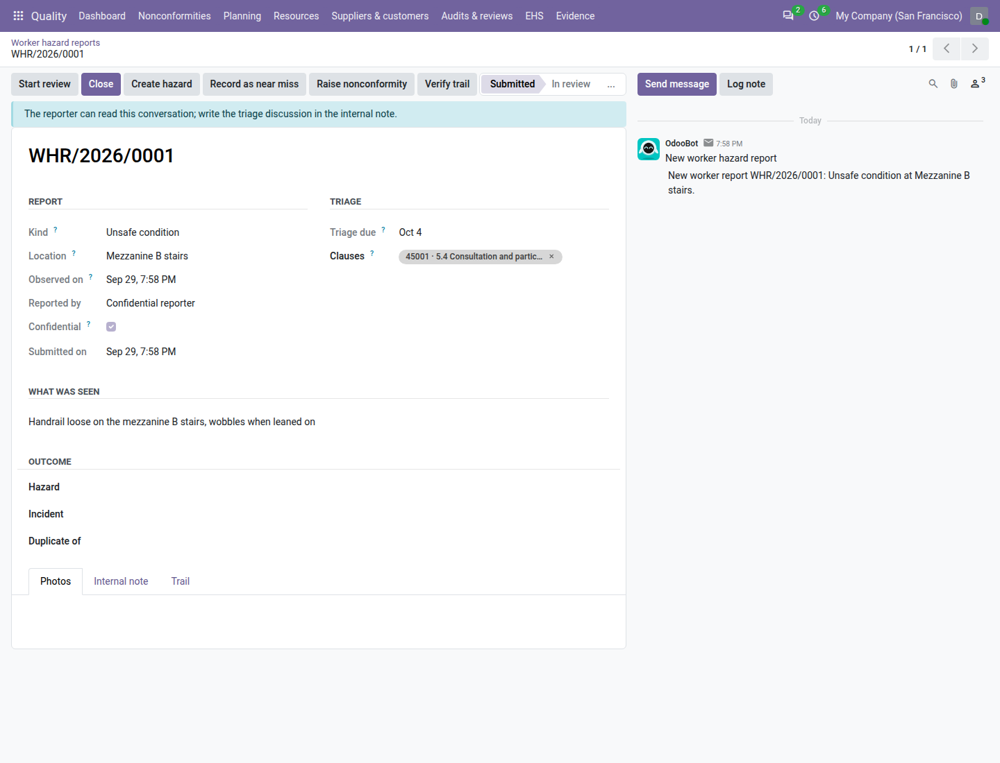

===================
Worker consultation
===================

ISO 45001 asks you to consult workers and have them take part in the health and safety system, and to remove what
keeps them from doing so, such as the fear of reprisal (clause 5.4). With the ISO 45001 registers switched on (see
:doc:`ehs_setup`), the **Quality** app keeps two registers for it:

- **Consultations**: each toolbox talk, safety committee, workshop or survey where workers were consulted or took part,
  with its 5.4 topic, the workers involved, what they said, and the answer they got;
- **Worker hazard reports**: the hazards and unsafe conditions any employee reports from the **Safety reports** app
  (see :doc:`safety_reports`), each answered with an outcome the reporter reads.

Both are under :menuselection:`Quality --> EHS --> Health & Safety`: :guilabel:`Consultations` and :guilabel:`Worker
hazard reports`.

Consultations
=============

.. list-table::
   :header-rows: 1
   :widths: 20 80

   * - State
     - Meaning
   * - **Draft**
     - Planned or being written. It can be deleted.
   * - **Held**
     - The workers were consulted; the response to them is due within the :guilabel:`Respond to a consultation within
       (days)` setting (30 by default).
   * - **Closed**
     - The response was given to the workers; locked.

Record a consultation
---------------------

#. Go to :menuselection:`Quality --> EHS --> Health & Safety --> Consultations` and click :guilabel:`New`.
#. Enter the title, for example *Noise controls in the press shop*.
#. In :guilabel:`Topic`, choose the ISO 45001 5.4 item it evidences, for example *Determining control measures and
   their effective use*. The topic decides whether it was a :guilabel:`Consultation` (workers asked for their view
   before a decision) or a :guilabel:`Participation` (workers took part in the work), and shows the :guilabel:`Clause`,
   for example *5.4 e 6*. Choose the kind yourself only for the topic *Other*. Record one consultation per topic.
#. In :guilabel:`Event`, enter the :guilabel:`Date` (not in the future), the :guilabel:`Format` (meeting, toolbox
   talk, workshop, survey, committee, other) and the :guilabel:`Organiser` — the quality user who answers the workers.
#. On the :guilabel:`Participants` tab, add a line per person — a :guilabel:`User` or a :guilabel:`Contact` (for
   example the union delegate) — with their role: :guilabel:`Worker`, :guilabel:`Worker representative`,
   :guilabel:`Manager` or :guilabel:`Contractor`, and :guilabel:`Their input` if recorded individually. A line names
   one person only: choosing a user, a contact or an employee clears the other two.
   :guilabel:`Workers and representatives` counts the non-managerial participants.
#. On the :guilabel:`Input received` tab, write what the workers said (at least 20 characters), for example *Operators
   ask for enclosures rather than more ear defenders*.
#. On the :guilabel:`Linked records` tab, link the :guilabel:`Hazards`, :guilabel:`Incidents`, :guilabel:`Worker
   reports`, :guilabel:`Objectives` and :guilabel:`Legal requirements` discussed. When the topic expects a link that
   is still empty, a yellow line reminds you (for example *Link the hazards this consultation concerned.*); it never
   blocks.
#. Attach the attendance sheet or the minutes on the :guilabel:`Attachments` tab.
#. Save — Odoo numbers it, for example ``CON/2026/004`` — and click :guilabel:`Held` once the workers were consulted.

Held needs at least one worker or worker representative, the input received, a date not in the future and, for the
topic *Other*, the kind. While something is missing, a line at the top of the form says *Needed for Held:* and lists
all of it. A date in the future is named there with the way out, for example *Date: this consultation is dated
10/15/2026, after today; change it to the day it took place, or press Held on that day.* Clicking :guilabel:`Held`
anyway opens a window titled *Before you press Held* with the same list; click :guilabel:`Got it`, fix the fields and
click :guilabel:`Held` again. The organiser gets the to-do *Respond to the workers on CON/2026/004*, due on
:guilabel:`Response due`.

         opportunities, with the Needed for Close line listing the response, the date it was communicated and how, and
         its participants: a worker, the union delegate and a manager.

Respond and close
-----------------

#. Turn the decision into tracked actions if needed: :guilabel:`Add follow-up action` creates a preventive action
   linked to the consultation (see :doc:`corrective_actions`); :guilabel:`Raise nonconformity` raises one.
#. On the :guilabel:`Response` tab, write the :guilabel:`Response` given to the workers — what was decided and why, at
   least 20 characters — and, if it differs, the :guilabel:`Decision`.
#. Enter :guilabel:`Response communicated on` (between the consultation date and today) and :guilabel:`Communicated
   by` (meeting, notice board, email, toolbox talk, other).
#. Click :guilabel:`Close`. The consultation is locked and the response to-do is done.

Until the consultation can be closed, a line at the top of the form says *Needed for Close:* and lists everything
still missing, as in the picture above; clicking :guilabel:`Close` early opens a window titled *Before you press
Close* with the same list. A closed consultation shows that it is locked: a quality manager changes it with
:guilabel:`Amend` at the top of the form, giving a reason that is kept in the trail.

Held, Close, Add follow-up action and Raise nonconformity are shown to the organiser and to quality managers. On a
consultation you do not organise, a line under the header says *Only the organiser (…) or a quality manager can work
on this consultation.*

To print, go to :menuselection:`Quality --> EHS --> Health & Safety --> Print worker consultation report` (or select
consultations in the list and choose it from :guilabel:`Actions`); set :guilabel:`From` and :guilabel:`To` and click :guilabel:`Print`; the window closes when the PDF has downloaded. It lists the consultations held and the
worker reports submitted in the period; it is file ``23_worker_consultation.pdf`` of the audit pack. A confidential
reporter is never named in it.

Worker hazard reports
=====================

.. list-table::
   :header-rows: 1
   :widths: 20 80

   * - State
     - Meaning
   * - **Submitted**
     - Just reported from Safety reports; waiting for the quality team.
   * - **In review**
     - Taken by a quality user, who triages it.
   * - **Closed**
     - Answered with an outcome; locked. The reporter is told.

Every new report posts *New worker report WHR/2026/0031: Unsafe condition at Mezzanine B stairs.* to the quality team.
A report must be closed within :guilabel:`Answer worker hazard reports within (days)` (5 by default) of its
submission: after its :guilabel:`Triage due` day it shows *The triage of this report is overdue.* and counts as overdue
on the tile :guilabel:`Worker hazard reports`.

Triage a report
---------------

#. Go to :menuselection:`Quality --> EHS --> Health & Safety --> Worker hazard reports` and open a report.
#. Click :guilabel:`Start review`: it moves to **In review** with you in :guilabel:`Triaged by`.
#. Decide what it is and act from the report:

   - :guilabel:`Create hazard` opens a new hazard filled from the report (see :doc:`hazards`);
   - :guilabel:`Record as near miss` opens a near miss filled from the report (see :doc:`incidents`);
   - :guilabel:`Raise nonconformity` raises one of source *Health, safety and environment*;
   - or fix the problem on the spot.

#. Write the triage discussion in the :guilabel:`Internal note` tab: the reporter never sees it. The chatter, on the
   other hand, is read by the reporter (*The reporter can read this conversation; write the triage discussion in the
   internal note.*).
#. Click :guilabel:`Close`, choose the outcome and write the :guilabel:`Outcome note` for the reporter (at least 20
   characters), then click :guilabel:`Close`.

.. list-table::
   :header-rows: 1
   :widths: 30 70

   * - Outcome
     - Needs
   * - :guilabel:`Hazard register`
     - The :guilabel:`Hazard` it was added to (filled by :guilabel:`Create hazard`).
   * - :guilabel:`Incident or near miss`
     - The :guilabel:`Incident` recorded from it (filled by :guilabel:`Record as near miss`).
   * - :guilabel:`Nonconformity`
     - The nonconformity raised from the report.
   * - :guilabel:`Fixed on the spot`
     - Nothing more.
   * - :guilabel:`Not a hazard`
     - Nothing more.
   * - :guilabel:`Duplicate`
     - The earlier report it duplicates, in :guilabel:`Duplicate of`.

The reporter is notified *Your report WHR/2026/0031 was reviewed*, with the outcome (for example *Added to the hazard
register*) and your note. A report never carries the reporter's name into the hazard, incident or nonconformity made
from it.

         "Confidential reporter", triage due, the description, and the Start review, Close, Create hazard, Record as
         near miss and Raise nonconformity buttons.

Confidential reports
--------------------

A reporter may tick :guilabel:`Report confidentially`. Then the report is created by the system, not by the reporter,
and :guilabel:`Reported by` shows:

.. list-table::
   :header-rows: 1
   :widths: 40 60

   * - Reader
     - :guilabel:`Reported by`
   * - The reporter
     - *You (confidential)*
   * - A quality manager
     - The reporter's name, followed by *(confidential)*
   * - A quality user or an internal auditor
     - *Confidential reporter*

The reporter's messages on the report are posted as *Confidential reporter:*, and the PDFs never print the name. Only
quality managers can see who reported, so that they can ask a question.

.. important::
   Confidential is not anonymous. The server's technical logs and a database administrator can still identify the
   reporter: confidentiality is towards the users of the application. Say so to your employees.

Filters: :guilabel:`Open`, :guilabel:`Closed`, :guilabel:`Triage overdue`, :guilabel:`In review by me`,
:guilabel:`Past retention`; group by :guilabel:`Kind`, :guilabel:`State`, :guilabel:`Outcome` or
:guilabel:`Submitted` (month).

On the dashboard and in the review
==================================

- The tile :guilabel:`Worker hazard reports` counts the open reports, with the badge *N overdue* and red when one is
  overdue. With :guilabel:`My records`, it counts the reports you have in review. See :doc:`dashboard`.
- The ISO 45001 review input *Consultation and participation of workers* shows the consultations by kind and topic,
  the reports by outcome and the median days to close. See :doc:`management_reviews`.

Employees (with HR installed)
=============================

When the **Employees** app is installed, a participant line can name an :guilabel:`Employee` — a shop-floor worker
without an Odoo user — and :guilabel:`Add department` on a consultation that is not closed adds every active employee
of the chosen departments and of their child departments who is not listed yet.

Who can do what
===============

.. list-table::
   :header-rows: 1
   :widths: 40 20 20 20

   * - Action
     - Quality user
     - Internal auditor
     - Quality manager
   * - Record a consultation
     - Yes
     - No (reads)
     - Yes
   * - Held, Close, follow-up actions
     - As the organiser
     - No
     - Yes
   * - Report a hazard
     - Yes (so can every employee)
     - Yes
     - Yes
   * - Triage and close a worker hazard report
     - Yes
     - No
     - Yes
   * - See who sent a confidential report
     - No
     - No
     - Yes

.. note::
   **Known limits**

   - No portal and no anonymous reporting: reports come from internal users, and confidentiality has the limits above.
   - No survey or voting tool: record the result of your own survey as a consultation.
